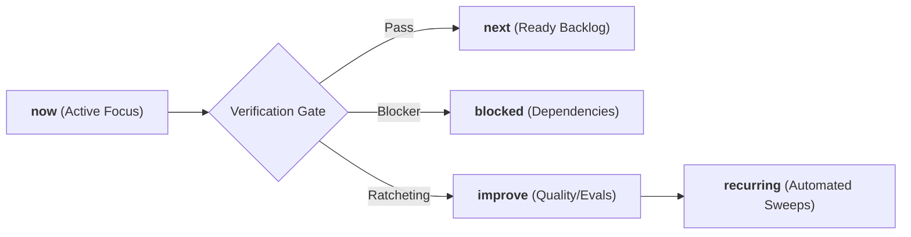

# Ars Arcanum (Scriptorium) — Agentic Operating Manifesto & Engineering Contracts
> **Sovereign Authoring Operating System (GPA 4.0/4.0 — Grade A+)** | Release v2.0.0

---

## 1. System Identity & Mission

**Ars Arcanum (Scriptorium)** is a sovereign, 100% offline, privacy-first operating system and craft studio designed for speculative fiction authors, worldbuilders, and narrative designers. 

### Core Operating Principles
1. **Absolute Creative Sovereignty**: Zero cloud dependencies, zero external network telemetry, and 100% offline privacy for unpublished creative intellectual property.
2. **Deterministic Rails over Probabilistic Free-Form**: Mandatory validation gates, rigid schemas, atomic POSIX file I/O, and mathematical consistency checks for all lore and manuscript operations.
3. **Continuous Verification & Anti-Stall Momentum**: Every milestone ratchets forward repository capabilities across explicit momentum queues (`now`, `next`, `blocked`, `improve`, `recurring`).
4. **Defense in Depth**: Strict path traversal sanitization, cross-platform file locking, stream-verified archives, and cryptographic GPG backup protection.

---

## 2. Invariant Engineering Contracts

All automated agents, subagents, and human contributors must strictly uphold these non-negotiable architectural contracts:

### 2.1 File Safety & Storage Invariants
- **Atomic Writes**: All file modifications must use `atomic_write()` from `scripts/lib/_bootstrap.py` (temporary file $\to$ `flush` $\to$ `fsync` $\to$ `os.replace` $\to$ parent directory `fsync`). Direct unbuffered file overwrites are prohibited.
- **Cross-Platform File Locking**: Concurrency-sensitive operations (snapshots, backups, migrations) must acquire an `ArcanumLock` (`scripts/lib/lockfile.py`) utilizing `fcntl.flock` on POSIX and `msvcrt.locking` on Windows.
- **Path Traversal Defense**: All user-supplied volume names, draft identifiers, and book targets must be sanitized via regex token validation `^[A-Za-z0-9_-]+$`. Directory separators (`/`, `\`) and path traversals (`..`) are rejected immediately.
- **Zero-Pip Dependency Guarantee**: All core craft engines, validators, parsers, and static site generators must execute exclusively on standard library Python primitives without external `pip` dependencies.

### 2.2 Content Security Policy & Offline Isolation
- Every generated HTML report, interactive corkboard, visual timeline, static codex, and Zen drafting studio must declare strict offline Content Security Policies:
  ```html
  <meta http-equiv="Content-Security-Policy" content="default-src 'none'; style-src 'unsafe-inline'; script-src 'unsafe-inline'; img-src data:; media-src data: blob:;">
  ```
- No external CDN scripts, remote fonts, or network requests are permitted in generated artifacts.

---

## 3. Momentum Queues & Compounding Architecture

The system tracks its active state across five persistent momentum queues:



1. **`now`**: The active milestone currently undergoing execution and verification.
2. **`next`**: Concrete, unblocked technical tasks staged for immediate execution.
3. **`blocked`**: Tasks awaiting external dependencies or human-in-the-loop decisions.
4. **`improve`**: Refactoring candidates, test coverage expansion, and performance optimizations.
5. **`recurring`**: Automated background invariants (supply-chain SHA-256 sweeps, version parity gates, static syntax sweeps, systemd backup timers).

---

## 4. Domain Engine Topology

The codebase separates concerns into three coordinated architectural tiers:

```
scripts/
├── arcanum                    # POSIX unified CLI bootstrap wrapper
├── arcanum_app.py             # Desktop GTK3 application entry point
├── lib/
│   ├── _bootstrap.py          # Atomic write, path resolution & common primitives
│   ├── cli.py                 # Authoritative Python CLI dispatcher (v2.0.0)
│   ├── ui_gtk3/               # Modular presentation package (<800 lines/file)
│   ├── ui_adw.py              # Modern Libadwaita interface
│   ├── registry.py            # Core vs. Craft engine discovery matrix
│   ├── studio_hub.py          # Cross-platform browser-based Studio Hub
│   ├── zen_studio.py          # Standalone offline drafting studio & lore drawer
│   ├── story_canvas.py        # Visual drag-and-drop story corkboard
│   ├── timeline_sync.py       # Dual-track narrative vs chronological synchronizer
│   ├── omnibus.py             # Multi-volume series omnibus compiler
│   ├── corpus_export.py       # Universal structured JSONL/SQLite RAG exporter & vault restore
│   ├── local_rag.py           # Zero-dependency hybrid TF-IDF & SQLite FTS5 semantic retriever
│   └── [Craft Engines]        # Astrophysics, climate, genealogy, conlang, causality, magic...
```

---

## 5. Verification Protocol & Quality Gates

Before any milestone or phase is marked complete, the following quality gates must pass with 100% compliance:

```bash
# 1. Full Python Test Suite Discovery (0 failures permitted)
python -m unittest discover tests

# 2. Strict Expanded Ruff Linter Pass (0 violations permitted)
ruff check .

# 3. Strict Mypy Static Type Checking across all source files
mypy --explicit-package-bases scripts/lib/*.py tests/*.py

# 4. Canonical 7-Stage Integration Verification Harness
bash scripts/verify.sh
```
