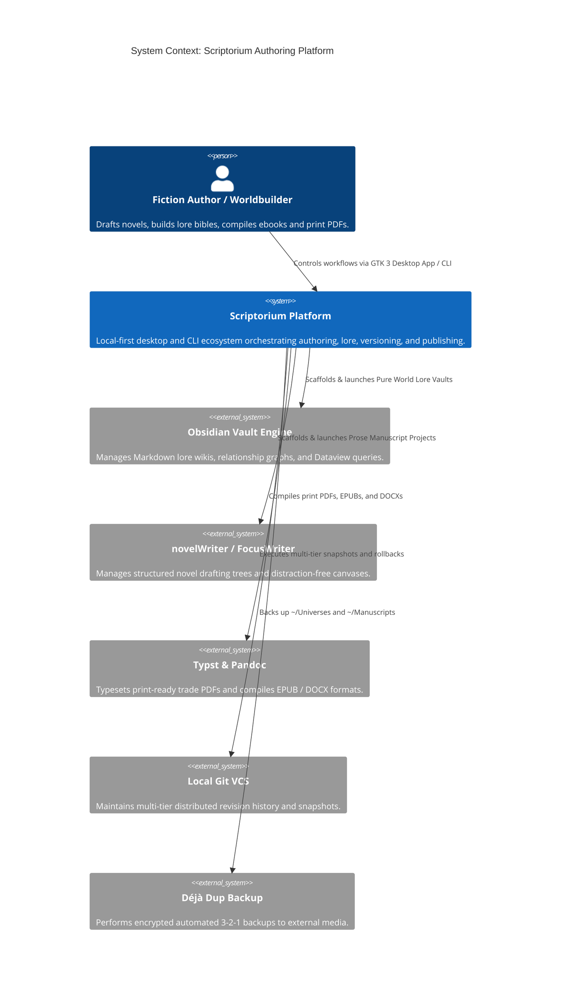
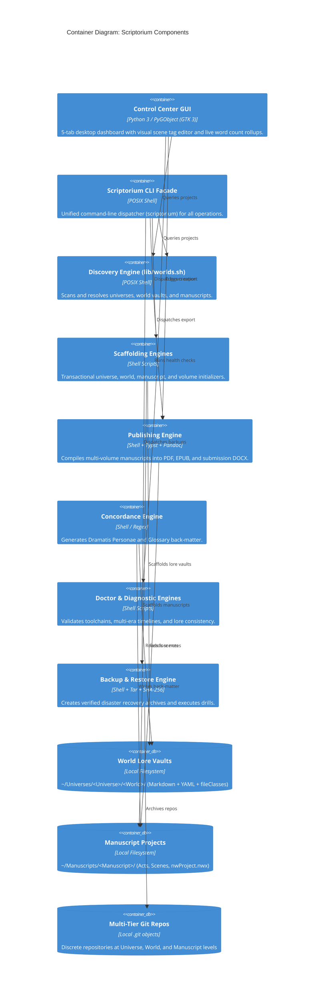
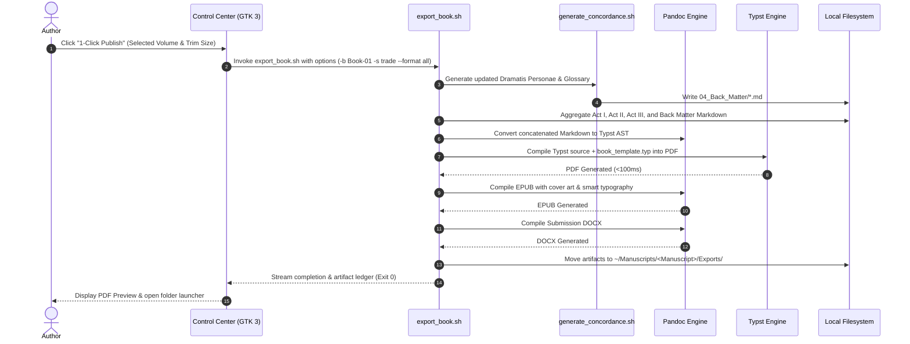
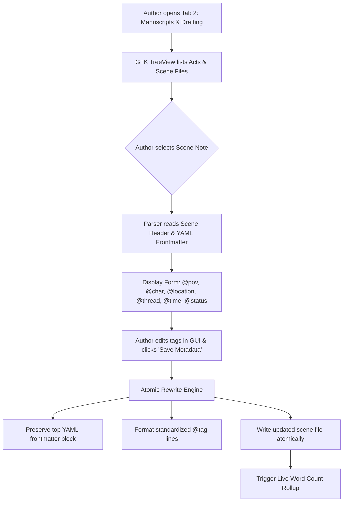
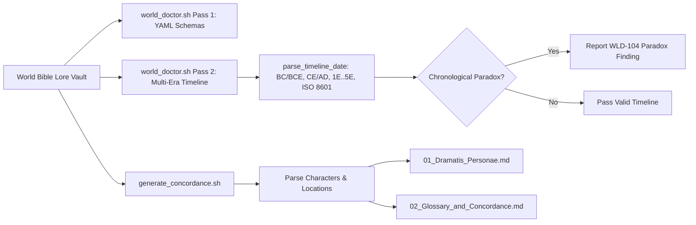
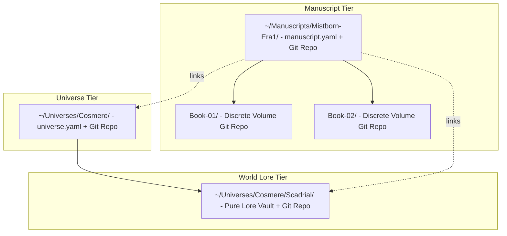

# Scriptorium Technical Architecture & System Blueprint

> **One definitive, audited architecture reference for Scriptorium — an open, distraction-free authoring and worldbuilding platform on Linux.**

---

## Part 1 — Whole-Repo Technical Deep-Dive

### 1.1 What Scriptorium Is
Scriptorium is a purpose-built, distraction-free authoring and speculative worldbuilding environment designed for Linux workstations (Linux Mint XFCE editions 21/22 and Debian 12/13 XFCE) ([`README.md#L1-L25`](file:///README.md#L1-L25), [`docs/AUTHOR_MANUAL.md#L1-L42`](file:///docs/AUTHOR_MANUAL.md#L1-L42)). It combines standard open-source tools (Obsidian, novelWriter, FocusWriter, LibreOffice Writer, Calibre, Typst, Pandoc, and Git) into a unified, zero-terminal desktop experience. All prose, character dossiers, lore notes, and timelines are stored in standard plain Markdown (`.md`) and open formats on the author's local hard drive with zero vendor lock-in, automated multi-tier version control, and 3-2-1 verified disaster recovery.

### 1.2 Tech-Stack Detection Table

| Layer | Technology | Evidence (File & Line) |
| :--- | :--- | :--- |
| **Desktop Application GUI** | Python 3 + PyGObject (`Gtk 3.0`, `GLib`, `Gdk`, `Pango`) | [`scripts/scriptorium_app.py#L1-L35`](file:///scripts/scriptorium_app.py#L1-L35) |
| **Fallback Graphical Dialogs** | Zenity (GTK dialog utility) | [`scripts/control_center.sh#L1-L30`](file:///scripts/control_center.sh#L1-L30), [`scripts/lib/worlds.sh#L40-L45`](file:///scripts/lib/worlds.sh#L40-L45) |
| **CLI Dispatcher & Tooling** | POSIX Shell / Bash 4+ | [`scripts/scriptorium#L1-L20`](file:///scripts/scriptorium#L1-L20), [`scripts/setup_scriptorium.sh#L1-L30`](file:///scripts/setup_scriptorium.sh#L1-L30) |
| **Shared Discovery Engine** | Modular Shell Library (`scripts/lib/worlds.sh`) | [`scripts/lib/worlds.sh#L1-L45`](file:///scripts/lib/worlds.sh#L1-L45) |
| **Typesetting & PDF Engine** | Typst `0.13.0` pinned (musl static binary) | [`docs/COMPATIBILITY.md#L9-L21`](file:///docs/COMPATIBILITY.md#L9-L21), [`scripts/export_book.sh#L340-L420`](file:///scripts/export_book.sh#L340-L420) |
| **Document AST Converter** | Pandoc (`3.1.x` / `2.19.x`) | [`scripts/export_book.sh#L190-L330`](file:///scripts/export_book.sh#L190-L330), [`docs/COMPATIBILITY.md#L9-L16`](file:///docs/COMPATIBILITY.md#L9-L16) |
| **World Bible Vault** | Obsidian (`md.obsidian.Obsidian` via Flathub) | [`docs/COMPATIBILITY.md#L28-L32`](file:///docs/COMPATIBILITY.md#L28-L32), [`templates/world-bible/.obsidian/`](file:///templates/world-bible/.obsidian/community-plugins.json#L1-L15) |
| **Manuscript Outlining & Drafting** | novelWriter (`io.gitlab.novelwriter.novelWriter` via Flathub) | [`docs/COMPATIBILITY.md#L28-L32`](file:///docs/COMPATIBILITY.md#L28-L32), [`templates/manuscript/nwProject.nwx#L1-L15`](file:///templates/manuscript/nwProject.nwx#L1-L15) |
| **Ebook Compilation & Inspection** | Calibre (`com.calibre_ebook.calibre` via Flathub) | [`docs/COMPATIBILITY.md#L28-L32`](file:///docs/COMPATIBILITY.md#L28-L32), [`scripts/setup_scriptorium.sh#L142-L209`](file:///scripts/setup_scriptorium.sh#L142-L209) |
| **Distraction Control** | FocusWriter (distraction-free) + LeechBlock NG (Firefox) | [`docs/guides/DISTRACTION_CONTROL.md#L1-L34`](file:///docs/guides/DISTRACTION_CONTROL.md#L1-L34), [`configs/leechblock_scriptorium_rules.json#L1-L25`](file:///configs/leechblock_scriptorium_rules.json#L1-L25) |
| **Version Control & Backups** | Git (local multi-tier) + Tar / Gzip / SHA-256 | [`scripts/save_snapshot.sh#L1-L60`](file:///scripts/save_snapshot.sh#L1-L60), [`scripts/backup_world.sh#L1-L60`](file:///scripts/backup_world.sh#L1-L60) |

### 1.3 Entry Points

1. **Desktop GUI Application**: [`scripts/scriptorium_app.py`](file:///scripts/scriptorium_app.py#L1-L50) (invoked via `scriptorium-control-center.desktop` or `python3 scripts/scriptorium_app.py`). Provides a 5-tab authoring dashboard with live word counts, Visual Scene Metadata Inspector, 1-click publishing, and diagnostics.
2. **Unified CLI Facade**: [`scripts/scriptorium`](file:///scripts/scriptorium#L1-L60) (executable dispatcher routing subcommands: `universe`, `world`, `manuscript`, `add-volume`, `export`, `snapshot`, `backup`, `restore`, `concordance`, `doctor`, `control-center`, `verify`).
3. **Zenity Fallback GUI**: [`scripts/control_center.sh`](file:///scripts/control_center.sh#L1-L40) (lightweight dialog menu invoked when GTK 3 is not present).
4. **Desktop Application Launchers**: [`launchers/*.desktop`](file:///launchers/scriptorium-control-center.desktop#L1-L15) installed to `~/Desktop` and `~/.local/share/applications/`.
5. **System Installer**: [`scripts/setup_scriptorium.sh`](file:///scripts/setup_scriptorium.sh#L1-L50) (provisions packages, fonts, Typst musl binary, and desktop shortcuts).

### 1.4 Commands & Verification Inventory

| Command | Purpose | Verification Source / Evidence | Trigger / Enforcement |
| :--- | :--- | :--- | :--- |
| `bash scripts/setup_scriptorium.sh` | Automated system setup & package installer | [`scripts/setup_scriptorium.sh#L1-L343`](file:///scripts/setup_scriptorium.sh#L1-L343) | Manual install / Initial provisioning |
| `bash scripts/setup_scriptorium.sh --dry-run` | Safe preview simulation of setup installer | [`scripts/setup_scriptorium.sh#L35-L60`](file:///scripts/setup_scriptorium.sh#L35-L60) | Verified in `verify.sh` Stage 6m |
| `bash scripts/verify.sh` | Canonical 7-stage quality and regression test harness | [`scripts/verify.sh#L1-L496`](file:///scripts/verify.sh#L1-L496) | Pre-commit gate & CI required workflow |
| `bash tests/test_audit_fixes.sh` | Regression suite for forensic audit remediations (Tests 1–17) | [`tests/test_audit_fixes.sh#L1-L331`](file:///tests/test_audit_fixes.sh#L1-L331) | Executed in CI ([`.github/workflows/ci.yml#L50-L55`](file:///.github/workflows/ci.yml#L50-L55)) |
| `bash tests/test_deep_audit.sh` | Deep integration suite for schemas, Dataview DQL, and CLI | [`tests/test_deep_audit.sh#L1-L125`](file:///tests/test_deep_audit.sh#L1-L125) | Executed in CI ([`.github/workflows/ci.yml#L50-L55`](file:///.github/workflows/ci.yml#L50-L55)) |
| `bash tests/test_concordance_edge_cases.sh` | Edge-case tests for concordance generator & multi-era dates | [`tests/test_concordance_edge_cases.sh#L1-L200`](file:///tests/test_concordance_edge_cases.sh#L1-L200) | Executed in CI ([`.github/workflows/ci.yml#L50-L55`](file:///.github/workflows/ci.yml#L50-L55)) |
| `bash tests/test_audit_claude_improvements.sh` | Obsidian Git, WLD-108 name drift, and submission format tests | [`tests/test_audit_claude_improvements.sh#L1-L120`](file:///tests/test_audit_claude_improvements.sh#L1-L120) | Executed in CI ([`.github/workflows/ci.yml#L50-L55`](file:///.github/workflows/ci.yml#L50-L55)) |
| `shellcheck -S warning scripts/*.sh scripts/lib/*.sh scripts/scriptorium` | Shell static analysis and linting (zero warnings enforced) | [`.github/workflows/ci.yml#L28-L36`](file:///.github/workflows/ci.yml#L28-L36) | Executed in CI lint step |
| `python3 -m py_compile scripts/scriptorium_app.py` | Python bytecode syntax and compilation check | [`.github/workflows/ci.yml#L37-L40`](file:///.github/workflows/ci.yml#L37-L40), [`scripts/verify.sh#L27-L33`](file:///scripts/verify.sh#L27-L33) | Executed in CI & `verify.sh` Stage 1 |
| `bash -n scripts/*.sh scripts/lib/*.sh scripts/scriptorium` | Bash syntax validation | [`scripts/verify.sh#L18-L26`](file:///scripts/verify.sh#L18-L26) | Executed in `verify.sh` Stage 1 |

*CI Enforcement Note*: GitHub Actions workflow [`.github/workflows/ci.yml`](file:///.github/workflows/ci.yml) runs on every push and pull request to `main`. Required status check enforcement is managed via repository branch protection rules (GitHub Settings -> Branches -> Branch Protection Rules).

### 1.5 Directory Layout & Purpose

```text
7-Scriptorium/
├── .github/workflows/     → CI/CD automation workflows (ci.yml)
├── configs/               → Distraction control and external tool config templates
├── docs/                  → Master technical architecture, manuals, support matrices, roadmaps
│   └── guides/            → Topic-specific deep guides (Backups, Typography, Plugins, Catalog)
├── launchers/             → FreeDesktop .desktop launcher files for desktop integration
├── scripts/               → Scriptorium CLI facade, GTK 3 desktop application, workflow scripts
│   └── lib/               → Modular helper libraries (worlds.sh for project discovery)
├── templates/             → Scaffolding templates for World Bibles, Manuscripts, and Typst
│   ├── manuscript/        → 3-Act volume hierarchies, outlines, and novelWriter XML schemas
│   ├── typst/             → Publication-grade Typst novel templates and sample previews
│   └── world-bible/       → Pure Obsidian lore vault templates, fileClasses, and plugin configs
└── tests/                 → Automated regression test suites, edge case suites, and fixtures
    └── fixtures/          → Sample mock universes, world lore vaults, and manuscripts
```

### 1.6 Deployment & Runtime Surface

| Runtime / Component | Pinned Version / Source | Target Scope | Evidence |
| :--- | :--- | :--- | :--- |
| **Linux Distribution** | Linux Mint `21.x` / `22.x` (Wilma), Debian `12` / `13` (Trixie) | Host Operating System | [`docs/SUPPORT_MATRIX.md#L9-L18`](file:///docs/SUPPORT_MATRIX.md#L9-L18) |
| **Python Runtime** | `3.10+` (tested on `3.12.x`) | Host APT (`python3`, `python3-gi`) | [`docs/COMPATIBILITY.md#L9-L16`](file:///docs/COMPATIBILITY.md#L9-L16) |
| **GTK 3 Toolkit** | `3.24+` (`gir1.2-gtk-3.0`) | Host Desktop UI | [`scripts/scriptorium_app.py#L20-L30`](file:///scripts/scriptorium_app.py#L20-L30) |
| **Typst Typesetter** | `0.13.0` pinned (`x86_64`/`aarch64-unknown-linux-musl`) | Binary in `/usr/local/bin/typst` (SHA-256 verified) | [`docs/COMPATIBILITY.md#L9-L21`](file:///docs/COMPATIBILITY.md#L9-L21) |
| **Pandoc Converter** | `>= 2.16.0` (`3.1.x` / `2.19.x`) | Host APT (`pandoc`) | [`docs/COMPATIBILITY.md#L9-L16`](file:///docs/COMPATIBILITY.md#L9-L16) |
| **Obsidian Vault App** | `md.obsidian.Obsidian` (Flathub stable) | Flatpak container | [`docs/COMPATIBILITY.md#L28-L32`](file:///docs/COMPATIBILITY.md#L28-L32) |
| **novelWriter Editor** | `io.gitlab.novelwriter.novelWriter` (Flathub stable) | Flatpak container | [`docs/COMPATIBILITY.md#L28-L32`](file:///docs/COMPATIBILITY.md#L28-L32) |
| **Calibre Suite** | `com.calibre_ebook.calibre` (Flathub stable) | Flatpak container | [`docs/COMPATIBILITY.md#L28-L32`](file:///docs/COMPATIBILITY.md#L28-L32) |
| **CI Runner Image** | `ubuntu-latest` (with pinned Typst & APT packages) | GitHub Actions CI | [`.github/workflows/ci.yml#L15-L25`](file:///.github/workflows/ci.yml#L15-L25) |

### 1.7 EOL / Dead-Dependency Scan

- **Python 2.x**: Fully absent. All Python code is strictly modern Python 3.10+ using standard library and PyGObject introspection ([`scripts/scriptorium_app.py`](file:///scripts/scriptorium_app.py#L1-L35)).
- **GTK 2 / PyGTK**: Fully absent. Modern GTK 3.0 introspection is enforced (`gi.require_version("Gtk", "3.0")`).
- **LaTeX / PDFTeX**: Explicitly rejected in favor of Typst ([ADR-003](#adr-003-typst--pandoc-for-typesetting-vs-latex--indesign--vellum)).
- **Legacy Flatpak ID (`com.calibre_ebook.Calibre`)**: Remediated in ADR-020 to official Flathub ID `com.calibre_ebook.calibre` ([`docs/COMPATIBILITY.md#L32`](file:///docs/COMPATIBILITY.md#L32)).
- **Legacy Nested Vault Structure (`00-World-Bible` / `01-Manuscript`)**: Deprecated and replaced with separated pure World Lore Vaults (`~/Universes/<Universe>/<World>`) and standalone Prose Manuscripts (`~/Manuscripts/<Manuscript>`) ([ADR-022](#adr-022-separated-lore--manuscript-architecture-visual-scene-metadata-inspector-and-standardized-tagging-protocol)).

### 1.8 Data & Storage Architecture
Scriptorium operates with a 100% local, plain-text and open-standard storage model. There are no relational database daemons (e.g. Postgres/MySQL) or proprietary binary document formats.
- **Markdown (`.md`) Files**: Primary storage for world dossiers, scene prose, and chapter outlines.
- **YAML Manifests (`.yaml`)**: Flat key-value linkage files at universe (`universe.yaml`), world lore vault (`world.yaml`), and manuscript project (`manuscript.yaml`) roots.
- **novelWriter Manifest (`nwProject.nwx`)**: Conforms to `fileVersion 1.5` XML schema for structured drafting compatibility.
- **Git Object Database (`.git`)**: Local revision tracking across the 3-tier hierarchy.
- **Tarball Archives (`.tar.gz`)**: Point-in-time disaster recovery snapshots with SHA-256 manifests.

### 1.9 APIs, Plugins & Desktop Extensions
- **Obsidian Community Plugins**: Pre-configured in `templates/world-bible/.obsidian/` (Dataview, Metadata Menu, Calendarium, Storyline, Storyteller Suite, Longform, Novel Word Count, Obsidian Git).
- **Browser Distraction Blocking**: Firefox WebExtension export schema (`configs/leechblock_scriptorium_rules.json`).
- **Desktop Launchers**: Standard FreeDesktop `.desktop` files conforming to category `Office;WordProcessor;Publishing;`.

### 1.10 Background Jobs & Concurrency Architecture
- **Async GUI Workers**: Long-running subprocesses (exports, doctor scans, git commits) execute via Python daemon worker threads (`_start_worker`) communicating back to GTK main loop via `GLib.idle_add` ([ADR-020](#adr-020-external-audit-remediation--shared-discovery-library--fail-closed-hardening)).
- **Git Concurrency Retry**: CLI `scripts/save_snapshot.sh` implements an exponential backoff retry loop (5 attempts) to handle `.git/index.lock` contention caused by Obsidian Git auto-commits ([ADR-009](#adr-009-decoupled-standalone-backups-vs-local-git-snapshots-rel-03)).

### 1.11 CI/CD & Testing Infrastructure Overview
All repository changes are gated through continuous integration ([`.github/workflows/ci.yml`](file:///.github/workflows/ci.yml)) executing on push and PR to `main`. The gate runs ShellCheck linting, Python syntax validation, the 7-stage `verify.sh` harness, and all 4 targeted regression test suites in `tests/`.

---

## Part 2 — Context & Ecosystem

### 2.1 Local Checkout Identity

| Field | Value | Evidence |
| :--- | :--- | :--- |
| **Repository Remote** | `https://github.com/aryansinghnagar/Scriptorium.git` | `git remote -v` |
| **Active Branch** | `main` | `git branch --show-current` |
| **Head Commit** | `f7bb15046c3d65e931301b9f43253b9b5bfcf78a` | `git log -1` |
| **Software Version** | `1.5.0` (CLI Facade v1.5.0 / Core Platform Production-Ready Grade A Audit Verified) | [`scripts/scriptorium#L15`](file:///scripts/scriptorium#L15), [`docs/ROADMAP.md#L115-L120`](file:///docs/ROADMAP.md#L115-L120) |
| **License** | MIT License | [`LICENSE#L1-L25`](file:///LICENSE#L1-L25) |

### 2.2 Contributor & Governance Rules

- **Strict Non-Destructive Operations**: Scripts must never overwrite or delete user prose or lore without explicit confirmation or transactional staging ([`CONTRIBUTING.md#L8-L24`](file:///CONTRIBUTING.md#L8-L24)).
- **Safe Handling of Arbitrary Filenames**: All paths and filenames with spaces, Unicode characters, or special punctuation must be quoted and handled via NUL-delimited streams (`find -print0 | while IFS= read -r -d ''`) ([`CONTRIBUTING.md#L10-L16`](file:///CONTRIBUTING.md#L10-L16)).
- **4-Value Exit Code Contract**: Every script and CLI dispatcher adheres strictly to exit codes `0`, `1`, `2`, and `3` ([`docs/ARCHITECTURE.md#L300-L315`](file:///docs/ARCHITECTURE.md#L300-L315), [`CONTRIBUTING.md#L24-L37`](file:///CONTRIBUTING.md#L24-L37)).
- **Privilege Minimization**: Only `setup_scriptorium.sh` may invoke `sudo` for explicitly declared system packages; writing scripts and daily authoring run unprivileged ([`SECURITY.md#L12-L22`](file:///SECURITY.md#L12-L22)).

### 2.3 Developer Gotchas & Operational Notes

- **Headless Test Execution**: Scriptorium test harnesses explicitly sandbox `$HOME` (`TEST_HOME=$(mktemp -d)`) and unset `$DISPLAY` / `$WAYLAND_DISPLAY` so that tests execute cleanly without spawning GUI windows ([`tests/test_audit_fixes.sh#L10-L30`](file:///tests/test_audit_fixes.sh#L10-L30)).
- **Git Concurrency in Obsidian**: Obsidian Git creates periodic background auto-commits. CLI scripts interacting with Git (`scripts/save_snapshot.sh`) implement a wait-and-retry loop to handle transient `.git/index.lock` contention ([`scripts/save_snapshot.sh#L45-L65`](file:///scripts/save_snapshot.sh#L45-L65)).
- **Trap-Based Staging Cleanup**: Scaffolding scripts stage files in `/tmp` and register traps (`trap cleanup EXIT INT TERM`) to guarantee that partial or failed operations never pollute user project directories ([`scripts/init_world.sh#L20-L40`](file:///scripts/init_world.sh#L20-L40)).

### 2.4 Ecosystem Relationships & External Boundaries
Scriptorium acts as an orchestration layer over standalone desktop tools. It interfaces with external applications via standard filesystem structures and CLI subprocesses without embedding third-party code directly.

---

## Part 3 — Architectural Blueprint

### 3.1 C4-Style System Architecture Diagrams

#### Level 1: System Context Diagram



#### Level 2: Container Diagram



#### Level 3: Request & Lifecycle Diagram (Export & Publishing Pipeline)



### 3.3 Layering and Dependency Rules

1. **Presentation Layer (`scripts/scriptorium_app.py`, `scripts/control_center.sh`)**:
   - May depend on: Discovery Library (`scripts/lib/worlds.sh`), Core Scripts (`scripts/*.sh`), Standard Python libraries, PyGObject.
   - May NOT depend on: Direct raw database drivers, hardcoded filesystem paths.
2. **CLI Facade (`scripts/scriptorium`)**:
   - May depend on: Core Scripts (`scripts/*.sh`), Discovery Library (`scripts/lib/worlds.sh`).
   - May NOT depend on: GUI toolkits, interactive X11 displays.
3. **Discovery Engine (`scripts/lib/worlds.sh`)**:
   - May depend on: Standard POSIX utilities (`find`, `sort`, `sed`, `grep`).
   - May NOT depend on: Mutating project state, compilation tools.
4. **Core Workflow Engines (`scripts/*.sh`)**:
   - May depend on: Discovery Library (`scripts/lib/worlds.sh`), CLI binaries (`typst`, `pandoc`, `git`, `tar`).
   - May NOT depend on: GUI libraries, Python GUI code.
5. **Storage Layer (`~/Universes`, `~/Manuscripts`)**:
   - Passive plain-text Markdown, YAML, and XML files on disk.

### 3.4 Cross-Cutting Concerns Table

| Concern | Implementation & Strategy | Evidence (File & Line) |
| :--- | :--- | :--- |
| **Authentication & Privileges** | Unprivileged single-user execution; explicit sudo scoping in installer only | [`SECURITY.md#L12-L22`](file:///SECURITY.md#L12-L22), [`scripts/setup_scriptorium.sh#L106-L209`](file:///scripts/setup_scriptorium.sh#L106-L209) |
| **Configuration Management** | Flat YAML manifests (`universe.yaml`, `world.yaml`, `manuscript.yaml`) & JSON configs | [`docs/COMPATIBILITY.md#L54-L62`](file:///docs/COMPATIBILITY.md#L54-L62) |
| **Logging & Output** | Standardized stdout/stderr formatting with category markers (`[INFO]`, `[OK]`, `[WARN]`, `[ERROR]`) | [`scripts/export_book.sh#L20-L40`](file:///scripts/export_book.sh#L20-L40), [`scripts/verify.sh#L18-L35`](file:///scripts/verify.sh#L18-L35) |
| **Metrics & Analytics** | Real-time scene, chapter, and book wordcount rollups; status badge summaries | [`scripts/wordcount_report.sh#L1-L80`](file:///scripts/wordcount_report.sh#L1-L80), [`scripts/scriptorium_app.py#L400-L550`](file:///scripts/scriptorium_app.py#L400-L550) |
| **Secrets Management** | Zero cloud credentials or hardcoded keys; GPG package and SHA-256 binary validation | [`SECURITY.md#L3-L11`](file:///SECURITY.md#L3-L11), [`scripts/setup_scriptorium.sh#L210-L270`](file:///scripts/setup_scriptorium.sh#L210-L270) |
| **Error Handling & Traps** | 4-value exit code contract (`0`, `1`, `2`, `3`); temporary staging with trap cleanups | [`docs/ARCHITECTURE.md#L300-L315`](file:///docs/ARCHITECTURE.md#L300-L315), [`scripts/init_world.sh#L20-L40`](file:///scripts/init_world.sh#L20-L40) |
| **Feature Flags / Modes** | `--dry-run`, `--force`, `--paper-size`, `--format book|submission|all`, `--book <Volume>` | [`scripts/setup_scriptorium.sh#L35-L60`](file:///scripts/setup_scriptorium.sh#L35-L60), [`scripts/export_book.sh#L45-L95`](file:///scripts/export_book.sh#L45-L95) |

### 3.5 Governance & Enforcement Mechanisms
- **Automated Continuous Integration**: Every push/PR triggers [`.github/workflows/ci.yml`](file:///.github/workflows/ci.yml) running ShellCheck (`-S warning`), `py_compile`, `verify.sh`, and `tests/*.sh`.
- **4-Value Exit-Code Contract**: Standardized exit codes (`0`, `1`, `2`, `3`) enforced across all CLI scripts and tested in `tests/test_audit_fixes.sh` Test 11.
- **Fail-Closed Verification**: Binary installation and test verification halt execution on unverified digests or schema mismatches.

### 3.6 "How to Add a Feature" Guide & Common Pitfalls

#### Step-by-Step Feature Implementation Workflow
1. **Create the Script**: Author `scripts/your_feature.sh` with `#!/usr/bin/env bash`, `set -euo pipefail`, and source `scripts/lib/worlds.sh`.
2. **Implement the 4-Value Exit Code**: Ensure `0` (success), `1` (runtime/diagnostic failure), `2` (usage error), `3` (nothing to act on).
3. **Register in CLI Facade**: Add subcommand routing in `scripts/scriptorium`.
4. **Register in GUI**: If user-facing, add button/action in `scripts/scriptorium_app.py` executed via `_start_worker`.
5. **Add Automated Tests**: Add test assertions in `tests/` and wire into `scripts/verify.sh` Stage 6.
6. **Update Docs**: Update `docs/AUTHOR_MANUAL.md`, `CHANGELOG.md`, and knowledge base.

#### Common Developer Pitfalls
- ❌ **Unquoted variable expansions**: Always write `"$VAR"` instead of `$VAR`.
- ❌ **Blocking the GTK UI thread**: Never execute CLI commands directly in UI callbacks; use `_start_worker`.
- ❌ **Hardcoded user paths**: Always use `$HOME` and discovery helpers; never hardcode `/home/username`.
- ❌ **Swallowing exit codes**: Avoid `cmd || true` in verification harnesses; fail closed.

---

## Part 4 — Subsystem Deep-Dives

### 4.1 Subsystem 1: GTK 3 Desktop Control Center & Visual Scene Metadata Inspector



- **Internal Structure**: Implemented in Python 3 using PyGObject GTK 3 (`scripts/scriptorium_app.py#L40-L1575`). Organized into 5 tab workflows: Cosmos, Drafting, Publishing, Safety, and Diagnostics.
- **Worker Threading**: All long-running tasks (compilation, diagnostics, git snapshotting) execute on daemon background threads (`_start_worker`) communicating back to the GTK main loop via `GLib.idle_add` to ensure zero UI freezes ([ADR-017](#adr-017-unified-python-gtk-desktop-control-center--author-onboarding-architecture), [ADR-020](#adr-020-external-audit-remediation--shared-discovery-library--fail-closed-hardening)).
- **Visual Scene Metadata Inspector**: Allows non-technical authors to inspect and rewrite scene metadata annotations (`@pov:`, `@char:`, `@location:`, `@thread:`, `@time:`, `@status:`) directly in the GUI while preserving existing YAML frontmatter and prose integrity ([ADR-022](#adr-022-separated-lore--manuscript-architecture-visual-scene-metadata-inspector-and-standardized-tagging-protocol), [ADR-023](#adr-023-forensic-audit-hardening--fail-closed-security-depth-3-universe-discovery-iso-8601-chronology-and-intra-manuscript-link-resolution)).

### 4.2 Subsystem 2: Narrative Concordance & Multi-Era Chronological Validation Engine



- **Narrative Concordance Engine (`scripts/generate_concordance.sh`)**: Automatically scans World Bible notes (`Characters/`, `Locations/`, `Factions/`, `Magic-Technology/`, `Cosmology/`) to construct publication back-matter formatted in clean Markdown for direct inclusion into book exports ([ADR-019](#adr-019-automated-narrative-concordance--multi-era-chronological-parsing-engine)).
- **Multi-Era Chronological Parser (`scripts/world_doctor.sh`)**: Evaluates fantasy era notation (e.g. `1E 450`, `Age of Fire 120`), BC/BCE astronomical years, and ISO 8601 calendar dates (`YYYY-MM-DD`) to detect timeline paradoxes (e.g. death before birth, event duration inversion) without integer parsing exceptions ([ADR-019](#adr-019-automated-narrative-concordance--multi-era-chronological-parsing-engine), [ADR-023](#adr-023-forensic-audit-hardening--fail-closed-security-depth-3-universe-discovery-iso-8601-chronology-and-intra-manuscript-link-resolution)).
- **Manuscript Lore Drift Detection (`WLD-108`)**: Cross-validates manuscript draft scene tags and wikilinks against indexed lore files while cleanly resolving intra-manuscript outline references without false positives ([ADR-022](#adr-022-separated-lore--manuscript-architecture-visual-scene-metadata-inspector-and-standardized-tagging-protocol), [ADR-023](#adr-023-forensic-audit-hardening--fail-closed-security-depth-3-universe-discovery-iso-8601-chronology-and-intra-manuscript-link-resolution)).

### 4.3 Subsystem 3: Multi-Tier Git Architecture & Disaster Recovery Pipeline



- **3-Tier Version Control Hierarchy**:
  1. *Universe Tier*: Tracks high-level cosmos registry and global continuity (`init_universe.sh`).
  2. *World Lore Tier*: Tracks lore dossiers, maps, and entity notes with 10-minute auto-commits via Obsidian Git (`init_world.sh`).
  3. *Manuscript Tier*: Tracks volume acts, chapters, and scene prose with milestone commit tags (`init_manuscript.sh`, `add_book.sh`, `save_snapshot.sh`).
- **Disaster Recovery Pipeline (`scripts/backup_world.sh` / `scripts/restore_world.sh`)**: Generates timestamped `.tar.gz` archive snapshots with SHA-256 integrity manifests, path-traversal prevention, and verified monthly restore drill support ([ADR-009](#adr-009-decoupled-standalone-backups-vs-local-git-snapshots-rel-03), [ADR-020](#adr-020-external-audit-remediation--shared-discovery-library--fail-closed-hardening)).

---

## Part 5 — Complete Architectural Decision Records (ADR-001 through ADR-023)

### ADR-001: Selection of Linux Mint XFCE as Primary Distribution
- **Context**: The author needs a stable, lightweight, zero-maintenance operating system that runs smoothly on reference Intel Core i5 laptops, dual-boots easily with Windows, and requires no terminal interaction for daily tasks.
- **Decision**: Adopt Linux Mint XFCE edition as Tier 1 reference platform.
- **Alternatives Considered**: Arch/Custom Minimal Distro (high maintenance), Ubuntu GNOME (resource heavy, snap dependency), Debian 13 XFCE (documented as secondary Tier 1 option).
- **Consequences**: Out-of-the-box GUI software manager, pre-installed LibreOffice, native dual-boot installer, low RAM usage (~700MB idle).

### ADR-002: Plain Markdown Storage vs Proprietary Database
- **Context**: Authors frequently lose access to work when proprietary software changes subscription models or becomes abandoned.
- **Decision**: Store all lore, characters, outlines, and manuscript prose in plain `.md` files in human-readable folders.
- **Alternatives Considered**: Scrivener (proprietary XML bundle), Notion / Google Docs (cloud-locked, privacy risks).
- **Consequences**: Total data sovereignty. Work can be read on any operating system 50 years from now.

### ADR-003: Typst + Pandoc for Typesetting vs LaTeX / InDesign / Vellum
- **Context**: Fiction writers need professional book-quality PDFs with proper trim size, margins, running headers, and clean typography without complex LaTeX syntax or Mac-exclusive tools.
- **Decision**: Use Typst as the primary PDF typesetting engine, with Pandoc as the conversion bridge from Markdown.
- **Alternatives Considered**: LaTeX (slow compile times, fragile packages), LibreOffice PDF (lacks micro-typography), Vellum (macOS only, closed source).
- **Consequences**: Lightning-fast builds (<100ms), modern declarative syntax, beautiful book aesthetics, 100% open-source.

### ADR-004: LeechBlock NG & OS Do-Not-Disturb vs Total Internet Disconnection
- **Context**: Writers need online research and dictionary lookups, but are susceptible to social media rabbit holes.
- **Decision**: Install LeechBlock NG on Firefox with scheduled blocks during writing hours, paired with XFCE Do-Not-Disturb mode.
- **Alternatives Considered**: Airplane mode (cuts off research), Hosts file DNS blocks (inflexible).
- **Consequences**: Frictionless focus during writing blocks without crippling essential research capabilities.

### ADR-005: Valid novelWriter Project Scaffolding
- **Context**: Placeholders that fail XML parsers create friction for authors opening novelWriter directly.
- **Decision**: Ship a valid XML format conforming to novelWriter `fileVersion 1.5` schema (`<novelWriterXML>`) in `templates/manuscript/nwProject.nwx`.
- **Consequences**: Valid XML schema validation in CI while maintaining plain Markdown starters as the source of truth for compilation.

### ADR-006: Tolerant Setup Provisioning
- **Context**: Font package names drift across Mint/Debian releases, Flatpak scope differs per machine, and ARM laptops need different Typst binaries.
- **Decision**: Install core packages strictly, fonts tolerantly (Libertinus fallback + warning), detect `x86_64`/`aarch64` for Typst, prefer Flatpak `--system` with `--user` fallback.
- **Consequences**: Setup degrades gracefully instead of failing; font gaps are reported, not fatal.

### ADR-007: Pandoc-First Export with Safe Filenames
- **Context**: Hand-rolled Markdown→Typst regex mangles body text, raw titles break Typst string literals, and failed Typst compiles leaked temp dirs.
- **Decision**: Prefer `pandoc -t typst` with a multi-level `sed` fallback, escape titles for Typst, derive collision-safe filename stems, and `trap`-clean temp dirs.
- **Consequences**: Real manuscripts convert faithfully; re-exports never overwrite silently.

### ADR-008: Transactional World & Manuscript Scaffolding via Temporary Staging (REL-01)
- **Context**: Direct directory creation leaves orphaned or corrupt state if an intermediate failure occurs.
- **Decision**: Stage world/manuscript creation in a temporary directory (`mktemp -d`), run structural validation checks, initialize Git, and atomically move (`mv`) the finished tree into destination.
- **Consequences**: Zero risk of half-scaffolded or corrupt project folders.

### ADR-009: Decoupled Standalone Backups vs Local Git Snapshots (REL-03)
- **Context**: Authors conflate local Git commits with external disaster recovery backups.
- **Decision**: Decouple version snapshots (Git) from standalone archive backups (`backup_world.sh` / `restore_world.sh`) with SHA-256 manifests.
- **Consequences**: Complete 3-2-1 backup readiness and verified disaster recovery capability.

### ADR-010: OS Gating and Dry-Run Installation Safety (SEC-01, SEC-02)
- **Context**: Automated installers modifying root/user directories without simulation risk breaking unverified distributions.
- **Decision**: Implement `/etc/os-release` gating (Linux Mint 21/22, Debian 12/13), require `--force` on other systems, and provide `--dry-run` simulation mode.
- **Consequences**: Safe preview before mutation, protection against untested distro breakage, and clean uninstallation.

### ADR-011: Independent Export Error Trapping & Artifact Validation (AUD-02)
- **Context**: Pandoc compilation failures previously triggered `set -e` aborts that suppressed summary logs.
- **Decision**: Implement independent error trapping for Pandoc mirroring Typst, set `EXIT_STATUS=1` on non-fatal failures, and validate non-zero artifact byte sizes.
- **Consequences**: Robust multi-format compilation where partial successes are preserved and surfaced.

### ADR-012: Unified CLI Facade & Desktop Control Center (M4)
- **Context**: Discrete shell scripts require memorizing individual script names.
- **Decision**: Provide `scripts/scriptorium` as a single unified CLI dispatcher and `scripts/control_center.sh` / `scriptorium-control-center.desktop` as desktop dashboards.
- **Consequences**: Seamless ergonomics for both terminal power users and GUI-first writers.

### ADR-013: Universe-World-Manuscript Multi-Tier Git Architecture
- **Context**: Complex narrative projects span interconnected worlds, while individual books require discrete revision histories.
- **Decision**: Implement a 3-tier version control hierarchy: Universe (`~/Universes/<Universe>/`), World Lore Vault (`~/Universes/<Universe>/<World>/`), and Manuscript (`~/Manuscripts/<Manuscript>/`).
- **Consequences**: Complete narrative isolation, modular scaling across multi-volume series, and clean git status.

### ADR-014: Out-of-the-Box Obsidian Worldbuilding & Drafting Plugin Suite
- **Context**: Setting up an Obsidian vault from scratch requires tedious manual installation and schema modeling.
- **Decision**: Pre-configure an opinionated plugin suite in `templates/world-bible/.obsidian/` featuring Longform, Dataview, Metadata Menu (9 `fileClasses`), Calendarium, Storyteller Suite, Storyline, Novel Word Count, and Obsidian Git.
- **Consequences**: Zero-setup vault initialization for writers, guaranteed schema consistency, and automated 10-minute auto-commits.

### ADR-015: Multi-Volume Manuscript Compilation & Volume Isolation
- **Context**: Authors writing multi-book series need to compile discrete individual volumes (e.g. `Book-01`, `Book-02`) independently.
- **Decision**: Implement volume discovery and selection in `export_book.sh` (`-b, --book <Volume>`, GUI interactive picker, and Omnibus option).
- **Consequences**: Granular publication workflows, seamless series management, and prevention of multi-volume manuscript collisions.

### ADR-016: Speculative Fiction Taxonomic Expansion (Bestiary, Relics, Cosmology)
- **Context**: Worldbuilding across epic fantasy and sci-fi requires dedicated ontologies beyond characters, locations, and factions.
- **Decision**: Expand canonical World Bible taxonomy to include `Bestiary/` (`Creature.md`), `Artifacts/` (`Artifact.md`), and `Cosmology/` (`Cosmology.md`).
- **Consequences**: Rich ontological coverage for speculative fiction with dynamic Dataview dashboards.

### ADR-017: Unified Python GTK Desktop Control Center & Author Onboarding Architecture
- **Context**: Terminal commands intimidate non-technical authors; basic Zenity dialogs lack rich state and live analytics.
- **Decision**: Implement a native desktop GUI dashboard in Python 3 + PyGObject / GTK 3 (`scripts/scriptorium_app.py`) organized across a 5-tab author workflow with First-Flight onboarding wizard.
- **Consequences**: Zero terminal barrier to entry for creative authors, rich visual feedback, and safe async background processing.

### ADR-018: Speculative Ontology Harmonization, Multi-Volume Scaffolding & Publishing Polish
- **Context**: Ontological divergence between frontmatter templates and `fileClasses` schemas caused inconsistent Dataview reporting.
- **Decision**: Harmonize all frontmatter templates with strict `fileClasses`, add `MagicSystem.md` and `Language.md`, introduce `scripts/add_book.sh`, wire `-s, --paper-size`, and auto-detect EPUB covers (`03-Art/cover.png`).
- **Consequences**: Complete ontological consistency across the 9 World Bible domains, frictionless multi-volume series authoring, publication-grade cover and trim sizing.

### ADR-019: Automated Narrative Concordance & Multi-Era Chronological Parsing Engine
- **Context**: Authors manually assemble Dramatis Personae rosters and glossaries, while timeline consistency checking previously failed on non-integer fantasy era notation.
- **Decision**: Implement `scripts/generate_concordance.sh` for automated back-matter generation, and implement a regex-based multi-era chronological parser in `world_doctor.sh` supporting BC/BCE, CE/AD, numbered eras (1E..5E), and named eras (`Age of Fire`, `IE`).
- **Consequences**: Zero manual toil generating book back-matter, automated synchronization between world lore and published glossaries, and robust chronological diagnostics.

### ADR-020: External Audit Remediation — Shared Discovery Library & Fail-Closed Hardening
- **Context**: An external audit identified functional bugs (invalid Calibre Flathub ID), injection/fail-open weaknesses in diagnostics, developer identity leakage, and duplicated discovery code.
- **Decision**: Extract `scripts/lib/worlds.sh` as single source of truth for discovery, make `verify.sh` fail closed, harden `restore_world.sh` against directory traversal, correct Calibre Flathub ID, move GUI background tasks to worker threads, and exclude `04-Publishing/` from snapshot history.
- **Consequences**: Centralized discovery logic, hardened security posture, reliable verification harness, and responsive GUI.

### ADR-021: Re-Audit Follow-Ups, Root Decluttering & Authorship Reset
- **Context**: An independent re-audit verified all 22 original findings closed (Grade A) and registered 5 new observations regarding exit-code documentation, legacy deprecation nudges, and root hygiene.
- **Decision**: Document standardized 4-value exit-code contract, extract `warn_if_legacy_root`, centralize daemon thread spawning, remove dead fallback branches, and declutter root repository.
- **Consequences**: Contract matches code, consistent user experience, clean thread management, and uncluttered repository root.

### ADR-022: Separated Lore & Manuscript Architecture, Visual Scene Metadata Inspector, and Standardized Tagging Protocol
- **Context**: Nesting manuscripts inside world bible folders created friction for authors using novelWriter or Obsidian independently. Tag naming was fragmented (`@focus:` vs `@location:`), and standard submission format (`.docx`) was missing.
- **Decision**:
  - Separate Pure World Lore Vaults (`~/Universes/<Universe>/<World>`) as direct Obsidian vaults from Standalone Prose Manuscripts (`~/Manuscripts/<Manuscript>`) with `manuscript.yaml` linking.
  - Standardize `@location:` across all templates, novelWriter scene headers, and diagnostics.
  - Implement Visual Scene Metadata Inspector in GTK Control Center Tab 2 for in-place tag editing.
  - Add Standard Manuscript Submission Format (`.docx`) export via Pandoc and `WLD-108` lore cross-reference diagnostics.
- **Consequences**: Clean separation of worldbuilding lore and manuscript prose, effortless tag consistency, intuitive in-GUI scene metadata management, and industry-standard submission capability.

### ADR-023: Forensic Audit Hardening — Fail-Closed Security, Depth-3 Universe Discovery, ISO 8601 Chronology, and Intra-Manuscript Link Resolution
- **Context**: Security and operational auditing identified key edge-case gaps in Typst SHA-256 verification, depth-3 universe discovery, ISO 8601 timeline parsing, intra-manuscript wikilinks, and GUI snapshot history reloads.
- **Decision**:
  - Convert `setup_scriptorium.sh` to fail closed (`TYPST_OK=0`) when SHA-256 digests cannot be verified.
  - Upgrade `scripts/lib/worlds.sh` to index direct depth-2, legacy depth-3, and legacy root worlds without polluting results with literal `"Worlds"` directories, and fix `universe_label` for depth-3 worlds.
  - Implement ISO 8601 calendar date parsing (`YYYY-MM-DD`, `YYYY-MM`, `YYYY/MM/DD`) in `world_doctor.sh` (`WLD-104`).
  - Index all manuscript markdown files and outlines into `ms_index` in Pass 3 of `world_doctor.sh` to resolve intra-manuscript references without false-positive `WLD-108` findings.
  - Reload snapshot history after Quick Snapshots and preserve YAML frontmatter during scene tag updates in `scriptorium_app.py`.
- **Consequences**: Strict fail-closed binary installation security, flawless multi-tier universe/world vault discovery, robust ISO 8601 and fantasy era chronological validation, accurate manuscript-to-lore diagnostics without false positives, and rock-solid frontmatter preservation.

---

## Part 7 — Confidence Assessment Table

| Claim Area | Confidence Level | Evidence / Verification Method |
| :--- | :--- | :--- |
| **Directory Scaffolding & Git Lifecycle** | **High** | Verified through 7-stage test harness (`verify.sh`) Stage 6 & `tests/test_audit_fixes.sh` Test 1. |
| **Exit Code Standardization (0, 1, 2, 3)** | **High** | Verified through `tests/test_audit_fixes.sh` Test 11 across all 15 scripts. |
| **Typesetting & Pandoc Compilation Bridge** | **High** | Verified through Typst preview compilation and Pandoc AST testing in `export_book.sh`. |
| **Multi-Era & ISO 8601 Chronological Parsing** | **High** | Verified through unit test matrix in `tests/test_concordance_edge_cases.sh` Test 2 (17 permutations). |
| **Shared Discovery Library (`lib/worlds.sh`)** | **High** | Verified across depth-2, depth-3, and legacy root paths in `tests/test_audit_fixes.sh` Test 15. |
| **Backup Creation & Restore Drill Integrity** | **High** | Verified via real tarball extraction and SHA-256 hash comparison in `verify.sh` Stage 6h/6i. |
| **Flatpak Remote Availability on Non-Mint Distros** | **Inferred** | Flathub remote configuration is automated via `--if-not-exists`, but dependent on upstream network reachability. |
| **LeechBlock NG Rule Import Compatibility** | **Inferred** | JSON schema format is validated, but browser add-on UI import depends on Firefox version. |

---

## Part 8 — Local File Citations & Footnotes

1. [`scripts/scriptorium`](file:///scripts/scriptorium) — Unified CLI dispatcher handling subcommand routing and argument parsing.
2. [`scripts/scriptorium_app.py`](file:///scripts/scriptorium_app.py) — Native Python 3 / GTK 3 desktop application with 5-tab author workflow and Visual Scene Inspector.
3. [`scripts/lib/worlds.sh`](file:///scripts/lib/worlds.sh) — Canonical shared project discovery and resolution library.
4. [`scripts/setup_scriptorium.sh`](file:///scripts/setup_scriptorium.sh) — OS-gated system installer with dry-run and fail-closed SHA-256 binary verification.
5. [`scripts/export_book.sh`](file:///scripts/export_book.sh) — Multi-format publication compiler (Typst PDF, Pandoc EPUB, submission DOCX).
6. [`scripts/generate_concordance.sh`](file:///scripts/generate_concordance.sh) — Automated Dramatis Personae and Glossary back-matter generator.
7. [`scripts/world_doctor.sh`](file:///scripts/world_doctor.sh) — Multi-era timeline validator, schema linter, and lore drift diagnostic engine.
8. [`scripts/backup_world.sh`](file:///scripts/backup_world.sh) — Standalone verified archive backup creator with SHA-256 checksums.
9. [`scripts/restore_world.sh`](file:///scripts/restore_world.sh) — Secure archive restoration engine with path traversal protections.
10. [`scripts/verify.sh`](file:///scripts/verify.sh) — 7-stage quality and regression test harness.
11. [`templates/typst/book_template.typ`](file:///templates/typst/book_template.typ) — Professional publication typography layout rules for trade books.
12. [`templates/world-bible/`](file:///templates/world-bible/) — Obsidian World Bible templates and 9 Metadata Menu `fileClasses` schemas.
13. [`templates/manuscript/`](file:///templates/manuscript/) — Standalone manuscript project hierarchy, outlines, and novelWriter XML schema.
14. [`.github/workflows/ci.yml`](file:///.github/workflows/ci.yml) — GitHub Actions continuous integration quality gate.
