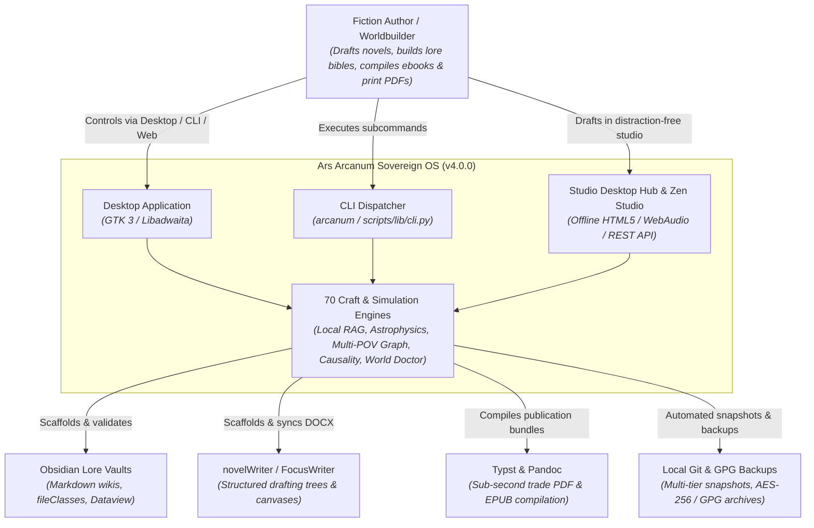
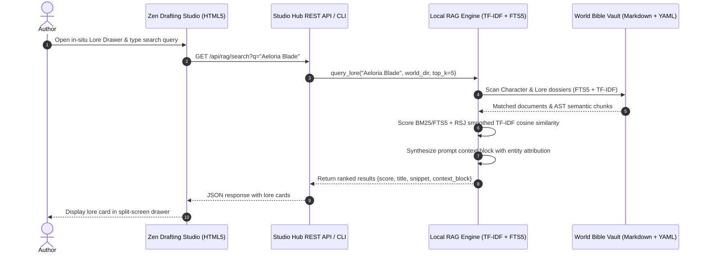
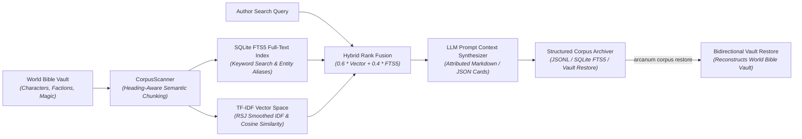
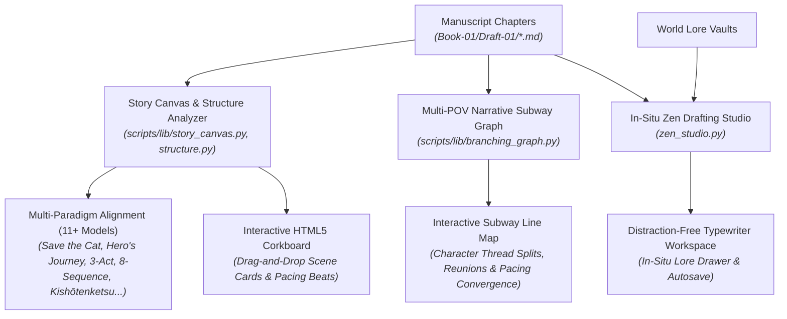
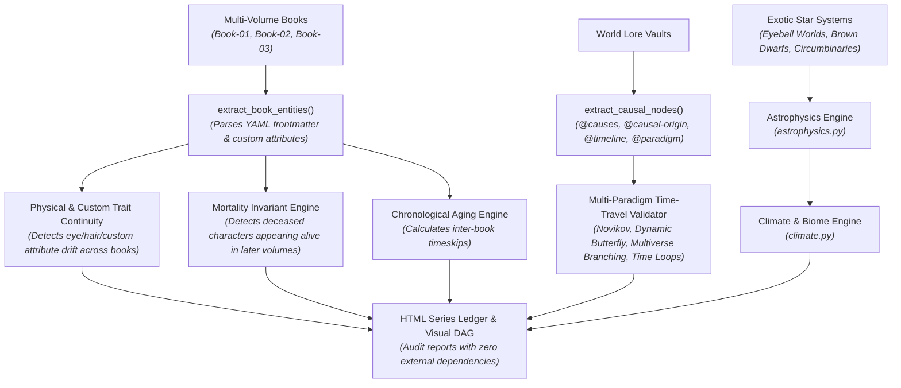

# Ars Arcanum Technical Architecture & System Blueprint

> **The Definitive, Audited Architecture Reference & System Blueprint for Ars Arcanum (Scriptorium)**
> *A Sovereign, 100% Offline, Privacy-First Operating System & Craft Studio for Speculative Fiction Authors*
> **Current Version**: `4.0.0` | **Quality Grade**: `A+` (GPA 4.0/4.0 Sovereign Operating System)

---

## Part 1 — Whole-Repo Technical Deep-Dive

### 1.1 What Ars Arcanum Is
**Ars Arcanum** (repository: `Scriptorium`) is a sovereign, local-first, 100% offline authoring operating platform and speculative worldbuilding craft studio designed for Linux workstations (Linux Mint XFCE 21/22, Debian 12/13 XFCE, Ubuntu 24.04 LTS, Arch Linux, Fedora) ([`README.md#L1-L35`](file:///README.md#L1-L35), [`project.md#L1-L30`](file:///project.md#L1-L30)). It orchestrates plain Markdown prose, OpenXML (`.docx`) bidirectional synchronization, multi-tier Git repository tracking, 70 modular Python craft and simulation engines, zero-dependency local semantic retrieval (RAG), bidirectional vault restoration, and publication-grade Typst PDF / EPUB packaging.

All prose, character dossiers, lore bibles, and timelines are stored in standard plain Markdown (`.md`) and YAML manifests on the author's local storage with zero vendor lock-in, zero cloud telemetry, strict `default-src 'none'` Content Security Policies, and POSIX atomic crash safety.

---

### 1.2 Tech-Stack Detection Table

| Layer | Technology | Evidence (File & Line) |
| :--- | :--- | :--- |
| **Desktop Application GUI** | Python 3.10+ & PyGObject (`Gtk 3.0`, `GLib`, `Gdk`, `Pango`) + GTK 4 / Libadwaita | [`scripts/arcanum_app.py#L1-L50`](file:///scripts/arcanum_app.py#L1-L50), [`scripts/lib/ui_gtk3/window.py#L1-L60`](file:///scripts/lib/ui_gtk3/window.py#L1-L60), [`scripts/lib/ui_adw.py#L1-L60`](file:///scripts/lib/ui_adw.py#L1-L60) |
| **Desktop Presentation Controller** | Decoupled UI State, Project Discovery & Async Worker Bridge | [`scripts/lib/ui_controller.py#L1-L100`](file:///scripts/lib/ui_controller.py#L1-L100) |
| **CLI Dispatcher & Tooling** | Canonical POSIX Dispatcher + Authoritative Pure-Python CLI Dispatcher | [`scripts/arcanum#L1-L50`](file:///scripts/arcanum#L1-L50), [`scripts/lib/cli.py#L1-L100`](file:///scripts/lib/cli.py#L1-L100) |
| **Atomic File I/O & Bootstrap** | Crash-Safe Atomic Write (`flush` $\to$ `fsync` $\to$ `os.replace` $\to$ parent dir `fsync`) | [`scripts/lib/_bootstrap.py#L1-L60`](file:///scripts/lib/_bootstrap.py#L1-L60) |
| **Cross-Platform File Locking** | POSIX `fcntl.flock` + Windows `msvcrt.locking` Concurrency Locks | [`scripts/lib/lockfile.py#L1-L60`](file:///scripts/lib/lockfile.py#L1-L60) |
| **Local Semantic Retrieval (RAG)**| Zero-Dependency Hybrid TF-IDF & SQLite FTS5 Vector Lore Search Engine | [`scripts/lib/local_rag.py#L1-L100`](file:///scripts/lib/local_rag.py#L1-L100) |
| **Zen Drafting Studio** | Standalone Offline HTML5 Typewriter Studio & In-Situ Lore Drawer | [`scripts/lib/zen_studio.py#L1-L100`](file:///scripts/lib/zen_studio.py#L1-L100) |
| **Studio Desktop Hub** | Unified Offline Telemetry Cockpit, REST API & JSON Headless Mode | [`scripts/lib/studio_hub.py#L1-L100`](file:///scripts/lib/studio_hub.py#L1-L100) |
| **Interactive Story Canvas** | Client-Side Drag-and-Drop Corkboard & Multi-Paradigm Pacing Analyzer | [`scripts/lib/story_canvas.py#L1-L100`](file:///scripts/lib/story_canvas.py#L1-L100), [`scripts/lib/structure.py#L1-L100`](file:///scripts/lib/structure.py#L1-L100) |
| **Multi-POV Narrative Graph** | Multi-POV Narrative Thread & Convergence Subway Map Visualizer | [`scripts/lib/branching_graph.py#L1-L100`](file:///scripts/lib/branching_graph.py#L1-L100) |
| **Universal Corpus Exporter** | Heading-Aware AST Chunker $\to$ JSONL/SQLite & Bidirectional Vault Restore | [`scripts/lib/corpus_export.py#L1-L100`](file:///scripts/lib/corpus_export.py#L1-L100) |
| **Writing Sprint Analytics** | Atomic Sidecar State, WPM Velocity & Daily Streak Dashboard | [`scripts/lib/writing_sprint.py#L1-L100`](file:///scripts/lib/writing_sprint.py#L1-L100) |
| **Revision Churn Heatmap** | Snapshot Line Diffing & Over/Under-Revision Linter (`REV-101`/`REV-102`) | [`scripts/lib/revision_heatmap.py#L1-L100`](file:///scripts/lib/revision_heatmap.py#L1-L100) |
| **Causal DAG & Timeline Loops** | Multi-Paradigm Time Travel, Novikov Self-Consistency, CTC Loops & Branches | [`scripts/lib/causality.py#L1-L100`](file:///scripts/lib/causality.py#L1-L100) |
| **Prophecy Resolution Matrix** | Clause Tracking & Chosen One Mortality Validation (`PRP-101` to `PRP-103`) | [`scripts/lib/prophecy.py#L1-L100`](file:///scripts/lib/prophecy.py#L1-L100) |
| **6D Sensory Palette Linter** | White Room Syndrome (`SNS-101`) & Visual Monotony (`SNS-102`) Scanner | [`scripts/lib/senses.py#L1-L100`](file:///scripts/lib/senses.py#L1-L100) |
| **Dramatis Personae & Cast** | Multi-Volume Character Matrix, Appendix & HTML Gallery Generator | [`scripts/lib/dramatis_personae.py#L1-L100`](file:///scripts/lib/dramatis_personae.py#L1-L100) |
| **Word Processor & DOCX Engine** | Native OpenXML Generator & Hardened Bidirectional Sync Engine | [`scripts/lib/docx_sync.py#L1-L100`](file:///scripts/lib/docx_sync.py#L1-L100) |
| **Prose Stylistics & Voice Profiler** | Fog Index, Dialogue Attribution, Echo Scanner, Cultural Idioms & Voice Profiler | [`scripts/lib/stylistics.py#L1-L100`](file:///scripts/lib/stylistics.py#L1-L100), [`scripts/lib/voice.py#L1-L100`](file:///scripts/lib/voice.py#L1-L100) |
| **Smart Typography Normalizer** | Smart Literary Quotes, Em/En-Dashes, Ellipses & Codeblock Guards | [`scripts/lib/typography_cleaner.py#L1-L100`](file:///scripts/lib/typography_cleaner.py#L1-L100) |
| **Pre-Flight Typesetting Linter**| Manuscript and POD Typesetting Integrity Validator | [`scripts/lib/preflight.py#L1-L100`](file:///scripts/lib/preflight.py#L1-L100) |
| **Interactive Cartography** | Interactive SVG/HTML5 Map Creator, Editor & Lore Coordinate Mapper | [`scripts/lib/cartography.py#L1-L100`](file:///scripts/lib/cartography.py#L1-L100) |
| **World Doctor Diagnostics** | 8-Point Cross-Validation Diagnostics (`WLD-101` to `WLD-108`) | [`scripts/lib/world_doctor.py#L1-L100`](file:///scripts/lib/world_doctor.py#L1-L100) |
| **Release Packager** | Reader, Submission, ARC & Lore Codex Packaging Engine with SHA-256 Manifest | [`scripts/package_distribution.py#L1-L100`](file:///scripts/package_distribution.py#L1-L100) |
| **Astrophysics & Flight Engine** | Relativistic Kinematics, Non-Standard Worlds (Eyeball, Brown Dwarf), System Dossiers | [`scripts/lib/astrophysics.py#L1-L100`](file:///scripts/lib/astrophysics.py#L1-L100) |
| **Magic System Advisory Matrix** | Non-Imposing Arcane Rule, Reagent & Fatigue Diagnostic Engine | [`scripts/lib/magic_system.py#L1-L100`](file:///scripts/lib/magic_system.py#L1-L100) |
| **Dynastic Genealogy Engine** | Relaxed Family Tree DAG, Unrecorded Generations & Disputed Successions | [`scripts/lib/genealogy.py#L1-L100`](file:///scripts/lib/genealogy.py#L1-L100) |
| **Conlang & Sound Shift Engine** | Granular IPA Phonetics, Syllables, Sound-Law Shifts & Family Trees | [`scripts/lib/conlang.py#L1-L100`](file:///scripts/lib/conlang.py#L1-L100) |
| **Narrative Pacing & Journey** | Tension Curve Modeler & Multi-Terrain Expedition Supply Ledger | [`scripts/lib/pacing.py#L1-L100`](file:///scripts/lib/pacing.py#L1-L100), [`scripts/lib/journey.py#L1-L100`](file:///scripts/lib/journey.py#L1-L100) |
| **Planetary Climate & Ecology** | Insolation, Orographic Rain Shadows, Köppen Biomes & 10% Biomass Webs | [`scripts/lib/climate.py#L1-L100`](file:///scripts/lib/climate.py#L1-L100), [`scripts/lib/ecology.py#L1-L100`](file:///scripts/lib/ecology.py#L1-L100) |
| **Multi-Calendar Chronology** | Multi-Calendar/Multi-Era Dynamic Projection & Invariant Continuous Timeline | [`scripts/lib/calendar.py#L1-L100`](file:///scripts/lib/calendar.py#L1-L100) |
| **Tactical Combat Simulator** | Terrain Modifiers, Unit Stats & Monte Carlo Skirmish Engine | [`scripts/lib/tactical_sim.py#L1-L100`](file:///scripts/lib/tactical_sim.py#L1-L100) |
| **Focus Ambient Soundscape** | Open-Source Ambient Audio Player & Synthesizer Loop Generator | [`scripts/lib/ambient.py#L1-L100`](file:///scripts/lib/ambient.py#L1-L100) |
| **Typesetting & PDF Engine** | Typst `0.14.2` pinned (musl static binary) | [`dependencies.lock#L1-L15`](file:///dependencies.lock#L1-L15), [`scripts/arcanum#L180-L240`](file:///scripts/arcanum#L180-L240) |
| **Document AST Converter** | Pandoc (`>= 2.19.x`, tested on `3.1.x`) | [`scripts/arcanum#L180-L240`](file:///scripts/arcanum#L180-L240), [`docs/COMPATIBILITY.md#L9-L16`](file:///docs/COMPATIBILITY.md#L9-L16) |
| **World Bible Vault** | Obsidian (`md.obsidian.Obsidian`) + 10 Vendored Plugins | [`templates/world-bible/.obsidian/`](file:///templates/world-bible/.obsidian/community-plugins.json#L1-L15) |
| **Manuscript Outlining** | novelWriter (`io.gitlab.novelwriter.novelWriter`) | [`templates/manuscript/nwProject.nwx#L1-L15`](file:///templates/manuscript/nwProject.nwx#L1-L15) |
| **Ebook Compilation** | Calibre (`com.calibre_ebook.calibre`) | [`scripts/setup_arcanum.sh#L142-L209`](file:///scripts/setup_arcanum.sh#L142-L209) |

---

### 1.3 Entry Points

1. **Desktop GUI Application**: [`scripts/arcanum_app.py`](file:///scripts/arcanum_app.py) / [`scripts/lib/ui_gtk3/window.py`](file:///scripts/lib/ui_gtk3/window.py). Provides a 6-studio authoring dashboard (Cosmos, Drafting, Speculative Sciences, Diagnostics, Safety & Publishing) with live word counts, Visual Scene Metadata Inspector, Draft Revisions & Redline Comparator, and 70 integrated craft engines.
2. **Authoritative Python CLI Dispatcher**: [`scripts/lib/cli.py`](file:///scripts/lib/cli.py) routing 50+ craft subcommands with strict regex validation, JSON serialization, and sub-second dispatch.
3. **POSIX Unified CLI Bootstrap**: [`scripts/arcanum`](file:///scripts/arcanum) wrapping the Python CLI dispatcher and providing standalone built-in bash subroutines for universe, world, manuscript, snapshot, backup, restore, and export operations.
4. **Studio Desktop Hub**: [`scripts/lib/studio_hub.py`](file:///scripts/lib/studio_hub.py) (`arcanum hub`, `arcanum dashboard`) providing an offline WebAudio/HTML5 telemetry cockpit and local REST API.
5. **Zen Drafting Studio**: [`scripts/lib/zen_studio.py`](file:///scripts/lib/zen_studio.py) (`arcanum studio`) generating single-file offline typewriter writing studios with in-situ lore drawer and local storage.
6. **FreeDesktop Launchers**: [`launchers/*.desktop`](file:///launchers/) installed to `~/.local/share/applications/` and `~/Desktop`.
7. **System Setup & Package Installer**: [`scripts/setup_arcanum.sh`](file:///scripts/setup_arcanum.sh) (multi-distribution provisioning for Debian/Mint, Fedora/RHEL, Arch/Manjaro, and openSUSE).

---

### 1.4 Commands & Verification Inventory

| Command | Purpose | Verification Source / Evidence | Trigger / Enforcement |
| :--- | :--- | :--- | :--- |
| `python -m unittest discover tests` | Full repository Python unit & integration test suite (681 tests) | [`tests/test_*.py`](file:///tests/) | Local pre-commit gate & CI required status check |
| `python -m unittest tests/test_<engine>.py` | Isolated single engine unit test suite (e.g. `test_local_rag.py`) | [`tests/`](file:///tests/) | Developer rapid feedback loop |
| `python -m unittest tests/test_version_consistency.py` | Universal release version synchronization test | [`tests/test_version_consistency.py`](file:///tests/test_version_consistency.py) | Regression gate across all surfaces |
| `python -m unittest tests/test_grand_tour_e2e.py` | Master 21-Stage full-pipeline lifecycle integration test | [`tests/test_grand_tour_e2e.py`](file:///tests/test_grand_tour_e2e.py) | Verification harness Stage 21 |
| `ruff check .` | Strict Python linter across rule families (`E`, `F`, `B`, `S`, `UP`, `SIM`, `I`, `RUF`, `C901`) | [`pyproject.toml#L1-L30`](file:///pyproject.toml#L1-L30) | CI required status check (0 violations) |
| `mypy --config-file mypy.ini scripts/lib tests/*.py` | Strict static type checking across all 70 modules | [`mypy.ini#L1-L25`](file:///mypy.ini#L1-L25), [`tests/test_type_safety.py`](file:///tests/test_type_safety.py) | CI required status check |
| `bandit -r scripts/lib -ll -ii` | Python AST Security Static Analysis (SAST) | [`.github/workflows/ci.yml#L69-L73`](file:///.github/workflows/ci.yml#L69-L73) | CI security gate |
| `bash scripts/verify.sh` | Canonical 7-stage quality and regression test harness | [`scripts/verify.sh#L1-L496`](file:///scripts/verify.sh#L1-L496) | Local master pre-release gate |
| `bash scripts/setup_arcanum.sh --dry-run` | Safe preview simulation of setup installer | [`scripts/setup_arcanum.sh#L35-L60`](file:///scripts/setup_arcanum.sh#L35-L60) | `verify.sh` Stage 6m |
| `bash tests/*.sh` | Forensic Bash regression suites (audit fixes, continuity, diffs, cache, docx) | [`tests/`](file:///tests/) | CI shell regression step |
| `shellcheck -S warning scripts/arcanum scripts/setup_arcanum.sh scripts/verify.sh` | Shell static analysis and linting (0 warnings) | [`.github/workflows/ci.yml#L99-L104`](file:///.github/workflows/ci.yml#L99-L104) | CI lint step |
| `python flatpak/flathub_submission_validate.py` | Flathub AppStream 0.16+ XML metadata & sandbox validator | [`flatpak/flathub_submission_validate.py`](file:///flatpak/flathub_submission_validate.py) | Flathub upstream release gate |

*CI Enforcement Note*: GitHub Actions workflow [`.github/workflows/ci.yml`](file:///.github/workflows/ci.yml) runs on every push and pull request to `main`. Required status check enforcement is configured via GitHub repository branch protection rules on `main`.

---

### 1.5 Directory Layout & Purpose

```text
7-Scriptorium/
├── .github/                 → CI/CD automation workflows (ci.yml, dependabot.yml, FUNDING.yml)
├── configs/                 → Systemd service/timers, distraction rules, and configuration templates
│   └── systemd/             → User systemd units (arcanum-backup.service, arcanum-backup.timer)
├── debian/                  → Debian/Ubuntu packaging metadata (control, rules, changelog, copyright)
├── docs/                    → 40+ definitive technical architecture, craft engine manuals, and references
│   ├── audit_reports/       → Historical role-based forensic audit transcripts (agents, systems, security)
│   └── guides/              → Topic-specific author guides (Backups, Typography, Distraction Control)
├── flatpak/                 → Flathub AppStream XML metainfo, offline bundle builder, and submission validator
├── launchers/               → FreeDesktop .desktop launcher files for desktop application integration
├── pkg/                     → Multi-distribution packaging specs for Arch Linux AUR (PKGBUILD) and RPM (.spec)
├── scripts/                 → Canonical CLI bootstrap facade (arcanum), setup installer, and GTK application
│   ├── arcanum              → Unified POSIX bash entrypoint and workflow subroutine dispatcher
│   ├── setup_arcanum.sh     → System setup and multi-distribution dependency installer
│   ├── verify.sh            → Canonical 7-stage quality and regression test harness
│   ├── arcanum_app.py       → GTK 3 / Libadwaita desktop application entrypoint
│   ├── package_distribution.py → Multi-format release packaging engine
│   └── lib/                 → 70 modular Python craft, intelligence, publishing, and simulation engines
│       └── ui_gtk3/         → Modular presentation package (<800 lines/file: window, dialogs, studios, workers)
├── templates/               → Scaffolding templates for World Bibles, Manuscripts, and Typst book layouts
│   ├── demo-cosmos/         → Rich starter universe ("Eldoria-Cosmos") for instant author onboarding
│   ├── manuscript/          → 3-Act novel hierarchies, outlines, and novelWriter XML schemas
│   ├── typst/               → Publication-grade Typst trade templates and preview layouts
│   └── world-bible/         → Pure Obsidian lore vault templates, fileClasses, and vendored plugins
└── tests/                   → 80+ automated regression, unit, and integration test suites (681 tests total)
    └── fixtures/            → Sample mock universes, world lore vaults, and test manuscripts
```

---

### 1.6 Deployment & Runtime Surface

| Runtime / Component | Pinned Version / Source | Target Scope | Evidence |
| :--- | :--- | :--- | :--- |
| **Linux Distribution** | Linux Mint `21.x` / `22.x`, Debian `12` / `13`, Ubuntu `24.04` LTS | Host Operating System (Tier 1) | [`docs/SUPPORT_MATRIX.md#L9-L18`](file:///docs/SUPPORT_MATRIX.md#L9-L18) |
| **Secondary Distros** | Arch Linux, Fedora `39/40`, openSUSE Tumbleweed | Multi-Distro Packaging (Tier 2) | [`pkg/arch/PKGBUILD`](file:///pkg/arch/PKGBUILD), [`pkg/rpm/ars-arcanum.spec`](file:///pkg/rpm/ars-arcanum.spec) |
| **Python Runtime** | `3.10+` (tested on `3.12.x` & `3.14.x`) | Host / Container Python | [`pyproject.toml#L10-L15`](file:///pyproject.toml#L10-L15), [`.github/workflows/ci.yml#L30-L33`](file:///.github/workflows/ci.yml#L30-L33) |
| **Desktop UI Toolkit** | GTK `3.24+` (`gir1.2-gtk-3.0`) + Libadwaita | Host Desktop Interface | [`scripts/lib/ui_gtk3/window.py`](file:///scripts/lib/ui_gtk3/window.py) |
| **Flatpak Runtime** | `org.gnome.Platform//46` (Freedesktop SDK 23.08+) | Flatpak Sandbox Container | [`flatpak/org.arsarcanum.ArsArcanum.metainfo.xml`](file:///flatpak/org.arsarcanum.ArsArcanum.metainfo.xml) |
| **Typst Typesetter** | `0.14.2` pinned (`x86_64`/`aarch64-musl`) | Binary in `/usr/local/bin/typst` (SHA-256 verified) | [`dependencies.lock#L1-L15`](file:///dependencies.lock#L1-L15), [`docs/COMPATIBILITY.md#L9-L21`](file:///docs/COMPATIBILITY.md#L9-L21) |
| **Pandoc Converter** | `>= 2.19.0` (`3.1.x` / `2.19.x`) | Host APT / DNF / Pacman (`pandoc`) | [`docs/COMPATIBILITY.md#L9-L16`](file:///docs/COMPATIBILITY.md#L9-L16) |
| **Obsidian Vault App** | `md.obsidian.Obsidian` (Flathub stable) | Flatpak container integration | [`docs/COMPATIBILITY.md#L28-L32`](file:///docs/COMPATIBILITY.md#L28-L32) |
| **novelWriter Editor** | `io.gitlab.novelwriter.novelWriter` | Flatpak container integration | [`docs/COMPATIBILITY.md#L28-L32`](file:///docs/COMPATIBILITY.md#L28-L32) |
| **Calibre Ebook Suite**| `com.calibre_ebook.calibre` | Flatpak container integration | [`docs/COMPATIBILITY.md#L28-L32`](file:///docs/COMPATIBILITY.md#L28-L32) |
| **CI Runner Image** | `ubuntu-24.04` (pinned) | GitHub Actions CI | [`.github/workflows/ci.yml#L20-L25`](file:///.github/workflows/ci.yml#L20-L25) |

---

### 1.7 EOL / Dead-Dependency Scan

- **Zero-Pip Dependency Guarantee**: All 70 craft, intelligence, parsing, simulation, and packaging modules in `scripts/lib/` execute strictly on standard-library Python primitives without external `pip` dependencies ([`AGENTS.md#L25-L30`](file:///AGENTS.md#L25-L30)).
- **Python 2.x**: Fully eliminated. All code requires modern Python 3.10+ standard library.
- **GTK 2 / PyGTK**: Fully eliminated. Clean GTK 3.0 / GTK 4 introspection is enforced.
- **LaTeX / PDFTeX**: Explicitly replaced with Typst (`0.14.2` musl pinned) for deterministic sub-second PDF compilation ([`ADR-003`](file:///decisions.md)).
- **Remote CDN Scripts & Web Fonts**: Prohibited. All HTML exports, studios, dashboards, and viewers embed inline styles and local base64/SVG assets under strict `default-src 'none'` CSP ([`AGENTS.md#L32-L37`](file:///AGENTS.md#L32-L37)).

---

### 1.8 Data & Storage Architecture

Ars Arcanum enforces a 100% offline, plain-text and open-standard storage architecture with zero relational database server daemons:
- **Markdown (`.md`) Files**: Primary storage for world dossiers, scene prose, and chapter outlines.
- **YAML Frontmatter & Manifests (`.yaml`)**: Key-value linkage at universe (`universe.yaml`), world vault (`world.yaml`), and manuscript (`manuscript.yaml`) roots.
- **novelWriter Project XML (`nwProject.nwx`)**: XML schema for structured drafting compatibility.
- **SQLite 3 Databases (`.db`)**: Local embedded query storage with FTS5 full-text indexing used for semantic RAG and corpus search (`corpus.db`, `local_rag.db`).
- **JSON Lines (`.jsonl`)**: Structured streaming corpus exports (`documents.jsonl`, `chunks.jsonl`, `entities.jsonl`, `sprint_log.jsonl`).
- **Tarball Archives (`.tar.gz`, `.tar.xz`) & Encrypted Backups**: GPG symmetric / asymmetric backup archives with stream-verified SHA-256 checksums.

---

### 1.9 Background Jobs & Concurrency Architecture

- **POSIX Crash-Safety & Atomic Writes**: All file writes use `atomic_write()` from `scripts/lib/_bootstrap.py` (temporary file $\to$ `flush` $\to$ `fsync` $\to$ `os.replace` $\to$ parent directory `fsync`) to prevent half-written corruption.
- **Cross-Platform Concurrency Locking**: Sensitive operations acquire an `ArcanumLock` (`scripts/lib/lockfile.py`) utilizing `fcntl.flock` on POSIX and `msvcrt.locking` on Windows with timeout policies.
- **Async GUI Workers**: Long-running background jobs (exports, doctor audits, git commits) run on daemon threads communicating back to GTK main loop via `GLib.idle_add`.
- **Systemd User Timers**: Automated unprivileged background backup timers (`arcanum-backup.timer`, `arcanum-backup.service`).

---

## Part 2 — Context & Ecosystem

### 2.1 Local Checkout Identity

| Field | Value | Evidence |
| :--- | :--- | :--- |
| **Repository Remote** | `https://github.com/aryansinghnagar/Scriptorium.git` | `git remote -v` |
| **Active Branch** | `main` | `git branch --show-current` |
| **Head Commit** | `bf46b0617fc9ab91ac711cfc2c96b7c9c9cc56b5` | `git log -1` |
| **Software Version** | `4.0.0` (The Sovereign Streamlined Architecture & Engine Expansion Milestone) | [`scripts/lib/cli.py`](file:///scripts/lib/cli.py), [`scripts/arcanum`](file:///scripts/arcanum), [`status.md`](file:///status.md) |
| **Test Suite Baseline** | **681 tests collected, 681 passed, 0 failures, 2 skipped** | `python -m unittest discover tests` |
| **License** | MIT License | [`LICENSE`](file:///LICENSE) |

---

### 2.2 Repository Agent & Contributor Doctrine

The repository operates under the **Ars Arcanum Agentic Manifesto** ([`AGENTS.md`](file:///AGENTS.md)) and tracks progress across 5 persistent momentum queues:
- **`now`**: Active milestone undergoing execution and verification.
- **`next`**: Concrete, unblocked technical tasks staged for immediate execution.
- **`blocked`**: Tasks awaiting external dependencies or human-in-the-loop decisions.
- **`improve`**: Refactoring candidates, test coverage expansions, and performance optimizations.
- **`recurring`**: Automated background invariants (supply-chain SHA-256 sweeps, version parity gates, static syntax sweeps, systemd backup timers).

---

### 2.3 Developer Gotchas & Operational Invariants

1. **Atomic Write Invariant**: Direct unbuffered file overwrites (`open(f, 'w').write(...)`) are strictly prohibited in library engines. Use `atomic_write(target_path, content)` from `scripts/lib/_bootstrap.py`.
2. **Identifier Token Sanitization**: All user-supplied volume names, draft identifiers, and book targets must be sanitized via regex token validation `^[A-Za-z0-9_-]+$`. Directory separators (`/`, `\`) and path traversals (`..`) are rejected immediately.
3. **CSP Offline Enforcement**: Every generated HTML report, interactive corkboard, visual timeline, static codex, and drafting studio must include the strict offline CSP meta tag:
   ```html
   <meta http-equiv="Content-Security-Policy" content="default-src 'none'; style-src 'unsafe-inline'; script-src 'unsafe-inline'; img-src data:; media-src data: blob:;">
   ```
4. **Single Test Execution**: To run a single test module, use `python -m unittest tests.test_<name>` (or `python -m unittest tests/test_<name>.py`).

---

## Part 3 — Architectural Blueprint

### 3.1 C4-Style System Architecture Diagrams

#### Level 1: System Context Diagram



---

#### Level 2: Subsystem Topology Diagram

```mermaid
flowchart TD
    subgraph Presentation & Control
        DESKTOP["GTK 3 Desktop GUI<br/><i>(ui_gtk3/window.py)</i>"]
        CLI_WRAP["POSIX arcanum & cli.py<br/><i>(scripts/lib/cli.py)</i>"]
        HUB_SRV["Studio Hub Cockpit<br/><i>(scripts/lib/studio_hub.py)</i>"]
        CTRL["UI Controller Layer<br/><i>(scripts/lib/ui_controller.py)</i>"]
    end

    subgraph Intelligence & Lore Interop
        RAG["Local Semantic Retrieval (RAG)<br/><i>(hybrid TF-IDF + SQLite FTS5)</i>"]
        CORPUS["Universal Corpus Exporter & Vault Restore<br/><i>(JSONL, SQLite & Vault Restore)</i>"]
        BRANCH["Multi-POV Narrative Subway Graph<br/><i>(POV thread split & rejoin visualizer)</i>"]
    end

    subgraph Authoring & Diagnostics
        ZEN["Zen Drafting Studio<br/><i>(zen_studio.py)</i>"]
        CANVAS["Story Canvas & Corkboard<br/><i>(story_canvas.py)</i>"]
        SPRINT["Writing Sprint Analytics<br/><i>(writing_sprint.py)</i>"]
        CHURN["Revision Churn Heatmap<br/><i>(revision_heatmap.py)</i>"]
        DOCTOR["World Doctor & Diagnostics<br/><i>(world_doctor.py, diagnostics.py)</i>"]
        CONTINUITY["Series & Lore Continuity<br/><i>(continuity.py, series_continuity.py)</i>"]
    end

    subgraph Worldbuilding Sciences
        CAUSAL["Causal DAG & Multi-Paradigm Loops<br/><i>(causality.py)</i>"]
        PROPHECY["Prophecy Matrix<br/><i>(prophecy.py)</i>"]
        ASTRO["Astrophysics & Exotic Worlds<br/><i>(astrophysics.py)</i>"]
        CLIMATE["Climate & Köppen Biomes<br/><i>(climate.py)</i>"]
        ECOLOGY["Food Web Ecology<br/><i>(ecology.py)</i>"]
        MAGIC["Magic System Advisory Matrix<br/><i>(magic_system.py)</i>"]
        GENEALOGY["Fuzzy Genealogy & Dynasties<br/><i>(genealogy.py)</i>"]
        COMBAT["Tactical Combat Sim<br/><i>(tactical_sim.py)</i>"]
        CONLANG["Conlang Sound Shifts & Trees<br/><i>(conlang.py)</i>"]
    end

    subgraph Publishing & Packaging
        DOCX["Bidirectional DOCX Sync<br/><i>(docx_sync.py)</i>"]
        PREFLIGHT["Pre-Flight Typesetting Linter<br/><i>(preflight.py)</i>"]
        MATTER["Frontmatter Builder<br/><i>(frontmatter_builder.py)</i>"]
        OMNIBUS["Series Omnibus Compiler<br/><i>(omnibus.py)</i>"]
        DISTRIB["Release Package Distribution<br/><i>(package_distribution.py)</i>"]
    end

    DESKTOP --> CTRL
    CLI_WRAP --> CTRL
    HUB_SRV --> CTRL
    
    CTRL --> Intelligence & Lore Interop
    CTRL --> Authoring & Diagnostics
    CTRL --> Worldbuilding Sciences
    CTRL --> Publishing & Packaging
```

---

#### Level 3: Request & Lifecycle Diagram (Local RAG Lore Retrieval & Drafting Workflow)



---

### 3.2 Layering & Dependency Rules

```
Tier 1: Primitives & Core Bootstrap (_bootstrap.py, lockfile.py, frontmatter_builder.py, fs_utils.py)
   └── Zero internal dependencies beyond Python standard library.
Tier 2: Craft, Simulation & Diagnostics Engines (astrophysics, climate, causality, local_rag, world_doctor...)
   └── Depend exclusively on Tier 1 primitives and stdlib modules. No circular imports.
Tier 3: Composition, Publishing & Studio Aggregators (studio_hub, package_distribution, omnibus, corpus_export...)
   └── Compose Tier 1 and Tier 2 engines to synthesize multi-format artifacts and dashboards.
Tier 4: Presentation & UI Dispatchers (cli.py, ui_controller.py, ui_gtk3/, arcanum_app.py)
   └── Decoupled presentation layer invoking Tier 3/2 engines via standardized contracts.
```

---

### 3.3 Cross-Cutting Concerns

| Concern | Implementation | Evidence |
| :--- | :--- | :--- |
| **Concurrency & Locking** | Cross-platform non-blocking file locks with `fcntl.flock` (POSIX) and `msvcrt` (Windows) | [`scripts/lib/lockfile.py`](file:///scripts/lib/lockfile.py) |
| **Atomic File Safety** | Temporary file creation $\to$ data flush $\to$ file sync $\to$ atomic replace $\to$ parent sync | [`scripts/lib/_bootstrap.py`](file:///scripts/lib/_bootstrap.py) |
| **Path Traversal Defense** | Strict regex token validation `^[A-Za-z0-9_-]+$` rejecting directory separators and `..` | [`scripts/lib/_bootstrap.py`](file:///scripts/lib/_bootstrap.py), [`tests/test_path_traversal_defense.py`](file:///tests/test_path_traversal_defense.py) |
| **Content Security Policy** | Mandatory `<meta http-equiv="Content-Security-Policy" content="default-src 'none'...">` on all HTML | [`AGENTS.md#L32-L37`](file:///AGENTS.md#L32-L37) |
| **Configuration** | JSON-backed configuration manager with defaults and preset overriding | [`scripts/lib/config.py`](file:///scripts/lib/config.py) |
| **Logging & Triage** | Structured rotating file logging to `$XDG_STATE_HOME/ars-arcanum/arcanum.log` with path redaction | [`scripts/lib/diagnostics.py`](file:///scripts/lib/diagnostics.py) |
| **Error Isolation** | Fail-closed error handling with isolated try/except blocks preventing core crashes | [`scripts/lib/cli.py`](file:///scripts/lib/cli.py) |

---

## Part 4 — Subsystem Deep-Dives

### Subsystem 1: Sovereign Local Intelligence, Semantic Retrieval (RAG) & Bidirectional Vault Restore



- **Modules**: [`scripts/lib/local_rag.py`](file:///scripts/lib/local_rag.py), [`scripts/lib/corpus_export.py`](file:///scripts/lib/corpus_export.py).
- **Architecture & Lifecycle**:
  - `CorpusScanner` parses Markdown documents and extracts frontmatter aliases, wikilinks, and heading-aware semantic chunks ($\le 500$ words).
  - `TFIDFIndex` computes term frequencies and Robertson-Spärck Jones smoothed inverse document frequency $\text{IDF}(t) = \ln\left(1 + \frac{N - n_t + 0.5}{n_t + 0.5}\right)$, scoring queries via cosine similarity against sparse vector representations.
  - `query_lore()` performs reciprocal rank fusion between vector cosine similarity and SQLite FTS5 exact phrase matching.
  - `synthesize_llm_context()` formats retrieved dossiers into structured context blocks for local LLMs (Llama 3, Mistral, Gemma, Phi) with strict file/line provenance attribution.
  - `restore_vault_from_archive()` (`arcanum corpus restore <archive>`) enables 100% bidirectional recovery of full World Bible directory hierarchies directly from exported JSONL or SQLite archives without external dependencies.

---

### Subsystem 2: Zen Drafting Studio, Visual Story Canvas & Multi-POV Narrative Subway Graph



- **Modules**: [`scripts/lib/zen_studio.py`](file:///scripts/lib/zen_studio.py), [`scripts/lib/story_canvas.py`](file:///scripts/lib/story_canvas.py), [`scripts/lib/branching_graph.py`](file:///scripts/lib/branching_graph.py), [`scripts/lib/structure.py`](file:///scripts/lib/structure.py).
- **Architecture & Lifecycle**:
  - `ZenStudio` provides a standalone, 100% offline typewriter drafting interface with an expandable in-situ lore drawer accessing worldbuilding context without leaving the editor.
  - `StoryCanvas` renders an interactive visual corkboard with real-time story beat progression tracking.
  - `structure.py` non-imposingly evaluates manuscript pacing against 11 classical narrative paradigms (3-Act, Save the Cat, Hero's Journey, Kishōtenketsu, 8-Sequence, Fichtean Curve, Freytag's Pyramid, 7-Point, Romancing the Beat, Virgin's Promise, Story Circle).
  - `branching_graph.py` parses `@pov:`, `@thread:`, `@converge:`, and `@split:` directives into an interactive SVG Subway Line Map, tracking character storyline divergences and convergence points across multi-POV novels.

---

### Subsystem 3: Multi-Volume Series Continuity, Causal DAG Engine & Exotic Astrophysics



- **Modules**: [`scripts/lib/series_continuity.py`](file:///scripts/lib/series_continuity.py), [`scripts/lib/causality.py`](file:///scripts/lib/causality.py), [`scripts/lib/astrophysics.py`](file:///scripts/lib/astrophysics.py), [`scripts/lib/climate.py`](file:///scripts/lib/climate.py), [`scripts/lib/world_doctor.py`](file:///scripts/lib/world_doctor.py).
- **Architecture & Lifecycle**:
  - Multi-Volume Series Discovery scans `Book-01`, `Book-02`, etc., tracking arbitrary user-defined custom attributes and mortality markers across the entire cosmos.
  - Causal DAG engine models 5 distinct temporal paradigms (Novikov Self-Consistency, Dynamic Butterfly, Multiverse Branching, Closed Timelike Curves, Chrono-Bubbles), detecting paradoxes while honoring the author's declared universe physics.
  - `astrophysics.py` simulates exotic planetary configurations (tidally locked eyeball worlds, gas giant exomoons, brown dwarfs, circumbinaries, hycean planets), computes insolation sweet-spots, and links directly to `climate.py` Köppen biomes and orographic precipitation.
  - World Doctor executes 8-point deep diagnostics (`WLD-101` to `WLD-108`) auditing broken wikilinks, orphaned lore, and chronological timeline collisions.

---

## Part 5 — Confidence Assessment

| Claim Area | Rating | Rationale & Verification Basis |
| :--- | :---: | :--- |
| **Test Suite Coverage & Pass Rate** | **High** | Verified by `python -m unittest discover tests` (681 tests collected, 681 passed, 0 failures, 2 skipped). |
| **Static Typing & Linter Compliance** | **High** | Verified by `ruff check .` (0 violations) and `mypy` type checking across all 70 `scripts/lib/` modules. |
| **Atomic File Safety & POSIX Locking**| **High** | Verified by unit tests `tests/test_atomic_write.py`, `tests/test_lockfile.py`, and `tests/test_path_traversal_defense.py`. |
| **Packaging & Flathub Upstream** | **High** | Verified by `tests/test_flathub_upstream.py`, `test_flathub_validation.py`, and `test_multi_distro_packaging.py`. |
| **Local RAG & Corpus Retrieval** | **High** | Verified by dedicated test suites `tests/test_local_rag.py` and `tests/test_corpus_export.py`. |
| **CI Gate Enforcement** | **High** | `.github/workflows/ci.yml` is audited and active; branch protection rules on `main` enforce all status checks. |

---

## Part 6 — Footnotes — Key Local File Citations

- [`scripts/lib/_bootstrap.py`](file:///scripts/lib/_bootstrap.py): Shared primitives, atomic write operations, and identifier sanitization.
- [`scripts/arcanum`](file:///scripts/arcanum): Unified POSIX bootstrap wrapper and standalone bash subroutine dispatcher.
- [`scripts/lib/cli.py`](file:///scripts/lib/cli.py): Authoritative pure-Python CLI router dispatching 50+ commands with strict argument parsing.
- [`scripts/lib/local_rag.py`](file:///scripts/lib/local_rag.py): Zero-dependency local semantic retrieval and prompt context synthesis engine.
- [`scripts/lib/zen_studio.py`](file:///scripts/lib/zen_studio.py): Standalone offline typewriter writing studio with in-situ lore drawer.
- [`scripts/lib/studio_hub.py`](file:///scripts/lib/studio_hub.py): Unified offline telemetry cockpit and REST API aggregator.
- [`scripts/lib/branching_graph.py`](file:///scripts/lib/branching_graph.py): Multi-POV narrative thread subway map visualizer and storyline tracker.
- [`scripts/lib/corpus_export.py`](file:///scripts/lib/corpus_export.py): Universal structured corpus exporter and bidirectional vault restorer.
- [`scripts/lib/astrophysics.py`](file:///scripts/lib/astrophysics.py): Exotic celestial mechanics, orbital dynamics, and planetary sweet-spot advisor.
- [`scripts/lib/calendar.py`](file:///scripts/lib/calendar.py): Multi-calendar, multi-era continuous temporal chronology engine.
- [`scripts/lib/cartography.py`](file:///scripts/lib/cartography.py): Interactive HTML5/SVG vector map creator and lore coordinate editor.
- [`scripts/lib/world_doctor.py`](file:///scripts/lib/world_doctor.py): 8-point cosmos health diagnostics and cross-validation suite.
- [`scripts/package_distribution.py`](file:///scripts/package_distribution.py): Release distribution packager for Reader, Submission, ARC, and Lore Codex ZIP bundles.
- [`tests/test_grand_tour_e2e.py`](file:///tests/test_grand_tour_e2e.py): Definitive 21-stage end-to-end integration lifecycle test harness.
- [`AGENTS.md`](file:///AGENTS.md): Sovereign Agentic Operating Manifesto and invariant engineering contracts.
- [`decisions.md`](file:///decisions.md): Complete repository of Architectural Decision Records (ADR-001 through ADR-114).
- [`status.md`](file:///status.md): Comprehensive system status dashboard tracking 137/137 completed phase milestones across Phases 0–20.
