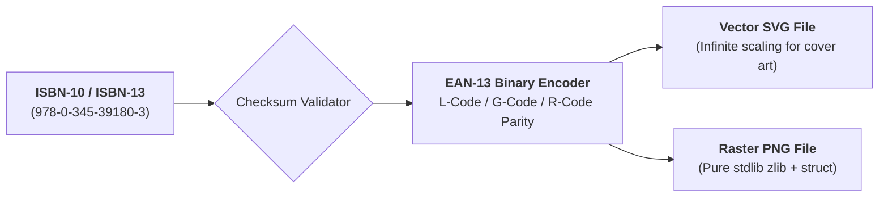

# Ars Arcanum ISBN-13 & EAN-13 Vector SVG/PNG Barcode Engine (`docs/BARCODE.md`)
> **Print-Ready Vector SVG & Raster PNG Bookland Barcodes (PUB-102)** | Release v3.6.0

---

## 1. Overview & Publishing Standards

The **Barcode Engine** (`arcanum barcode` / `scripts/lib/barcode.py`) generates publishing-grade vector SVG and raster PNG Bookland EAN-13 barcodes directly from standard library Python primitives without external image libraries or network calls.

Book distributors, IngramSpark, Amazon KDP, and traditional offset printers require crisp, high-contrast EAN-13 barcodes on the back cover of print books, encoded with standard start/center/stop guard bar descenders and human-readable ISBN typography.



---

## 2. Checksum Algorithm & EAN-13 Binary Encoding

### 2.1 Modulo-10 Weighted Checksum
For a 12-digit base sequence $d_1 d_2 \dots d_{12}$:
$$\text{Sum} = \sum_{i=1}^{12} d_i \times (1 \text{ if } i \text{ is odd else } 3)$$
$$\text{Check Digit } d_{13} = (10 - (\text{Sum} \bmod 10)) \bmod 10$$

### 2.2 Guard Bar & Parity Architecture
- **Quiet Zones**: 9 modules of whitespace before start and after stop guards.
- **Start Guard**: `101` (descends below data bars).
- **Left 6 Digits**: Encoded using L-Code (odd parity) or G-Code (even parity) based on the first digit parity sequence table.
- **Center Guard**: `01010` (descends below data bars).
- **Right 6 Digits**: Encoded using R-Code (even parity / C-parity).
- **Stop Guard**: `101` (descends below data bars).

---

## 3. CLI Invocation & Options

```bash
# Generate vector SVG barcode for print cover design
arcanum barcode 978-0-345-39180-3 -o cover_barcode.svg

# Generate raster PNG barcode with 2x scaling
arcanum barcode 978-0-345-39180-3 -o cover_barcode.png -s 2.0

# Automatic ISBN-10 to ISBN-13 conversion and generation
arcanum barcode 0-345-39180-2 -o converted_barcode.svg

# Output JSON validation metadata
arcanum barcode 978-0-345-39180-3 --json
```

---

## 4. Zero-Dependency & Pure-Python Invariants
- **No External Image Libraries**: PNG bytes are encoded directly using Python standard library `struct` and `zlib` (RFC 1950 deflate compression with IHDR, IDAT, and IEND chunks).
- **Vector Scalability**: SVG output utilizes crisp `<rect>` elements that scale cleanly in vector design tools (Adobe InDesign, Illustrator, Affinity Publisher, Inkscape).
- **Strict Offline Guarantee**: 100% offline generation with zero external font or web service dependencies.
