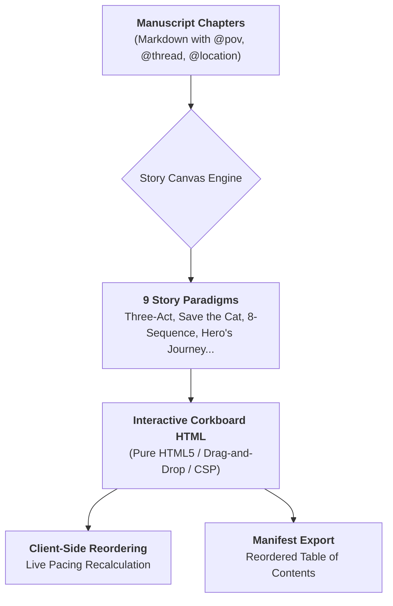

# Ars Arcanum Story Canvas & Interactive Narrative Corkboard (`docs/CANVAS_GUIDE.md`)
> **Visual Multi-Paradigm Beat Board & Scene Pacing Engine (STC-101)** | Release v3.6.0

---

## 1. Overview & Visual Architecture

The **Story Canvas** (`arcanum canvas` / `scripts/lib/story_canvas.py`) compiles novel manuscripts into a **standalone, zero-dependency, 100% offline interactive HTML5 corkboard**.

It maps scenes and chapters across structural narrative beats using 9 industry-standard storytelling paradigms, giving authors a spatial, tactile overview of plot progression, character POV balance, and pacing harmony.



---

## 2. Supported Storytelling Paradigms

The Story Canvas engine supports 9 architectural paradigms:

| Paradigm Identifier | Paradigm Name | Beat / Act Columns |
| :--- | :--- | :--- |
| `three_act` | **Three-Act Structure** | Act I: Setup (25%) $\to$ Act II-A: Rising (25%) $\to$ Act II-B: Crisis (25%) $\to$ Act III: Climax & Resolution (25%) |
| `save_the_cat` | **Save the Cat! (Blake Snyder)** | Opening Image $\to$ Theme $\to$ Catalyst $\to$ Debate $\to$ Break into 2 $\to$ B-Story $\to$ Fun & Games $\to$ Midpoint $\to$ Bad Guys Close In $\to$ All is Lost $\to$ Dark Night $\to$ Break into 3 $\to$ Finale $\to$ Final Image |
| `eight_sequence` | **8-Sequence Method (Frank Daniel)** | Seq 1 (Status Quo) $\to$ Seq 2 (Inciting/Lock-in) $\to$ Seq 3 (First Obstacle) $\to$ Seq 4 (Midpoint) $\to$ Seq 5 (Rising Stakes) $\to$ Seq 6 (Culmination/Low Point) $\to$ Seq 7 (Climax) $\to$ Seq 8 (Resolution) |
| `heros_journey` | **Hero's Journey (Joseph Campbell / Vogler)** | Ordinary World $\to$ Call to Adventure $\to$ Refusal $\to$ Meeting Mentor $\to$ Crossing First Threshold $\to$ Tests/Allies/Enemies $\to$ Approach $\to$ Ordeal $\to$ Reward $\to$ The Road Back $\to$ Resurrection $\to$ Return with Elixir |
| `kishotenketsu` | **Kishōtenketsu (4-Part East Asian Structure)** | Ki (Introduction) $\to$ Shō (Development) $\to$ Ten (Twist / Unrelated Perspective) $\to$ Ketsu (Harmonizing Conclusion) |
| `fichtean_curve` | **Fichtean Curve** | Exposition $\to$ Crisis 1 $\to$ Crisis 2 $\to$ Crisis 3 $\to$ Climax $\to$ Resolution |
| `seven_point` | **7-Point Story Structure (Dan Wells)** | Hook $\to$ Plot Turn 1 $\to$ Pinch Point 1 $\to$ Midpoint $\to$ Pinch Point 2 $\to$ Plot Turn 2 $\to$ Resolution |
| `story_grid` | **Story Grid 5 Commandments (Shawn Coyne)** | Inciting Incident $\to$ Progressive Complication $\to$ Crisis $\to$ Climax $\to$ Resolution |
| `dan_harmon` | **Story Circle (Dan Harmon)** | You $\to$ Need $\to$ Go $\to$ Search $\to$ Find $\to$ Take $\to$ Return $\to$ Change |

---

## 3. Corkboard Features & Interactivity

### 3.1 Live Client-Side Drag-and-Drop
- **Card Dragging**: Grab any scene card and drag it between act columns or reposition within a column.
- **Pacing Recalculation**: Target vs. actual word counts and act balance meters update instantly without server requests.
- **POV Swimlane Filtering**: Use the POV selector dropdown to highlight a single character's arc across all acts.

### 3.2 Scene Card Inspector Badges
Each scene card renders:
- **Title & Chapter Index**: File name and header title.
- **POV Badge**: `@pov: CharacterName` frontmatter tag with distinct color-coding.
- **Location Badge**: `@location: SettingName` metadata.
- **Plot Thread Badge**: `@thread: MainPlot` or `@thread: Subplot-A`.
- **Prose Excerpt**: Opening lines preview.
- **Word Count & Reading Time**: Total words and estimated minutes.

---

## 4. CLI Invocation & Options

```bash
# Generate interactive story canvas for default Three-Act paradigm
arcanum canvas ~/Manuscripts/My-Novel/Book-01/Draft-01

# Select specific storytelling paradigm (e.g., Save the Cat or 8-Sequence)
arcanum canvas ~/Manuscripts/My-Novel/Book-01/Draft-01 -p save_the_cat --html canvas.html

# Output scene card metadata as JSON
arcanum canvas ~/Manuscripts/My-Novel/Book-01/Draft-01 --json

# Launch in browser immediately
arcanum canvas ~/Manuscripts/My-Novel/Book-01/Draft-01 -p heros_journey --open
```

---

## 5. Security & Content-Security-Policy Invariants
The HTML corkboard generated by `arcanum canvas` declares strict offline CSP:
```html
<meta http-equiv="Content-Security-Policy" content="default-src 'none'; style-src 'unsafe-inline'; script-src 'unsafe-inline'; img-src data:; media-src data: blob:;">
```
All drag-and-drop state, act calculations, and manifest exports execute 100% in local memory with zero external network access.
