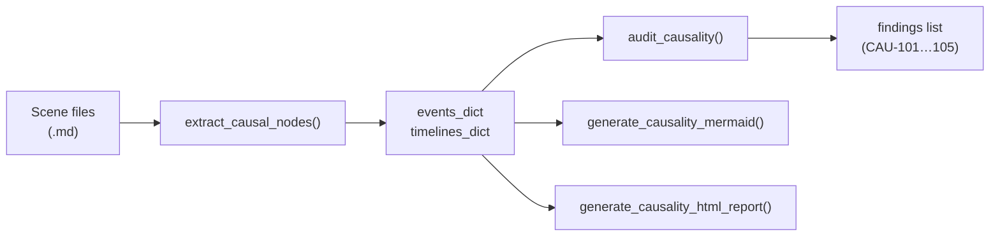
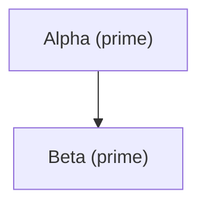
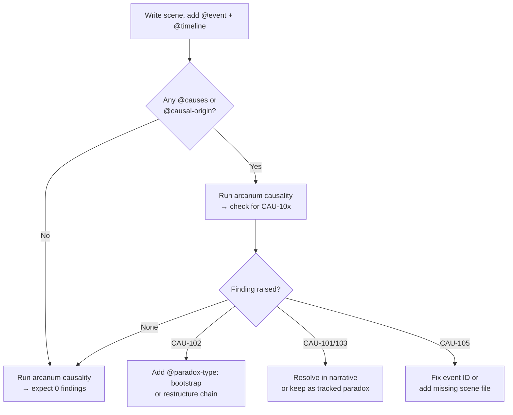

# CAUSALITY — Ars Arcanum Causal DAG & Time-Travel Consistency Validator

> [!NOTE]
> This guide covers the `causality` subsystem introduced in **v3.1.0 The Sovereign Craft
> Deepening**. It analyses your manuscript's causal graph, detects temporal paradoxes, and
> generates visual DAG exports and HTML audit reports.

---

## Table of Contents

1. [Overview](#overview)
2. [@-Directive Reference](#-directive-reference)
3. [YAML Frontmatter Reference](#yaml-frontmatter-reference)
4. [Diagnostic Codes (CAU-101 – CAU-105)](#diagnostic-codes)
5. [CLI Usage](#cli-usage)
6. [Mermaid Export](#mermaid-export)
7. [HTML Audit Report](#html-audit-report)
8. [Tips for Intentional Paradox Tagging](#tips-for-intentional-paradox-tagging)

---

## Overview

The causality engine builds a **directed acyclic graph (DAG)** of events across your
manuscript and world notes. Every scene file can declare the events it contains, which
timeline those events belong to, and what causal relationships connect them.

The engine then:

- Parses all `Manuscript/` scene files **and** `World/History/` lore notes.
- Constructs `events_dict` and `timelines_dict` in memory.
- Runs `audit_causality` to detect cycle-based paradoxes, dangling references, and
  orphan timeline branches.
- Optionally renders a **Mermaid flowchart** or an **HTML report** for browser review.



---

## @-Directive Reference

Place `@`-directives **anywhere in the body** of a markdown file (not inside frontmatter).
Each directive occupies its own line.

| Directive | Value format | Required? | Description |
|---|---|---|---|
| `@event:` | `EventName` | **Yes** (to register an event) | Human-readable name of the causal node. The event ID is derived from the file stem. |
| `@timeline:` | `timeline-id` | Recommended | The timeline branch this event belongs to. Defaults to `prime`. |
| `@time:` | `1422 3E` / `Year Season` | Optional | In-world timestamp for ordering and display. |
| `@causes:` | `event-id` | Optional | Declares that this event **directly causes** another event. Repeat the tag for multiple targets. |
| `@causal-origin:` | `event-id` | Optional | Declares a prerequisite: this event **requires** another event to have happened first. |
| `@paradox-type:` | `bootstrap` \| `grandfather` \| `novikov-violation` | Optional | Classifies an intentional causal loop. Without this tag, any detected cycle becomes CAU-102. |
| `@branch-from:` | `timeline-id` | Optional | Identifies the parent timeline this branch splits from (e.g. `prime`). |

### Inline Example

```markdown
# The Conclave Convenes

@event: The Conclave Convenes
@timeline: alt-mage-war
@time: 1419 3E
@causal-origin: founding-of-the-tower
@causes: the-great-sundering
@branch-from: prime
```

> [!TIP]
> Event IDs are normalised from the **filename stem** using
> `re.sub(r'[\s_#-]+', '-', stem.strip().lower())`.
> A file named `The Great Sundering.md` gets the ID `the-great-sundering`.
> Use the normalised ID in `@causes` and `@causal-origin` tags.

---

## YAML Frontmatter Reference

All `@`-directives have equivalent YAML frontmatter keys. Frontmatter is merged with
inline tags — frontmatter **wins** on conflicts for scalar fields.

```yaml
---
name: "The Conclave Convenes"        # display name (overrides @event)
timeline: alt-mage-war               # timeline ID
time: "1419 3E"                      # in-world timestamp
causal_origin: founding-of-the-tower # single origin (string)
causes:                               # list of caused event IDs
  - the-great-sundering
  - collapse-of-dawnhold
paradox_type: bootstrap              # bootstrap | grandfather | novikov-violation
branch_from: prime                   # parent timeline ID
---
```

> [!IMPORTANT]
> For **list-valued** fields (`causes`, `causal_origin`) you may use either a YAML sequence
> or a comma-separated string. The engine normalises both forms.

---

## Diagnostic Codes

`audit_causality` returns a list of finding dicts. Each finding has:

```python
{
    "id":       "CAU-102",          # diagnostic code
    "severity": "error",            # "error" | "warning" | "info"
    "message":  "...",              # human-readable explanation
    "file":     "path/to/scene.md", # source file (when applicable)
    # ...additional context keys
}
```

| Code | Severity | Name | Triggered when |
|---|---|---|---|
| **CAU-101** | `error` | Grandfather Paradox | A causal cycle exists **and** at least one node in the cycle has `paradox_type: grandfather`. |
| **CAU-102** | `error` | Unregistered Bootstrap / Causal Loop | A causal cycle exists but **no** node has a `paradox_type` tag — the loop is undeclared. |
| **CAU-103** | `error` | Novikov Self-Consistency Violation | A causal cycle exists **and** at least one node has `paradox_type: novikov-violation`. |
| **CAU-104** | `warning` | Orphan Timeline Branch | A timeline entry appears in `timelines_dict` with **zero events** and its ID is not `prime`. |
| **CAU-105** | `warning` | Dangling Causal Origin / Temporal Inversion | A `@causal-origin` or `@causes` reference points to an event ID that **does not exist** in `events_dict`, OR the referenced event's timestamp is chronologically after the referencing event's timestamp. |

### CAU-101 — Grandfather Paradox

A grandfather paradox means an event in the past is destroyed by one of its own
descendants, making the descendant's existence impossible.

```markdown
# Theron Kills His Grandfather

@event: Theron Kills His Grandfather
@timeline: prime
@paradox-type: grandfather
@causes: theron-never-born
```

**Fix:** Either break the causal loop, move one node to an alternate timeline, or reclassify
the intended loop as `bootstrap` if the narrative treats it as self-consistent.

---

### CAU-102 — Unregistered Bootstrap / Causal Loop

Two or more events form a mutual cause cycle with no `@paradox-type` declaration.

```
event-a causes event-b
event-b causes event-a
```

**Fix:** Tag all nodes in the loop with `@paradox-type: bootstrap` if intentional, or
restructure the causal chain to be acyclic.

---

### CAU-103 — Novikov Self-Consistency Violation

A cycle exists where one or more events are explicitly tagged `novikov-violation`,
indicating the author is aware the loop breaks self-consistency rather than preserving it.

**Fix:** Resolve the paradox in-narrative, or change the tag to `bootstrap` if the loop is
actually self-consistent in your world's physics.

---

### CAU-104 — Orphan Timeline Branch

A timeline has been registered (its ID appears in `timelines_dict`) but contains no
events. Non-`prime` timelines with zero events are flagged.

**Fix:** Either add at least one event to the branch or remove the stale timeline
registration.

---

### CAU-105 — Dangling Causal Origin / Temporal Inversion

- **Dangling:** `@causal-origin: some-event` but `some-event` is not found in any scanned
  file.
- **Temporal inversion:** The origin event's `@time` coordinate is *later* than the
  dependent event's `@time`.

**Fix:** Add the missing event file, correct the event ID spelling, or adjust timestamps.

---

## CLI Usage

```
arcanum causality [MANUSCRIPT] [-w WORLD] [--html] [--write-note] [--json]
```

| Flag / Argument | Default | Description |
|---|---|---|
| `MANUSCRIPT` | `./Manuscript` | Path to the manuscript directory. |
| `-w WORLD`, `--world WORLD` | `./World` | Path to the world-notes directory. |
| `--html` | off | Write an HTML audit report alongside the note. |
| `--write-note` | off | Write a Mermaid DAG note back into `World/Meta/Causal-DAG.md`. |
| `--json` | off | Print findings as JSON to stdout instead of a human-readable table. |

### Examples

```bash
# Basic audit with findings table
arcanum causality

# Full report: HTML + write note + custom world path
arcanum causality Manuscript -w "World Notes" --html --write-note

# Machine-readable output for CI pipelines
arcanum causality --json | jq '.[] | select(.severity=="error")'
```

> [!IMPORTANT]
> The CLI exits with code **1** if any `error`-severity finding is raised, making it
> suitable for integration into pre-commit hooks or CI gates.

---

## Mermaid Export

`generate_causality_mermaid(events, timelines)` returns an Obsidian-compatible fenced
code block:

````markdown

````

- **Node labels** show the event's `name` and `timeline`.
- **Edges** represent `causes` relationships (solid arrows `-->`).
- **Causal origins** are rendered as dashed edges `-. requires .->`.
- Nodes tagged with a `paradox_type` are styled with a distinctive colour class.

The `--write-note` CLI flag writes this block to `World/Meta/Causal-DAG.md` so it renders
automatically in Obsidian's graph/canvas view.

---

## HTML Audit Report

`generate_causality_html_report(audit_data, output_path)` writes a self-contained HTML
file that:

- Embeds the Mermaid DAG with inline rendering.
- Displays a filterable findings table (severity, code, message, source file).
- Includes a `Content-Security-Policy` meta tag restricting resource loads to
  `default-src 'none'` — safe for local file-system viewing.
- Requires **no external network requests**; all assets are inlined.

`audit_data` must be a dict with keys:

```python
{
    "events":    events_dict,    # from extract_causal_nodes()
    "timelines": timelines_dict, # from extract_causal_nodes()
    "findings":  findings_list,  # from audit_causality()
    "world":     "MyWorldName",  # display name string
}
```

---

## Tips for Intentional Paradox Tagging

### Bootstrap Loops (Self-Consistent)

Use `paradox_type: bootstrap` for causal loops that are internally consistent — the loop
has always existed and requires no external trigger. Classic examples: a time-traveller
who teaches their younger self the skill they later teach themselves.

```markdown
@event: Merlin Teaches Young Arthur
@paradox-type: bootstrap
@causes: arthur-becomes-king
```

Tag **every node** in the loop with `@paradox-type: bootstrap`. The engine suppresses
CAU-101/102/103 only when the entire detected cycle is uniformly tagged `bootstrap`.

### Controlled Grandfather Paradoxes

If your narrative deliberately includes a grandfather paradox (e.g. the plot hinges on
the contradiction), tag the offending node with `@paradox-type: grandfather`. CAU-101 is
raised as an `error` but the audit continues — this lets you track the paradox as an
intentional, unresolved story element without hiding it.

### Novikov Violations as Plot Devices

`novikov-violation` signals that characters within the world are *trying* to break
self-consistency. CAU-103 is raised to keep the violation visible for editorial review.

> [!WARNING]
> Removing `@paradox-type` from a loop does not resolve the paradox in-story — it merely
> silences the audit diagnostic. Always tag intentional loops explicitly.

### Recommended Authoring Workflow


