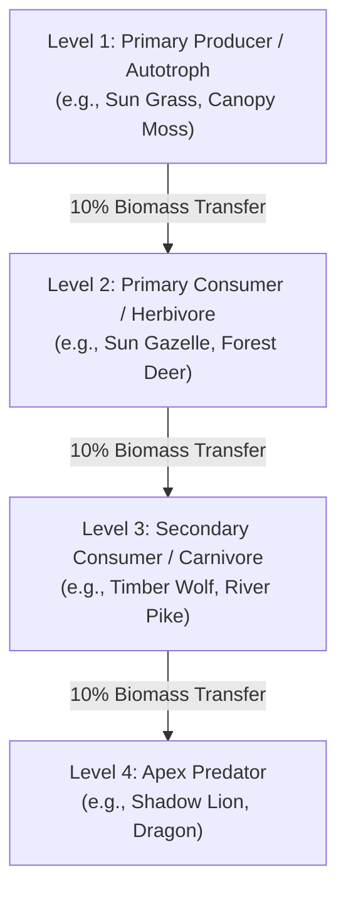
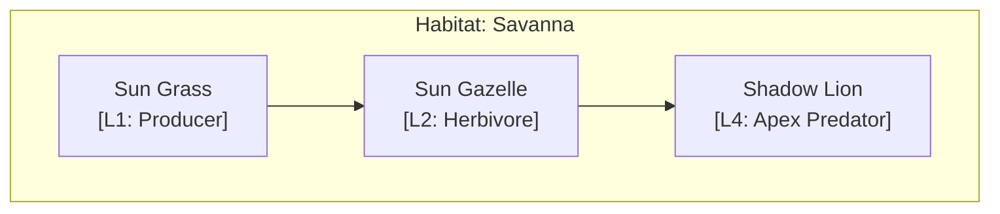

# ECOLOGY — Trophic Food Web & Biomass Efficiency Simulator

> **Module**: `scripts/lib/ecology.py`  
> **CLI Command**: `arcanum ecology`  
> **Purpose**: Automated ecological food-web auditor, Lindeman's 10% trophic efficiency validator, and Mermaid.js predation chain visualizer for speculative fauna and flora worldbuilding bibles.

---

## Table of Contents

1. [Overview](#overview)
2. [CLI Usage](#cli-usage)
3. [Species YAML Schema](#species-yaml-schema)
4. [Trophic Levels & Lindeman's Efficiency](#trophic-levels--lindemans-efficiency)
5. [Diagnostic Codes (ECO-301 to ECO-305)](#diagnostic-codes-eco-301-to-eco-305)
6. [Mermaid.js Food-Web Diagrams](#mermaidjs-food-web-diagrams)
7. [Standalone HTML Report](#standalone-html-report)
8. [Example Workflow](#example-workflow)

---

## Overview

The `ecology` engine audits speculative bestiaries and flora databases (`World/Bestiary/*.md`, `World/Flora/*.md`) to verify that the depicted ecosystems are biologically coherent and thermodynamically sustainable.

Key capabilities include:
- **Trophic Hierarchy Verification**: Checks that each species occupies an appropriate trophic position (Primary Producer, Herbivore, Carnivore, Apex Predator).
- **Food Web Graph Integrity**: Detects orphaned top predators, circular predation loops ($A \to B \to A$), and unregistered prey wikilinks.
- **Biomass & Energetic Feasibility**: Applies Lindeman's ecological efficiency rule (roughly 10% energy transfer between trophic levels) to identify apex predator biomass deficits where predators would starve.
- **Automated Visualizations**: Generates Obsidian-compatible Mermaid.js food-web relationship graphs and offline CSP-compliant HTML diagnostic reports.

---

## CLI Usage

```bash
arcanum ecology check [WORLD_DIR] [OPTIONS]
arcanum ecology report [WORLD_DIR] [OPTIONS]
```

*(Note: If no subcommand is provided, `check` is executed by default.)*

### Options

| Flag | Type | Description |
|---|---|---|
| `world` / `-w WORLD` | path | Path to the target World Bible directory |
| `--json` | flag | Output machine-readable JSON results |
| `--html PATH` | path | Export standalone interactive HTML report |
| `--write-note PATH` | path | Write Obsidian-compatible Mermaid food-web markdown note |

---

## Species YAML Schema

Species profiles are defined in markdown files with YAML frontmatter placed under `World/Bestiary/`, `World/Flora/`, or `World/00-World-Bible/{Bestiary,Flora}/`.

```yaml
---
name: "Shadow Wolf"
trophic_level: 3
habitat: "Boreal Forest"
dietary_prey:
  - "[[Forest Deer]]"
  - "[[Snow Hare]]"
biomass_kg: 65.0
population_density: 1.2
daily_caloric_demand: 4500.0
---

# Shadow Wolf
A nocturnal pack predator indigenous to the northern taiga...
```

### Supported Fields

| Field | Type | Default | Description |
|---|---|---|---|
| `name` | string | `filename` | Official common name of the species |
| `trophic_level` | int (1–4) | `2` | 1 = Producer/Flora, 2 = Primary Consumer (Herbivore), 3 = Secondary Consumer (Carnivore), 4 = Apex Predator |
| `habitat` | string | `"Global"` | Primary ecosystem/biome (e.g. `"Savanna"`, `"Boreal Forest"`, `"Deep Caverns"`) |
| `dietary_prey` | list[str] | `[]` | List of species names or Obsidian wikilinks (`[[Species]]`) preyed upon |
| `biomass_kg` | float | `50.0` | Average individual body mass in kilograms |
| `population_density` | float | `10.0` | Number of individuals per $100\text{ km}^2$ |
| `daily_caloric_demand` | float | `2500.0` | Daily energy requirement in kilocalories |

---

## Trophic Levels & Lindeman's Efficiency

The engine categorizes species into four trophic tiers:



**Biomass Density Calculation**:
$$\text{Biomass Density} = \text{biomass\_kg} \times \text{population\_density}$$

According to ecological energetic constraints, predator biomass density should not exceed **35%** of available prey biomass density within the same habitat without triggering a famine warning (`ECO-302`).

---

## Diagnostic Codes (ECO-301 to ECO-305)

| Code | Severity | Name | Description |
|---|---|---|---|
| `ECO-301` | **WARNING** | Apex Predator Without Prey | An apex predator (Level $\ge 3$) has no registered `dietary_prey` listed in its profile. |
| `ECO-302` | **WARNING** | Trophic Biomass Deficit | Total predator biomass density exceeds 35% of registered prey biomass density within the habitat. |
| `ECO-303` | **ERROR** | Circular Predation Loop | Two or more species have mutual predation dependencies ($A$ eats $B$, and $B$ eats $A$). |
| `ECO-304` | **WARNING** | Missing Primary Producers | A non-global habitat contains consumers (Levels 2–4) but zero registered Level 1 autotrophs/flora. |
| `ECO-305` | **WARNING** | Unregistered Prey Species | A `dietary_prey` entry references a species name that does not exist in any parsed file. |

---

## Mermaid.js Food-Web Diagrams

The engine automatically synthesizes Obsidian-compatible Mermaid.js flowchart diagrams with color-coded trophic styling:



Exporting with `--write-note` saves this diagram directly to a vault note for interactive visual exploration in Obsidian or GitHub.

---

## Standalone HTML Report

The `--html` flag renders an offline, zero-dependency HTML dashboard:
- Full Content-Security-Policy isolation (`default-src 'none'`).
- Filterable species roster with trophic badges and biomass statistics.
- Interactive trophic pyramid graphs and issue cards detailing any `ECO-301`–`ECO-305` findings.

---

## Example Workflow

```bash
# 1. Audit world ecology and check for trophic deficits
arcanum ecology check Cosmos/World

# 2. Generate an Obsidian food web diagram note
arcanum ecology report Cosmos/World --write-note "Cosmos/World/Lore/Food_Web.md"

# 3. Export a complete HTML diagnostic report
arcanum ecology check Cosmos/World --html reports/ecology_audit.html
```
