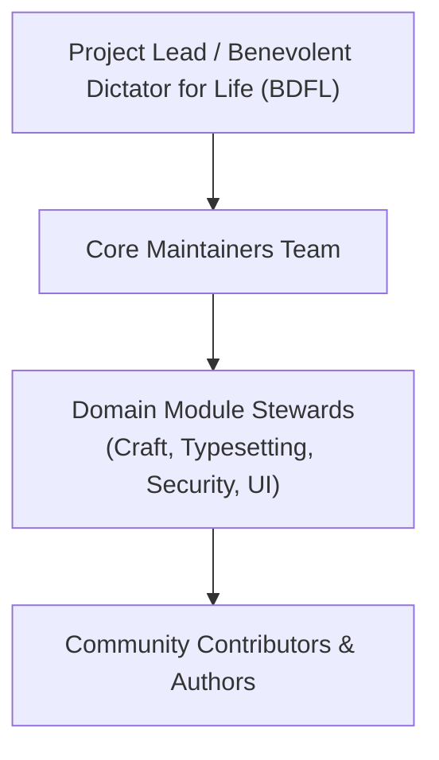

# Ars Arcanum — Open-Source Governance Charter & Project Operating Model

> **Project Mandate**: Maintain a 100% sovereign, offline, privacy-first speculative fiction authoring platform that remains open, free from telemetry, and permanently available to authors worldwide.

---

## 1. Governance Principles

Ars Arcanum operates under four non-negotiable core principles:

1. **Author Sovereignty**: No proprietary file formats, no mandatory cloud sync, no lock-in. Plain Markdown (`.md`) and standard open schemas remain the primary source of truth.
2. **Zero-Telemetry & Local-First**: The software shall never include phone-home analytics, advertising, tracking, or mandatory internet connectivity for core authoring functions.
3. **Fail-Closed Security & Crash Safety**: Every filesystem operation must use atomic writes (`atomic_write`), verified checksums, and defensive validation against corruption or path traversal.
4. **Transparent & Merit-Based Evolution**: Major architectural shifts require formal Architecture Decision Records (ADRs) and community RFC review.

---

## 2. Roles & Responsibilities

### 2.1 Project Lead (BDFL)
- Holds final decision-making authority in deadlocked architectural disputes.
- Sets high-level strategic roadmap, release tags, and security advisory disclosures.
- Current Lead: **Aryan Singh Nagar** (`@aryansinghnagar`).

### 2.2 Core Maintainers
- Review and merge pull requests across the codebase.
- Maintain CI/CD pipelines, Debian/RPM/AUR packaging, and automated test coverage floors.
- Ensure strict adherence to coding standards (Ruff, Mypy, ShellCheck).
- Minimum criteria for core maintainer nomination: $\ge 6$ months of continuous, high-quality contributions and unanimous approval of existing maintainers.

### 2.3 Domain Stewards
- **Craft & Speculative Physics**: Manages orbital mechanics, hard magic validation, and genealogy DAG algorithms.
- **Publishing & Typesetting**: Manages Typst 0.14+ templates, Pandoc filters, and OpenXML (.docx) sync engines.
- **Desktop & Packaging**: Manages GTK3/Adwaita interfaces, Flatpak manifests, Debian rules, RPM specs, and AUR packages.
- **Security & Reliability**: Manages path traversal defenses, GPG backup encryption, and supply-chain auditing.

---

## 3. Decision-Making & RFC Process

For trivial bug fixes, documentation corrections, and non-breaking performance improvements, standard GitHub pull requests require **one core maintainer approval**.

For major architectural changes (e.g. modifying manifest schemas, adding new storage backends, altering CLI contracts, or introducing runtime dependencies):

1. **RFC Proposal**: The author submits an issue tagged `[RFC] <Title>`.
2. **Community Discussion**: A minimum 14-day public review period during which domain stewards and authors provide feedback.
3. **ADR Recording**: Once consensus is reached, the decision is formally drafted as an Architecture Decision Record in `decisions.md` (e.g., `ADR-046`).
4. **Implementation & Gate**: Code is merged only after meeting 100% test pass rate, strict static typing, and zero linter violations.

---

## 4. Release Cadence & Versioning

Ars Arcanum follows strict **Semantic Versioning 2.0.0 (`MAJOR.MINOR.PATCH`)**:

- **MAJOR**: Breaking changes to manifest schemas, directory layouts, or CLI syntax.
- **MINOR**: New speculative modeling engines, typesetting presets, GUI studios, or packaging formats.
- **PATCH**: Bug fixes, performance optimizations, typography tweaks, and documentation updates.

### Release Verification Gate
No release tag may be cut without passing the canonical 7-stage verification harness:
1. `python -m unittest discover tests` $\to$ 100% green pass.
2. All 8 Bash integration test harnesses $\to$ 100% green pass.
3. `ruff check .` $\to$ 0 violations across expanded rule suite.
4. `mypy` $\to$ strict typing verified across `scripts/lib/`.
5. Supply-chain SHA-256 verification $\to$ 100% matched against `dependencies.lock`.
6. `desktop-file-validate` $\to$ all 10 `.desktop` launchers valid.
7. Path traversal & backup encryption test suites $\to$ 100% passing.

---

## 5. Security & Vulnerability Disclosure

Security vulnerabilities are reported privately via **GitHub Security Advisories** or by emailing `security@arsarcanum.org` (or maintainer contact in `SECURITY.md`).

- **Response SLA**: Initial triage within 48 hours.
- **Patch Window**: Critical fixes published within 7 days with coordinated CVE disclosure.
- **Fail-Closed Invariant**: Fixes must prioritize data integrity and prevent data loss over convenience.
