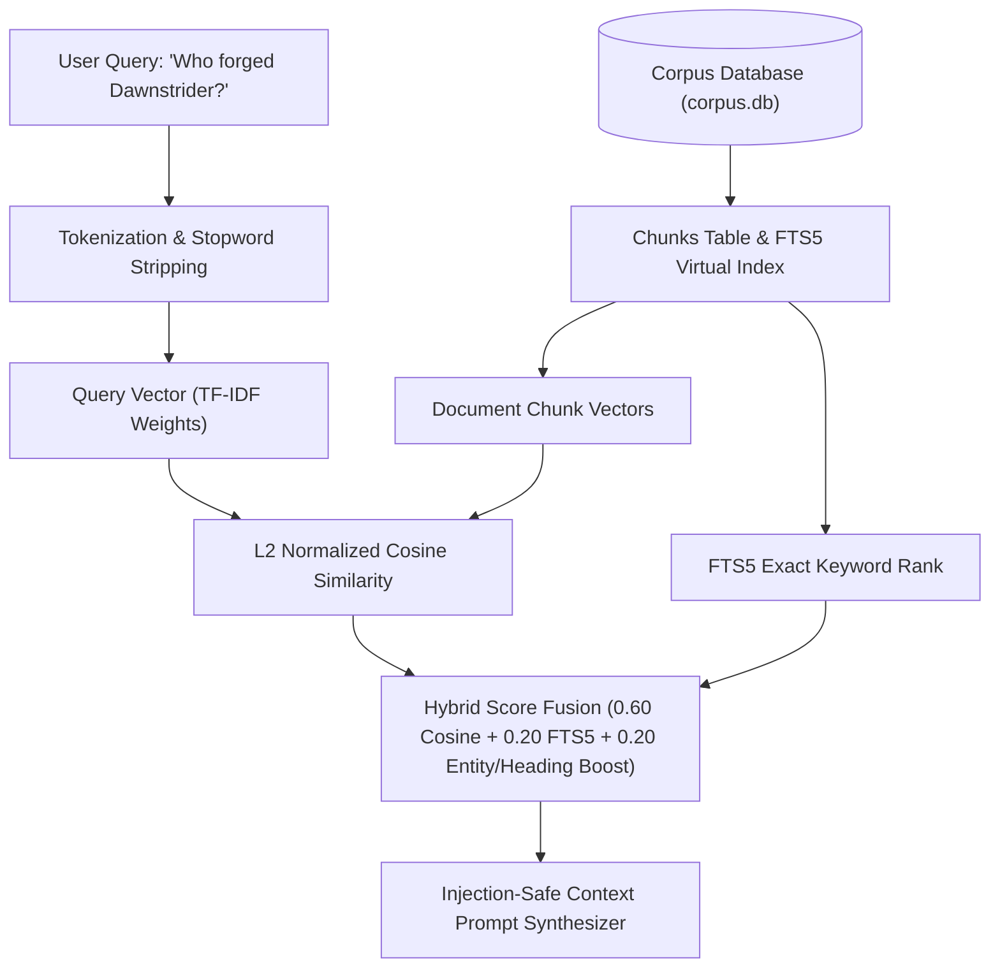

# Sovereign Local Semantic Retrieval (RAG) & Lore Engine
> **Ars Arcanum Module**: `scripts/lib/local_rag.py` | **CLI**: `arcanum rag` (aliases: `query-lore`, `semantic-search`)

---

## 1. Executive Summary & Sovereignty Guarantees

The **Ars Arcanum Sovereign Local Semantic Retrieval Engine** provides instant, natural language semantic search, continuity recall, and prompt context synthesis across multi-volume World Bibles, Obsidian lore vaults, and manuscript archives.

### Sovereign Invariants
- **Zero-Pip Guarantee**: Powered entirely by the Python standard library (`math`, `sqlite3 FTS5`, `collections.Counter`). Zero heavy machine learning or vector DB dependencies (`numpy`, `torch`, `chromadb`, `faiss` are completely avoided).
- **100% Offline Privacy**: All vector spaces, term frequencies, and similarity rankings are computed locally in-memory or in SQLite. Zero text is sent to external clouds or third-party APIs.
- **Injection-Safe Context Synthesis**: Automatically formats canonical lore records into structured LLM prompts (`<system_instructions>`, `<canonical_lore_context>`, `<user_query>`) with strict provenance attribution and token estimates.

---

## 2. Mathematical Architecture



### 2.1 Term Weighting & Inverse Document Frequency (IDF)
Using smoothed Robertson-Spärck Jones IDF:
$$\text{IDF}(t) = \ln\left(1.0 + \frac{N - \text{df}(t) + 0.5}{\text{df}(t) + 0.5}\right) + 1.0$$
where $N$ is total chunks in the corpus and $\text{df}(t)$ is document frequency of term $t$.

### 2.2 Sub-linear Term Frequency (TF)
$$\text{TF}(t, d) = 1.0 + \ln(\text{count}(t, d)) \quad \text{if count} > 0 \text{ else } 0$$

### 2.3 Cosine Similarity Angle
$$\text{Sim}_{\text{cosine}}(\vec{q}, \vec{d}) = \frac{\sum_{t \in q \cap d} w(t, q) \cdot w(t, d)}{\|\vec{q}\| \cdot \|\vec{d}\|}$$

---

## 3. CLI Usage & Examples

### 3.1 Quick Querying
```bash
# Query default workspace corpus database
arcanum rag "Who wields the Dawnstrider blade?"

# Query with custom SQLite corpus database
arcanum rag "What are the limitations of Aether soulstone casting?" -d dist/corpus/corpus.db

# Query directly from an Obsidian world vault or manuscript folder
arcanum rag "How did the Void Incursion begin?" -t ~/Universes/Cosmos/Worlds/Eldoria/
```

### 3.2 Output Formats

| Format | Flag | Description |
| :--- | :--- | :--- |
| `context` | `-f context` *(default)* | Injection-safe system prompt for offline LLMs (Llama 3, Mistral, Ollama) |
| `markdown` | `-f markdown` | Rich tabular report with relevance rankings and excerpt blocks |
| `json` | `-f json` | Structured JSON array of scored chunks with metadata |
| `html` | `-f html` | Standalone offline HTML dashboard with CSP and copyable prompt snippet |

### 3.3 Filtering by Taxonomy & Relevance
```bash
# Retrieve top-3 chunks from Characters category with minimum score 0.30
arcanum rag "High Archon Valerius" -k 3 -m 0.30 -c Characters

# Export LLM prompt context to file for automated local drafting scripts
arcanum rag "Battle of the Crimson Rift" -f context -o prompt_context.txt
```

---

## 4. Local LLM Integration (Ollama / LM Studio)

When writing with local models, author scripts can pipe `arcanum rag` directly into `ollama`:

```bash
# Pipe canonical lore context into local Llama 3 model
arcanum rag "Describe the architecture of the Sunfire Citadel" -f context | ollama run llama3
```
