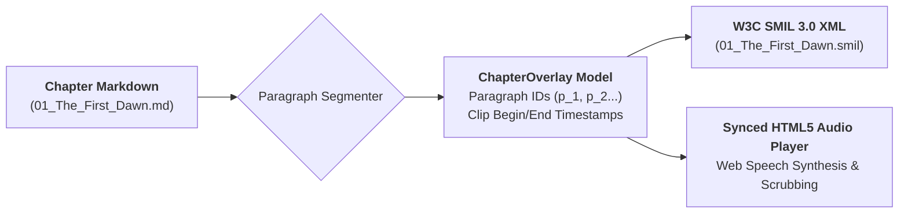

# Ars Arcanum EPUB 3 SMIL Media Overlays & Synced Audio Engine (`docs/MEDIA_OVERLAY.md`)
> **Synchronized Audio-Text Narration & W3C SMIL 3.0 Compiler (PUB-103)** | Release v3.6.0

---

## 1. Overview & Publishing Standards

The **Media Overlay Engine** (`arcanum overlay` / `scripts/lib/media_overlay.py`) compiles chapter prose and audio narration timestamps into **W3C EPUB 3 Media Overlay SMIL files** and a **standalone offline browser-based audio player**.

In accessible and enhanced digital publishing, EPUB 3 Media Overlays link synchronized audio audio recordings with individual XHTML paragraph elements (`<par>` elements pointing to text IDs and audio clip ranges).



---

## 2. SMIL 3.0 Structure & Timestamp Precision

### 2.1 Timestamp Formatting
Timestamps are formatted according to the SMIL 3.0 clock value standard:
$$\text{HH:MM:SS.mmm} \quad (\text{e.g. } 00:01:05.500)$$

### 2.2 Generated SMIL XML Example
```xml
<?xml version="1.0" encoding="UTF-8"?>
<smil xmlns="http://www.w3.org/ns/SMIL" xmlns:epub="http://www.idpf.org/2007/ops" version="3.0">
  <body>
    <seq id="seq_1" epub:textref="01_The_First_Dawn.xhtml">
      <par id="par_1">
        <text src="01_The_First_Dawn.xhtml#p_1"/>
        <audio src="audio/01_The_First_Dawn.mp3" clipBegin="00:00:00.000" clipEnd="00:00:01.900"/>
      </par>
      <par id="par_2">
        <text src="01_The_First_Dawn.xhtml#p_2"/>
        <audio src="audio/01_The_First_Dawn.mp3" clipBegin="00:00:01.900" clipEnd="00:00:07.500"/>
      </par>
    </seq>
  </body>
</smil>
```

---

## 3. Standalone Synchronized Narration Player

The engine generates a complete offline HTML5 player that utilizes the browser's built-in `window.speechSynthesis` API or synchronized MP3 audio files:
- **Active Sentence/Paragraph Highlighting**: Scrolls and highlights the active text paragraph as it is spoken.
- **Playback Rate Speed Controls**: 0.75x, 1.0x, 1.25x, 1.5x, 2.0x narration speeds (`speedSelect`).
- **Interactive Scrubber & Timeline Bar**: Jump to any paragraph by clicking or moving the timeline slider (`scrubber`).
- **Keyboard Navigation**: Spacebar to Play/Pause, Left/Right arrows to skip paragraphs.

---

## 4. CLI Invocation & Options

```bash
# Generate SMIL overlay files for all chapters in a manuscript
arcanum overlay ~/Manuscripts/My-Novel/Book-01/Draft-01

# Generate standalone synchronized HTML player
arcanum overlay ~/Manuscripts/My-Novel/Book-01/Draft-01 --player dist/narration_player.html

# Set custom reading speed (Words Per Minute)
arcanum overlay ~/Manuscripts/My-Novel/Book-01/Draft-01 --wpm 165

# Output JSON timestamp metadata
arcanum overlay ~/Manuscripts/My-Novel/Book-01/Draft-01 --json
```

---

## 5. Offline Security & CSP Invariants

The generated narration player is 100% offline and declares:
```html
<meta http-equiv="Content-Security-Policy" content="default-src 'none'; style-src 'unsafe-inline'; script-src 'unsafe-inline'; img-src data:; media-src data: blob:;">
```
All audio synthesis and playback occur directly within the browser runtime with zero network data transfer.
