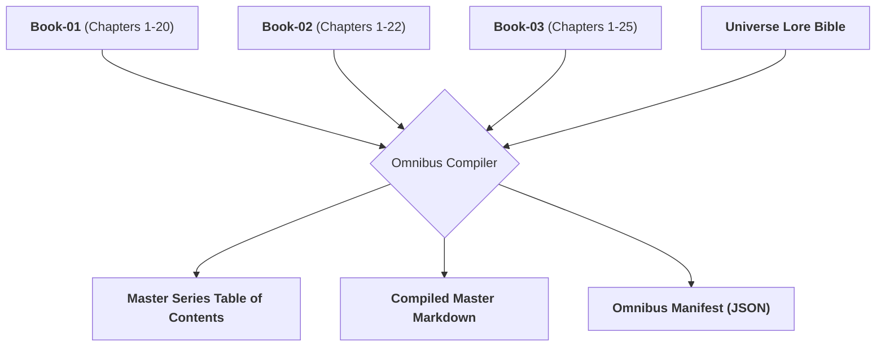

# Ars Arcanum Multi-Volume Series Omnibus Compiler (`docs/OMNIBUS.md`)
> **Epic Series Assembly, Master TOC & Multi-Book Publishing Engine (PUB-101)** | Release v3.6.0

---

## 1. Overview & Architectural Mission

The **Series Omnibus Compiler** (`arcanum omnibus` / `scripts/lib/omnibus.py`) compiles an entire multi-book series into a unified, publication-ready master omnibus manuscript and structured release bundle.

In long-running speculative fiction franchises, each book lives in its own volume folder (`Book-01`, `Book-02`, `Book-03`...) containing internal draft branches and chapters. The Omnibus Compiler discovers all volumes, sorts them chronologically, inserts standardized volume divider title pages, harmonizes chapter numbering, and generates a master Table of Contents.



---

## 2. Omnibus Compilation Pipeline

### 2.1 Volume Discovery & Sorting
- Automatically scans the project root for directories matching `Book-*` or `Volume-*`.
- Identifies the active draft branch inside each volume (e.g. `Draft-01`, `Draft-02`, or root chapter structure).
- Extracts title, subtitle, and synopsis from each volume's `manuscript.yaml` or frontmatter.

### 2.2 Volume Divider Title Pages & Partitions
Between volume boundaries, the compiler inserts standardized markdown page breaks and styled book title headers:
```markdown
\newpage

# Book I: The Sun-Cleaver

*A novel of the Elyrian Reach*

---
```

### 2.3 Master Table of Contents Generation
The compiled output contains a unified, linked master Table of Contents:
```markdown
## Table of Contents

### Book I: The Sun-Cleaver
- [Chapter 1: The First Dawn](#chapter-1-the-first-dawn)
- [Chapter 2: The High Spire](#chapter-2-the-high-spire)

### Book II: The Obsidian Crown
- [Chapter 1: Shards of Power](#chapter-1-shards-of-power)
- [Chapter 2: The Siege of Elyria](#chapter-2-the-siege-of-elyria)
```

---

## 3. CLI Invocation & Options

```bash
# Compile entire manuscript series into omnibus
arcanum omnibus ~/Manuscripts/The-Solar-Saga

# Output compiled omnibus to specific file
arcanum omnibus ~/Manuscripts/The-Solar-Saga --output dist/Solar_Saga_Omnibus.md

# Include back-matter concordance and Dramatis Personae
arcanum omnibus ~/Manuscripts/The-Solar-Saga --with-concordance

# Output JSON compilation metadata
arcanum omnibus ~/Manuscripts/The-Solar-Saga --json
```

---

## 4. Output Manifest Schema

When run with `--json`, the compiler outputs complete series rollup metadata:

```json
{
  "series_title": "The Solar Saga",
  "author": "Aryan Singh Nagar",
  "total_volumes": 3,
  "total_chapters": 67,
  "total_words": 284500,
  "estimated_reading_hours": 23.7,
  "volumes": [
    {
      "volume_index": 1,
      "volume_id": "Book-01",
      "title": "The Sun-Cleaver",
      "chapters_count": 20,
      "word_count": 85000
    },
    {
      "volume_index": 2,
      "volume_id": "Book-02",
      "title": "The Obsidian Crown",
      "chapters_count": 22,
      "word_count": 94500
    },
    {
      "volume_index": 3,
      "volume_id": "Book-03",
      "title": "The Starlight Throne",
      "chapters_count": 25,
      "word_count": 105000
    }
  ]
}
```

---

## 5. Offline Guarantees & Invariants
- **Atomic POSIX/Windows File I/O**: Compiled output is written via `atomic_write()` to eliminate partial corruption.
- **Zero-Pip Dependency Guarantee**: Built entirely on standard library path handling and regular expressions.
- **Content Security Policy**: Any auxiliary HTML reports or previews generated declare strict offline CSP (`default-src 'none'`).
