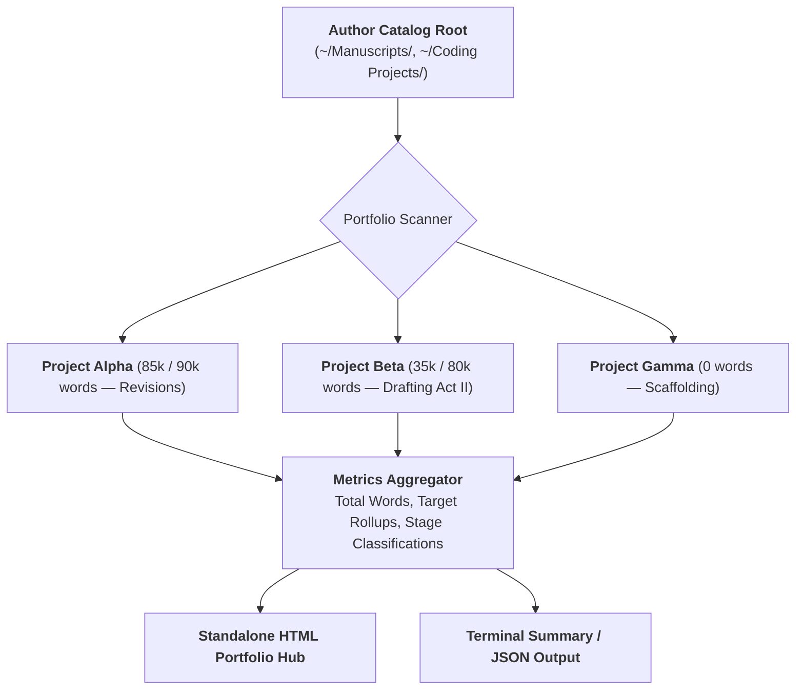

# Ars Arcanum Author Portfolio & Catalog Analytics Dashboard (`docs/PORTFOLIO.md`)
> **Multi-Project Progress Aggregation & Editorial Pipeline Hub (OPS-103)** | Release v3.6.0

---

## 1. Overview & Architectural Mission

The **Portfolio Dashboard Engine** (`arcanum portfolio` / `scripts/lib/portfolio.py`) aggregates word counts, volume progress, and editorial stages across an author's entire catalog of active projects, universes, and standalone novels.

Instead of manually tallying draft lengths across disconnected folders, the Portfolio Engine scans the filesystem, parses manifests (`manuscript.yaml`), calculates completion percentages relative to target goals, and compiles a **standalone, offline HTML5 visual dashboard**.



---

## 2. Editorial Lifecycle Stage Classification

The engine automatically categorizes each manuscript into one of five standardized editorial lifecycle stages:

| Stage | Word Count & Artifact Criteria | Description |
| :--- | :--- | :--- |
| **Scaffolding** | $0\text{ words}$ (or empty folder structure) | Story setup, character dossiers, outline, and chapter files created. |
| **Drafting (Act I)** | $1,000 \le \text{words} < 0.5 \times \text{target\_words}$ | Opening acts, initial character introductions, and inciting incidents. |
| **Drafting (Act II/III)** | $0.5 \times \text{target\_words} \le \text{words} < \text{target\_words}$ | Midpoint complications, climax build-up, and third-act resolution. |
| **Revisions / Pre-Flight** | $\text{words} \ge \text{target\_words}$ | Full first draft complete; undergoing line edits, lore linting, and structural polish. |
| **Publication-Ready** | $\text{words} \ge \text{target\_words} \times 0.9$ + PDF/EPUB exports present | Final formatted artifacts generated in `Exports/` directory. |

---

## 3. CLI Invocation & Options

```bash
# Scan default manuscript directories and output terminal summary
arcanum portfolio

# Scan custom root directory
arcanum portfolio ~/My-Writing-Vault

# Generate standalone HTML dashboard
arcanum portfolio ~/My-Writing-Vault --html dist/portfolio.html

# Output structured JSON catalog metrics
arcanum portfolio ~/My-Writing-Vault --json
```

---

## 4. Standalone HTML Hub & Security

The generated portfolio hub features:
- **Catalog Metric Cards**: Active manuscripts count, total catalog words, total chapters, total volumes.
- **Project Progress Bars**: Visual progress percentage with stage badges and word count ratios.
- **Strict Content Security Policy**: Declares `default-src 'none'; style-src 'unsafe-inline'; script-src 'unsafe-inline'; img-src data:; media-src data: blob:;`.
- **100% Offline Privacy**: Zero tracking, zero telemetry, completely local execution.
