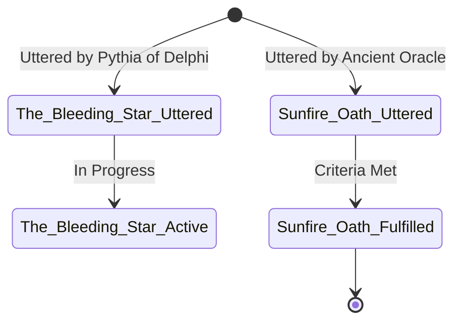

# Prophecy Resolution Matrix — Author Guide

> **Command:** `arcanum prophecy`
> **Module:** `scripts/lib/prophecy.py`
> **Phase:** 13 — The Sovereign Craft Deepening

---

## Overview

The **Prophecy Resolution Matrix** cross-validates in-world prophecy lore against manuscript progress and World Bible character data. It answers three craft questions every epic-fantasy author must track:

1. **Is every prophecy actually *in* my story?** (Lore that never appears in the manuscript is dead weight.)
2. **Can the chosen one still fulfill it?** (A deceased target entity makes fulfillment impossible.)
3. **Does the manuscript *earn* the resolution status I've declared in lore?** (Marking a prophecy `fulfilled` without manuscript evidence is a continuity error.)

The engine scans `Cosmology/Prophecies/*.md` in the World Bible, aggregates prophecy metadata, and then cross-validates against manuscript scene text and `@prophecy:` scene tags.

---

## Lore Schema — Prophecy File Frontmatter

Prophecy lore files live at:

```
<WorldDir>/Cosmology/Prophecies/<Prophecy_Name>.md
```

### Frontmatter Reference

```yaml
---
name: "The Bleeding Star"           # Canonical prophecy name (required)
type: prophecy                      # Must contain 'prophecy' for discovery
oracle: "[[Pythia of Delphi]]"      # Wikilink or plain name of the prophecy's source
target_entity: "[[Chosen King]]"    # Wikilink or plain name of the destined recipient
status: unfulfilled                 # See Status Lifecycle below
clauses:                            # Predictive conditions / sub-prophecies
  - "When the red star bleeds across the dawn"
  - "The shattered crown shall be remade"
  - "And the last heir shall drink from the broken cup"
date_uttered: "3rd Age, Year 401"   # Optional; era or date when prophecy was spoken
resolution_criteria: |              # Optional free-text clarification of fulfillment conditions
  All three clauses must occur within a single lunar cycle.
---

# The Bleeding Star

*Body text can contain lore elaboration, legend fragments, and annotation.*
```

> [!IMPORTANT]
> The `type` field must include the word `prophecy` (case-insensitive) for the file to be discovered. Files whose `type` is unrelated and whose path does not include `prophecy` are skipped.

### Wikilink Resolution

Both `oracle` and `target_entity` accept Obsidian-style wikilinks. The engine strips the brackets and alias to extract the canonical name:

```
"[[Pythia of Delphi|The Oracle]]"  →  "Pythia of Delphi"
"[[Chosen King]]"                  →  "Chosen King"
"Unnamed Seer"                     →  "Unnamed Seer"
```

---

## Manuscript Directive — `@prophecy:`

To tag a scene as containing a prophecy reference or resolution event, add a directive line anywhere in the scene file:

```markdown
# Chapter 14 — The Hour of Stars

The king finally understood the words carved into the monolith.
@prophecy: The Bleeding Star
```

### Supported Tag Keys

| Tag | Meaning |
|---|---|
| `@prophecy: <Name>` | This scene references or advances the named prophecy |
| `@prophecy-fulfilled: <Name>` | This scene constitutes the fulfillment event |
| `@prophecy-subverted: <Name>` | This scene constitutes an ironic or tragic subversion |

The engine also performs a corpus text-match: if the prophecy's canonical name appears anywhere in the manuscript (case-insensitive, after normalising whitespace and hyphens), the prophecy is considered *in-manuscript* even without an explicit tag.

---

## Status Lifecycle

```
unfulfilled  ──→  partially_fulfilled  ──→  fulfilled
                                        ──→  subverted
                                        ──→  broken
```

| Status | Meaning |
|---|---|
| `unfulfilled` | Prophecy was uttered; no clauses resolved yet |
| `partially_fulfilled` | One or more clauses have come to pass; story still in motion |
| `fulfilled` | All clauses resolved; destiny achieved |
| `subverted` | Prophecy resolved through irony, reversal, or loophole (classic "Macbeth" pattern) |
| `broken` | A precondition was violated, rendering fulfillment impossible |

> [!NOTE]
> The engine treats `active` as an alias for `unfulfilled` when evaluating PRP-102 (Dead Chosen One). All other statuses are compared as literal strings.

---

## Diagnostic Codes

### PRP-101 — Orphan Prophecy

**Trigger:** A prophecy exists in `Cosmology/Prophecies/` but the canonical prophecy name never appears in any manuscript scene file and no `@prophecy:` tag references it.

**Interpretation:** The prophecy was written into the lore but forgotten during drafting — it is not part of the story the reader will experience.

**Severity:** `WARNING`

**Remediation:**
- Decide whether the prophecy serves the story. If not, archive it or move it to a `_unused/` subfolder.
- If it should be present, add at least one scene reference: a character reciting a fragment, an NPC mentioning the legend, or a scene tag.

---

### PRP-102 — Dead Chosen One

**Trigger:** The `target_entity` of an `unfulfilled` (or `partially_fulfilled`) prophecy matches a character whose World Bible entry has `status: deceased` or a `death_year` / `death_date` field.

**Interpretation:** The destined recipient of the prophecy is dead, creating a structural contradiction unless the story explicitly addresses how fulfillment can now occur (reincarnation, successor, subversion).

**Severity:** `ERROR`

**Remediation:**
- If the character's death is intentional and the prophecy pivots to a successor, update `target_entity` to the new recipient and add a manuscript note explaining the transfer.
- If the death is a lore error, correct the character's status.
- If the prophecy should be `broken` or `subverted` as a result of the death, update `status` accordingly.

---

### PRP-103 — Resolution Status Discrepancy

**Trigger:** A prophecy is marked `fulfilled` or `subverted` in lore, but no `@prophecy:` tag in the manuscript references it, and the manuscript corpus contains neither the word `fulfilled` nor the word `prophecy`.

**Interpretation:** The World Bible declares the prophecy resolved, but there is no manuscript evidence of the resolution event. The lore is ahead of the draft.

**Severity:** `WARNING`

**Remediation:**
- Write the resolution scene and tag it with `@prophecy-fulfilled: <Name>` or `@prophecy-subverted: <Name>`.
- Alternatively, if the lore entry is aspirational (written for the planned ending), leave `status: partially_fulfilled` until the scene is drafted.

---

## CLI Usage

```bash
arcanum prophecy [MANUSCRIPT] [-w WORLD] [OPTIONS]
```

| Argument / Option | Description |
|---|---|
| `MANUSCRIPT` | Path to manuscript draft directory (optional positional) |
| `-w`, `--world WORLD` | Path to World Bible directory (optional; auto-discovered) |
| `-m`, `--manuscript PATH` | Explicit manuscript directory path |
| `--html PATH` | Export a standalone HTML report to `PATH` |
| `--json` | Print machine-readable JSON audit data to stdout |
| `--write-note PATH` | Export Mermaid.js Prophecy Lifecycle diagram to an Obsidian note |

### Examples

```bash
# Auto-discover world and manuscript
arcanum prophecy

# Explicit paths
arcanum prophecy ~/Manuscripts/MyNovel -w ~/Worlds/MyWorld

# Check prophecy lore only (no manuscript cross-validation)
arcanum prophecy -w ~/Worlds/MyWorld

# Export HTML report
arcanum prophecy ~/Manuscripts/MyNovel -w ~/Worlds/MyWorld --html reports/prophecy.html

# Export Mermaid lifecycle diagram to Obsidian vault
arcanum prophecy -w ~/Worlds/MyWorld --write-note "MyWorld/Cosmology/Prophecy_Lifecycle.md"

# Machine-readable JSON for CI
arcanum prophecy --json | jq '.findings[] | select(.id == "PRP-101")'
```

---

## Mermaid State Machine

When `--write-note` is used, the engine generates a `stateDiagram-v2` Mermaid diagram suitable for embedding in an Obsidian note or any Markdown renderer that supports Mermaid.

### Structure



Each prophecy is rendered as:
1. An entry transition from `[*]` labelled with the oracle source.
2. A transition to the appropriate terminal or ongoing state based on `status`.

| Status | Rendered Transition |
|---|---|
| `unfulfilled` / `active` | `→ <Name>_Active : In Progress` |
| `fulfilled` / `partially_fulfilled` | `→ <Name>_Fulfilled : Criteria Met` → `[*]` |
| `subverted` | `→ <Name>_Subverted : Irony / Subversion` → `[*]` |
| `broken` | `→ <Name>_Broken : Failed Precondition` → `[*]` |

---

## Return Codes

| Code | Meaning |
|---|---|
| `0` | No findings; prophecy tracking is consistent |
| `1` | One or more PRP findings detected |
| `2` | Configuration error (no valid World Bible directory) |
