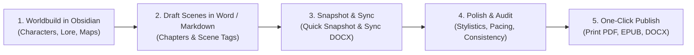

# Ars Arcanum / Scriptorium — Author's Quick Start Guide
> **The Sovereign, 100% Offline Writing & Worldbuilding Studio for Fiction Authors.**

Welcome! Ars Arcanum provides a distraction-free, professional writing environment that puts you in complete control of your creative work. All notes, chapters, and lore dossiers remain in standard plain Markdown (`.md`) and open formats on your own computer—free from subscription fees, cloud lock-in, or telemetry.

---

## 🚀 1. Getting Started in 3 Clicks

### Step 1: Launch the Desktop App
Double-click the **"Ars Arcanum Control Center"** icon on your Desktop (or run `arcanum` in your terminal).

### Step 2: First-Flight Onboarding
When you launch for the first time, the **Onboarding Wizard** appears:
- **New Universe**: Enter a name (e.g. `Solaris-Verse`) to create your narrative cosmos and starter world lore vault.
- **Generate Demo Cosmos**: Click to generate *"The Chronicles of Eldoria"*, pre-populated with starter characters, magic systems, bestiary creatures, and sample manuscript chapters.
- **Open Existing**: Point to an existing universe or manuscript folder.

---

## 🎨 2. The 6 Creative Studios

```
┌────────────────────────────────────────────────────────────────────────┐
│                        Ars Arcanum Studio Hub                          │
├──────────────┬──────────────┬──────────────┬─────────────┬─────────────┤
│ 🪐 Cosmos     │ ✍️ Drafting   │ 🔮 Craft &   │ 📚 Publish  │ 🔒 Safety   │
│   & Worlds   │   & Word     │    Speculate │   & Export  │   & Backups │
└──────────────┴──────────────┴──────────────┴─────────────┴─────────────┘
```

### Studio 1: 🪐 Cosmos & Worlds (Lore Bible)
- **Open World Bible**: Launches **Obsidian** configured with all 10 pre-installed plugins (Dataview, Storyline, Calendarium, Longform, Metadata Menu, and more).
- **Taxonomy Register**: View instant counts of characters, factions, magic systems, languages, and historical events registered across your world.

### Studio 2: ✍️ Manuscripts & Drafting
- **Visual Scene Inspector**: Select any chapter scene to view and edit scene metadata headers (`@pov:`, `@location:`, `@status:`, `@thread:`) without breaking your writing flow.
- **Word Processor Sync**: Click **"📝 Open in Word Processor"** to write or edit chapters directly in Microsoft Word, LibreOffice Writer, or Google Docs. Click **"🔄 Sync DOCX ↔ Markdown"** to import changes safely without losing scene metadata.
- **Redline Comparator**: Compare draft revisions (e.g. `Draft-01` vs `Draft-02`) with an interactive, color-coded visual redline report in your browser.

### Studio 3: 🔮 Speculative Fiction & Craft Studio
Access 18 offline modeling and consistency engines:
- **Magic System Rules**: Verify character affinity tiers, catalyst reagents, and fatigue limits.
- **Timeline & Multi-Era Chronology**: Check dates, syzygies, and historical event sequences.
- **Story Structure Check**: Align manuscript pacing against Save the Cat, Hero's Journey, 7-Point Structure, and 3-Act templates.
- **Dialogue & Stylistics Linter**: Scan for said-bookisms, floating dialogue, and sliding-window word echoes.

### Studio 4: 📚 Publishing & Book Compilation
- **1-Click Print PDF**: Sub-second compilation into trade-quality PDF using **Typst 0.14.2**.
- **EPUB & Ebook**: Compiles validated EPUB with cover art detection.
- **Submission Manuscript**: Produces industry-standard Shunn/Modern format `.docx` for literary agents and editors.
- **Automatic Concordance**: Generates *Dramatis Personae* and *Glossary* back-matter automatically.

### Studio 5: 🔒 Snapshots & Safe Backups
- **📷 Quick Snapshot**: Record a 1-click version milestone in local Git.
- **Offline Verified Archive**: Create a standalone `.tar.gz` archive with SHA-256 integrity verification.
- **External Drive Replication**: Configure an external USB drive or secondary hard drive in Settings for automated 3-2-1 backup protection.

### Studio 6: 🩺 System Health & Doctor
- Run comprehensive diagnostics on system compilers, Flatpak apps, world lore vaults, and backup destinations.
- Plain-language alerts guide you if any tool needs configuration.

---

## 💡 3. Recommended Author Workflow



---

## ❓ Frequently Asked Questions

**Q: Do I need an internet connection?**  
**A:** No. Ars Arcanum is 100% local-first and works completely offline. Zero telemetry, zero cloud dependencies.

**Q: Where are my files stored?**  
**A:** Everything lives under your home directory:
- `~/Universes/<YourUniverse>/<YourWorld>/` (World lore bibles)
- `~/Manuscripts/<YourManuscript>/` (Novels, chapters, and exported books)

**Q: How do I export my book?**  
**A:** Open the Control Center, switch to **"📚 Publishing & Exports"**, select your volume and trim size (e.g. US Trade 6x9), and click **"1-Click Publish"**. Your PDF, EPUB, and DOCX files will appear in `~/Manuscripts/<Name>/Exports/`.
