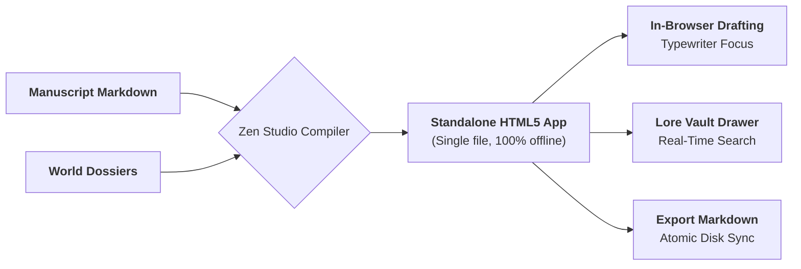

# Ars Arcanum Sovereign Zen Drafting Studio (`docs/ZEN_STUDIO.md`)
> **Distraction-Free Offline Drafting Studio & Lore Inspector (PRO-101)** | Release v3.6.0

---

## 1. Overview & Architectural Doctrine

Distraction-free authorial drafting requires a clean, typography-focused writing canvas paired with instantaneous access to world lore — without context-switching between separate application windows, losing keyboard flow, or exposing creative drafts to cloud editor telemetry.

**Ars Arcanum's Zen Studio** (`arcanum studio` / `scripts/lib/zen_studio.py`) compiles active manuscript drafts and the World Bible into a **single, zero-dependency offline HTML5 application** that runs entirely client-side inside any modern web browser:

- **Typewriter-Scrolling Prose Canvas**: Centered, responsive typography with customizable line lengths, dark/sepia/light reading palettes, and smooth vertical focus.
- **In-Situ World Bible Drawer**: Instant side-panel search drawer to view character dossiers, faction motives, geographic landmarks, magic rules, and language terms while writing.
- **Live Prose Telemetry**: Real-time word count (`telWords`), character count (`telChars`), estimated silent reading duration (`telReadTime` at 200 WPM), and speaking narration time (`telSpeakTime` at 150 WPM).
- **Offline Persistence & Safe Export**: Automatic `localStorage` caching per chapter with single-click Markdown file download and export.



---

## 2. Interface Elements & Telemetry

### 2.1 Telemetry Header & Stats
The Zen Studio header displays live statistical updates as you type:
- **Words**: Total tokenized words in the active chapter.
- **Characters**: Total characters including whitespace.
- **Reading Time**: Estimated reading time based on standard 200 words-per-minute literary velocity.
- **Speaking Time**: Estimated audiobook narration time at standard 150 words-per-minute voice actor pacing.

### 2.2 In-Situ Lore Vault Drawer
Clicking the **Lore Vault** button (or pressing the shortcut) slides out a searchable catalog of lore cards parsed directly from the `World/` directory:
- Character cards with aliases, role tags, and physical descriptions.
- Faction cards with allegiances and political goals.
- Relic, magic, and geographic dossiers.
- Real-time client-side substring filter (`filterLore()`).

---

## 3. CLI Invocation & Options

```bash
# Generate and open Zen Studio for active draft with World Bible
arcanum studio ~/Manuscripts/The-Silver-Chronicles/Book-01/Draft-01 -w ~/Universes/Eldoria/Eldoria-Prime

# Specify custom output path
arcanum studio ~/Manuscripts/MyNovel --output dist/my_novel_zen.html

# Output JSON metadata structure without opening browser
arcanum studio ~/Manuscripts/MyNovel --json

# Launch drafting studio without lore drawer (manuscript only)
arcanum studio ~/Manuscripts/MyNovel --manuscript-only
```

---

## 4. Keyboard Shortcuts & Workflow

| Control / Key | Action | Functionality |
| :--- | :--- | :--- |
| `Files` | Toggle Chapter Sidebar | Browse and switch between manuscript chapters |
| `Lore Vault` | Toggle Lore Drawer | Search character, artifact, and location dossiers |
| `Theme` | Cycle Themes | Switch between Obsidian Dark, Sepia Warm, and Manuscript Light |
| `Download` | Export Markdown | Exports current modified chapter text to `.md` file |
| `Auto-Save` | LocalStorage Cache | Preserves in-progress edits across browser restarts |

---

## 5. Offline Security & Content-Security-Policy

The generated Zen Studio HTML file declares a strict offline Content Security Policy:
```html
<meta http-equiv="Content-Security-Policy" content="default-src 'none'; style-src 'unsafe-inline'; script-src 'unsafe-inline'; img-src data:; font-src data:; media-src data: blob:;">
```
- **Zero Cloud Network Telemetry**: No external CDN fonts, scripts, or tracking pixels.
- **100% Client-Side Privacy**: All parsing, typing, and searching executes in local browser memory.
- **Sovereign Creative Control**: Your unpublished intellectual property never touches any remote server.
