# Scriptorium — Unified Forensic Remediation Plan & Consumer-Readiness Roadmap

**Plan Date**: 2026-09-17  
**Target Repository**: `aryansinghnagar/Scriptorium`  
**Audited HEAD**: `01a23dd5ddb0091402bf8bb2601a44db29887f50`  
**Scope**: Complete repository (Shell scripts, Python runtime, GTK3/Libadwaita UI, Typst templates, Debian/Flatpak packaging, CI/CD, Documentation).  
**Source Audits Merged**: 
1. *Scriptorium — Professional Multidisciplinary Audit* (Findings F-01 through F-12 & Performance Analysis)
2. *Scriptorium — Comprehensive Consumer-Readiness Audit* (Findings H-01 to H-02, M-01 to M-10, L-01 to L-04)
3. *Direct Multi-Pass Verification* (Verified active issues vs historical fixes F-01 & F-02 on live disk).

---

## 1. Executive Summary & Verification Reconciliation

Scriptorium exhibits a solid local-first architectural foundation: offline data safety, transactional staging with `mktemp -d + trap`, non-interactive ShellCheck enforcement, and rich authoring domain features. However, consumer distribution is currently **BLOCKED** by high-severity integration-boundary defects, silent data-corruption vectors, and packaging gaps.

### Verification Status & Historical Defect Reconciliation
A rigorous multi-pass verification against HEAD `01a23dd` established that:
- **Historical Defects Already Resolved (Excluded from Action Items)**:
  - `F-01` (`control_center.sh` crash on undefined `WORLDS_BASE`): Resolved in `01a23dd` via explicit `UNIVERSES_BASE`, `MANUSCRIPTS_BASE`, and `LEGACY_WORLDS_BASE` variables ([`scripts/control_center.sh:33-35`](file:///scripts/control_center.sh#L33-L35)).
  - `F-02` (`ui_gtk3.py` mis-resolving `PROJECT_ROOT` as `scripts/`): Resolved in `01a23dd` via 3-tier resolution `LIB_DIR = Path(__file__).resolve().parent`, `SCRIPT_DIR = LIB_DIR.parent`, `PROJECT_ROOT = SCRIPT_DIR.parent` ([`scripts/lib/ui_gtk3.py:40-43`](file:///scripts/lib/ui_gtk3.py#L40-L43)).
- **Active Issues Requiring Remediation**: 24 distinct functional, security, data-integrity, performance, and packaging defects are confirmed active and require remediation.

---

## 2. Unified Master Issue Registry

```
====================================================================================================
SEVERITY MATRIX & WORKSTREAM BREAKDOWN
====================================================================================================
Phase 0: Immediate Safety & Distribution Blockers (P0 / High)    -> 4 Issues (SEC-01, RES-01, PKG-01, PKG-02)
Phase 1: Data Integrity & Manifest Resilience (P1 / High-Med)     -> 8 Issues (DAT-01, DAT-02, SEC-02, REL-01..05)
Phase 2: Diagnostic Correctness, Consistency & Continuity         -> 5 Issues (CNT-01, CNT-02, ANA-01, DOC-01, DOC-02)
Phase 3: Performance, Packaging & UI Responsiveness               -> 7 Issues (PRF-01, PRF-02, UI-01, BAK-01, PKG-03..04, DEP-01)
Phase 4: Test Harness, Verification & Release Governance          -> 5 Issues (TST-01..03, GOV-01, DOC-03)
====================================================================================================
```

---

## Phase 0: Immediate Safety & Distribution Blockers (Release Gate)

### [SEC-01] Restore Engine Destructive Parent Wipe on Empty Sanitized Target Name
- **Audit Cross-Reference**: Report 1 `F-05.2` | Report 2 `H-01`
- **Severity**: P0 / High (Catastrophic Data Loss)
- **Affected File**: [`scripts/restore_world.sh:160-201`](file:///scripts/restore_world.sh#L160-L201)
- **Verified Defect**:
  When user inputs a target name consisting only of stripped punctuation (e.g. `--target '!!!'`), `FINAL_WORLD_NAME="$(printf '%s' "${FINAL_WORLD_NAME}" | tr -cd 'A-Za-z0-9_-')"` reduces to `""`.
  This results in `TARGET_FINAL_DIR="${DEST_PARENT}/"`.
  When invoked with `--force`, the script executes `rm -rf "${TARGET_FINAL_DIR}"`, wiping the entire destination directory (e.g., all worlds in `~/Universes/Default-Universe` or all books in `~/Manuscripts`).
- **Required Remediation**:
  1. Validate `FINAL_WORLD_NAME` immediately after sanitization; fail closed (`exit 1`) if empty, `.` or `..`.
  2. Enforce that `TARGET_FINAL_DIR` is a strict child of `DEST_PARENT` via `realpath` canonicalization.
  3. Replace `rm -rf` overwrite semantics with an atomic swap (move existing to backup, stage new directory, remove backup on success).
  4. Add regression tests in `tests/test_audit_fixes.sh` testing target inputs `!!!`, `///`, `...`, and whitespace.

---

### [RES-01] Ambiguous Project-Name Resolution Silently Targets Wrong World
- **Audit Cross-Reference**: Report 2 `H-02`
- **Severity**: High (Data Corruption / Wrong Target Mutation)
- **Affected File**: [`scripts/lib/worlds.sh:165-278`](file:///scripts/lib/worlds.sh#L165-L278)
- **Verified Defect**:
  `resolve_world_dir` searches direct world paths across all universes (`find "${u_base}" -mindepth 2 -maxdepth 2`) and returns the first match via `break`. If duplicate world names exist across different universes (e.g., `~/Universes/Fantasy/Eldoria` and `~/Universes/SciFi/Eldoria`), commands like `snapshot`, `backup`, `export`, and `doctor` silently execute on the wrong project without warning.
- **Required Remediation**:
  1. Collect all matching world paths instead of executing an immediate `break`.
  2. If matches == 1: return path.
  3. If matches > 1: unless an explicit `--universe` argument was provided, fail closed with exit code `2`, print all conflicting paths to `stderr`, and require `--universe <Name>` disambiguation.
  4. Apply identical ambiguity-detection logic to `resolve_manuscript_dir` and `resolve_target_dir`.
  5. In GTK/GUI pickers, pass absolute project paths rather than basenames.

---

### [PKG-01] Packaged CLI Facade Fails Under Symlink Invocation
- **Audit Cross-Reference**: Report 1 `F-03`
- **Severity**: P0 / High (Packaging Execution Blocker)
- **Affected File**: [`scripts/scriptorium:9-13`](file:///scripts/scriptorium#L9-L13)
- **Verified Defect**:
  `scripts/scriptorium` resolves its location with `dirname "${BASH_SOURCE[0]}"` without dereferencing symlinks via `readlink -f`.
  When installed as a package binary (`/usr/bin/scriptorium -> /usr/share/scriptorium/scripts/scriptorium` or `/app/bin/scriptorium`), `SCRIPT_DIR` becomes `/usr/bin` and `PROJECT_ROOT` falls back to `/usr`. Dispatching subcommands attempts to execute `/usr/scripts/<command>.sh`, which fails with file-not-found.
- **Required Remediation**:
  1. Resolve physical location using `RESOLVED_SCRIPT="$(readlink -f "${BASH_SOURCE[0]}" 2>/dev/null || realpath "${BASH_SOURCE[0]}")"`.
  2. Determine `SCRIPT_DIR="$(dirname "${RESOLVED_SCRIPT}")"` and `PROJECT_ROOT="$(dirname "$SCRIPT_DIR")"`.
  3. Support both repository root (`${PROJECT_ROOT}/scripts/`) and packaged root (`/usr/share/scriptorium/scripts/`) structures.
  4. Add a test in `tests/test_audit_fixes.sh` asserting execution via external symlinks.

---

### [PKG-02] Desktop Launchers Ship Unsubstituted `__PROJECT_ROOT__` Placeholder
- **Audit Cross-Reference**: Report 1 `F-04` | Report 2 `M-01`
- **Severity**: P0 / Medium (Consumer Desktop Launcher Blocker)
- **Affected Files**: [`launchers/*.desktop`](file:///launchers/scriptorium-control-center.desktop#L7), [`debian/rules:26`](file:///debian/rules#L26), [`org.scriptorium.Scriptorium.yaml:31`](file:///org.scriptorium.Scriptorium.yaml#L31), [`.github/workflows/ci.yml:94`](file:///.github/workflows/ci.yml#L94)
- **Verified Defect**:
  `launchers/*.desktop` contain `Exec=bash "__PROJECT_ROOT__/scripts/..."`.
  While `setup_scriptorium.sh` performs text substitution for local installer runs, `debian/rules` and Flatpak manifest simply copy the raw `.desktop` files.
  `desktop-file-validate` in CI checks format syntax, passing the placeholder without catching that the target binary path is invalid on installed systems.
- **Required Remediation**:
  1. For Debian package builds, generate `.desktop` files pointing to `/usr/bin/scriptorium` or replace `__PROJECT_ROOT__` with `/usr/share/scriptorium` in `debian/rules`.
  2. For Flatpak builds, point launchers to `/app/bin/scriptorium <subcommand>` or substitute `/app/share/scriptorium`.
  3. Add a CI validation step that checks for literal `__PROJECT_ROOT__` in packaged build outputs.

---

## Phase 1: Data Integrity, Security & Manifest Resilience

### [DAT-01] GTK Scene Metadata Editor Silently Deletes Custom `@` Tags
- **Audit Cross-Reference**: Report 2 `M-04`
- **Severity**: Medium (Data Loss in Authoring Prose)
- **Affected File**: [`scripts/lib/ui_gtk3.py:1015-1054`](file:///scripts/lib/ui_gtk3.py#L1015-L1054)
- **Verified Defect**:
  The metadata save handler strips lines matching a hardcoded list (`@pov:`, `@char:`, `@character:`, `@location:`, `@focus:`, `@thread:`, `@plot:`, `@time:`, `@status:`, `@tag:`), but only regenerates `pov`, `char`, `location`, `thread`, `time`, and `status`. Any author-defined tags (`@tag:`, `@theme:`, `@object:`, `@custom:`) or comments inside the header block are permanently discarded on save.
- **Required Remediation**:
  1. Parse header metadata into an extensible dictionary preserving unknown `@tag:` key-value pairs.
  2. Preserve unknown `@` tags and comments byte-for-byte upon serialization.
  3. Write changes atomically via a temporary file + atomic rename, with a pre-save backup.

---

### [DAT-02] Manuscript Creation Generates Invalid XML on Special Characters
- **Audit Cross-Reference**: Report 2 `M-05`
- **Severity**: Medium (Data Corruption / Project Bootstrap Failure)
- **Affected File**: [`scripts/init_manuscript.sh:158-168`](file:///scripts/init_manuscript.sh#L158-L168)
- **Verified Defect**:
  `AUTHOR_NAME` and `MANUSCRIPT_NAME` are directly interpolated into `nwProject.nwx` (`<author>${AUTHOR_NAME}</author>`). Passing characters like `A & B`, `<Draft>`, or `"Quotes"` produces malformed XML that novelWriter fails to parse.
- **Required Remediation**:
  1. Sanitize XML entity strings (`&` -> `&amp;`, `<` -> `&lt;`, `>` -> `&gt;`, `"` -> `&quot;`, `'` -> `&apos;`) before templating, or generate XML using Python's `xml.etree.ElementTree`.
  2. Add instant XML validation check `python3 -c "import xml.etree.ElementTree as ET; ET.parse('nwProject.nwx')"` in `init_manuscript.sh` before finalizing staging.
  3. Add test fixtures covering `&`, quotes, and diacritics.

---

### [SEC-02] Root `.gitignore` Stripped Protection for Secrets & Keys
- **Audit Cross-Reference**: Report 2 `M-02`
- **Severity**: Medium (Credential & Key Leakage Risk)
- **Affected File**: [`.gitignore`](file:///.gitignore#L50-L86)
- **Verified Defect**:
  Commit `01a23dd` replaced `.env`, `*.pem`, `*.key`, `*.cert`, `*.p12`, `*.pfx` patterns with cache and Debian build ignores.
- **Required Remediation**:
  1. Restore full accidental-credential ignore patterns:
     ```gitignore
     # Secrets and credential protection
     .env
     .env.*
     *.pem
     *.key
     *.cert
     *.p12
     *.pfx
     *.secret
     ```

---

### [REL-01] Restore Engine Leaks Temporary Directory on Successful Restore
- **Audit Cross-Reference**: Report 1 `F-05.1`
- **Severity**: Low/Medium (Filesystem Pollution)
- **Affected File**: [`scripts/restore_world.sh:113-121, 205`](file:///scripts/restore_world.sh#L113-L121)
- **Verified Defect**:
  `cleanup()` only executes `rm -rf "${STAGING_DIR}"` when `[ "${SUCCESS}" -eq 0 ]`. On success, `SUCCESS=1` is set, intentionally skipping cleanup and leaking `/tmp/tmp.XXXXXX` on every successful restore.
- **Required Remediation**:
  1. Invert cleanup logic: always remove `STAGING_DIR` on EXIT trap if it exists:
     ```bash
     cleanup() {
         [ -n "${STAGING_DIR:-}" ] && [ -d "${STAGING_DIR}" ] && rm -rf "${STAGING_DIR}"
     }
     ```

---

### [REL-02] Restore Engine Accepts Unsanitized `--dest` Path
- **Audit Cross-Reference**: Report 1 `F-05.3`
- **Severity**: Medium (Unsanitized Path Write)
- **Affected File**: [`scripts/restore_world.sh:166-167`](file:///scripts/restore_world.sh#L166-L167)
- **Verified Defect**:
  Unlike `backup_world.sh:108-114` which validates paths against `$HOME` and temporary roots, `restore_world.sh` directly assigns `DEST_PARENT="${DEST_PARENT_CLI}"` without path validation or boundary checks.
- **Required Remediation**:
  1. Port the canonical path verification routine from `backup_world.sh` into `scripts/lib/worlds.sh`.
  2. Enforce that destination directories reside within `$HOME`, `/tmp`, or `/var/tmp`.

---

### [REL-03] Fail-Open Integrity Verification on Missing Checksum Sidecar
- **Audit Cross-Reference**: Report 1 `F-05.4` | Report 2 `M-10`
- **Severity**: Medium (Integrity Bypass)
- **Affected File**: [`scripts/restore_world.sh:109-111`](file:///scripts/restore_world.sh#L109-L111)
- **Verified Defect**:
  If `${BASE_NAME}.sha256` is missing, the restore engine prints a warning and proceeds with extraction. Anyone replacing an archive can simply omit the sidecar to bypass verification.
- **Required Remediation**:
  1. Make missing `.sha256` an error by default (exit code `1`), requiring `--force` or `--skip-checksum` to proceed.
  2. Clearly document SHA-256 as integrity against accidental corruption, not cryptographic authenticity.

---

### [REL-04] Scaffolding Claims Version Control Succeeded After Swallowed Git Failures
- **Audit Cross-Reference**: Report 2 `M-07`
- **Severity**: Medium (False Assurance)
- **Affected Files**: [`scripts/init_manuscript.sh:229, 238`](file:///scripts/init_manuscript.sh#L229-L238), [`scripts/init_world.sh:295, 310`](file:///scripts/init_world.sh#L295-L310), [`scripts/init_universe.sh:120`](file:///scripts/init_universe.sh#L120), [`scripts/add_book.sh:176`](file:///scripts/add_book.sh#L176)
- **Verified Defect**:
  Git `commit` commands use `2>/dev/null || true`. If git identity is missing or locks conflict, the commit fails silently, but the script still notifies the user: `Discrete Git version control initialized!`.
- **Required Remediation**:
  1. Inspect Git command return codes; if initial commit fails, log a warning and notify the user that the project was created without initial commit history.
  2. Provide actionable remediation in the summary output (`git -C <dir> commit ...`).

---

### [REL-05] Setup Installer Reports Success When Required Flatpaks Fail to Install
- **Audit Cross-Reference**: Report 2 `M-06`
- **Severity**: Medium (Installation Failure Masking)
- **Affected File**: [`scripts/setup_scriptorium.sh:227-246`](file:///scripts/setup_scriptorium.sh#L227-L246)
- **Verified Defect**:
  `flatpak_install()` returns exit code `0` even if both system and user scope installations fail, resulting in a false `[SUCCESS]` summary message while Obsidian/novelWriter/Calibre are missing.
- **Required Remediation**:
  1. Track per-application install status (`installed`, `already_present`, `failed`).
  2. If any declared core application fails, summarize missing packages and exit with a non-zero diagnostic code or actionable warning.

---

## Phase 2: Diagnostic Correctness, Consistency & Continuity

### [CNT-01] Continuity Engine Misattributes Character Traits in Multi-Character Scenes
- **Audit Cross-Reference**: Report 2 `M-03`
- **Severity**: Medium (False Positive Contradictions)
- **Affected File**: [`scripts/lib/continuity.py:153-172`](file:///scripts/lib/continuity.py#L153-L172)
- **Verified Defect**:
  When a scene does not specify `@char:` metadata, all characters mentioned anywhere in the scene are added to `scene_chars`. The engine then attributes every trait found on every line to *all* characters in `scene_chars`.
  *Example*: `Alice and Bob stood by the gate. Bob looked into Alice's green eyes.` results in Bob being assigned green eyes, raising a false `CNT-101` contradiction if Bob has brown eyes in lore.
- **Required Remediation**:
  1. Transition trait extraction from whole-scene attribution to sentence-level / entity-proximity attribution.
  2. Attribute traits only to the entity explicitly bound by possessives or subject pronouns in the immediate sentence span.
  3. Respect `@pov:` and `@char:` as active character context.
  4. Add unit test fixtures in `tests/test_continuity.py` verifying multi-character scenes.

---

### [CNT-02] Continuity Engine Non-Deterministic Path Selection & Swallowed Exceptions
- **Audit Cross-Reference**: Report 1 `F-11`
- **Severity**: P1 / Medium (Non-Deterministic Behavior & Silent Failures)
- **Affected File**: [`scripts/lib/continuity.py:124-125, 188-189, 254-270`](file:///scripts/lib/continuity.py#L124-L125)
- **Verified Defect**:
  1. When run without `-w` or `-m`, `(home / "Universes").glob("*/*")` picks `universes[0]`, which is arbitrary across filesystems.
  2. Profile and scene read errors are caught with bare `except Exception as e: logger.debug(...)` and swallowed, presenting incomplete audits as clean.
- **Required Remediation**:
  1. Sort discovered paths deterministically; if multiple universes/worlds exist without CLI arguments, prompt for selection or fail with exit code `2`.
  2. Surface file read/parse errors in the final audit JSON and console report under a `warnings` or `errors` array.

---

### [ANA-01] Three Divergent Word-Count Definitions Across Tools
- **Audit Cross-Reference**: Report 1 `F-08`
- **Severity**: P1 / Medium (Metric Inconsistency)
- **Affected Files**: [`scripts/lib/cache.py:107`](file:///scripts/lib/cache.py#L107), [`scripts/wordcount_report.sh:117, 144`](file:///scripts/wordcount_report.sh#L117-L144), [`scripts/lib/ui_gtk3.py:864`](file:///scripts/lib/ui_gtk3.py#L864)
- **Verified Defect**:
  - `cache.py`: `len(re.findall(r"\b\w+\b", clean_prose))`
  - `wordcount_report.sh`: `len(WORD.findall(prose))` where `WORD = re.compile(r"\S+")`
  - `ui_gtk3.py`: `len(" ".join(lines).split())`
  The three tools report conflicting word counts for the exact same manuscript depending on hyphenation, punctuation, and markdown formatting.
- **Required Remediation**:
  1. Standardize on a single canonical word count implementation in `scripts/lib/cache.py` (strip frontmatter, strip codeblocks, count words using standard unicode word boundaries).
  2. Have `wordcount_report.sh` and `ui_gtk3.py` consume the canonical counting logic directly.

---

### [DOC-01] `--fast` Doctor Mode Is a No-Op / Discards Warmed Cache
- **Audit Cross-Reference**: Report 1 `F-07` | Report 2 `L-01`
- **Severity**: P1 / Low-Med (Misleading Optimization)
- **Affected Files**: [`scripts/world_doctor.sh:147-155`](file:///scripts/world_doctor.sh#L147-L155), [`scripts/scriptorium_doctor.sh:260-264`](file:///scripts/scriptorium_doctor.sh#L260-L264)
- **Verified Defect**:
  `world_doctor.sh` with `--fast` calls `lib.cache.scan_project()`, but all diagnostic routines ignore the cached metadata and re-walk the disk using `os.walk()` and `read_capped()`.
  Additionally, `scriptorium_doctor.sh` enforces a hard 15s timeout that swallows timeouts on large vaults (>10k files) into a silent JSON error.
- **Required Remediation**:
  1. Refactor `world_doctor.sh` diagnostic passes to read frontmatter, wikilinks, and tags from `.scriptorium_cache.json` when valid.
  2. Increase or configure the timeout in `scriptorium_doctor.sh` and surface timeouts as visible warnings with remediation advice.

---

### [DOC-02] Cache Exceptions Swallowed into Zero-State Records
- **Audit Cross-Reference**: Report 2 `L-02`
- **Severity**: Low (Silent State Degradation)
- **Affected File**: [`scripts/lib/cache.py:130-140`](file:///scripts/lib/cache.py#L130-L140)
- **Verified Defect**:
  When `parse_markdown_file` throws an exception, it catches it and returns `{"mtime": 0, "size": 0, "word_count": 0, ...}`. Traversal records zero words and empty tags without notifying callers of the parse failure.
- **Required Remediation**:
  1. Record explicit `error` field in the cache entry and expose cache health statistics in `scan_project()`.

---

## Phase 3: Performance, Packaging & UI Responsiveness

### [PRF-01] Typst Template Quadratic Element Queries in Running Headers & Footers
- **Audit Cross-Reference**: Report 1 Performance Analysis
- **Severity**: P1 / Performance
- **Affected File**: [`templates/typst/book_template.typ:149-163`](file:///templates/typst/book_template.typ#L149-L163)
- **Verified Defect**:
  In `header` and `footer` contexts, the template executes:
  `query(selector(par).or(heading)...).filter(el => el.location().page() == page-num)`
  This runs an $O(N)$ document query twice per page, resulting in $O(P \times N)$ quadratic slowdown on 300+ page manuscripts.
- **Required Remediation**:
  1. Hoist document queries or use Typst `state` / targeted `heading` queries rather than filtering all paragraph elements per page.

---

### [PRF-02] Unbounded File Reads & Cache Scope Bloat
- **Audit Cross-Reference**: Report 1 Performance Analysis
- **Severity**: P1 / Performance
- **Affected File**: [`scripts/lib/cache.py:101-102, 150-153`](file:///scripts/lib/cache.py#L101-L102)
- **Verified Defect**:
  `cache.py` uses unbounded `f.read()` and scans generated directories (`Exports/`, `04-Publishing/`, `05-Backups/`), bloating memory and indexing compiled artifacts.
- **Required Remediation**:
  1. Impose a `MAX_BYTES` cap (e.g. 4 MiB) on file reads.
  2. Exclude `Exports/`, `04-Publishing/`, `05-Backups/`, `Backups/`, and `04_Back_Matter/` from cache traversal.

---

### [UI-01] GTK3 Main Loop Flooding & Unreaped Subprocesses
- **Audit Cross-Reference**: Report 1 `F-10`
- **Severity**: P1 (UI Freezes & Process Hygiene)
- **Affected File**: [`scripts/lib/ui_gtk3.py:1280-1283, 1310, 1411`](file:///scripts/lib/ui_gtk3.py#L1280-L1283)
- **Verified Defect**:
  1. `proc.stdout` reader calls `GLib.idle_add` on every line, flooding the GTK event loop during high-volume output (e.g., `verify.sh`).
  2. `subprocess.Popen(["xdg-open", ...])` instances are not tracked or reaped.
  3. `subprocess.run` invocations for long-running scripts lack `timeout`.
- **Required Remediation**:
  1. Batch log updates into chunks or use a bounded queue with throttled `idle_add`.
  2. Add `timeout` parameters to all blocking `subprocess.run` calls.

---

### [BAK-01] Backup Includes `.git`, Lacks Bitwise Reproducibility & Disk Space Pre-Check
- **Audit Cross-Reference**: Report 1 `F-06`
- **Severity**: P1 (Archive Bloat & Non-Deterministic Tarballs)
- **Affected File**: [`scripts/backup_world.sh:138-149`](file:///scripts/backup_world.sh#L138-L149)
- **Verified Defect**:
  1. Backup excludes `Backups` and `Exports`, but does not exclude `.git/`, duplicating large history trees into `.tar.gz` and risking secret leaks.
  2. Tarball creation lacks deterministic flags (`--sort=name`, `--mtime`, `--owner=0`, `--group=0`).
  3. No pre-flight disk space check before creating large archives.
- **Required Remediation**:
  1. Provide clear options/docs regarding `.git` inclusion vs exclusion in backups.
  2. Add `--sort=name --mtime=@0 --owner=0 --group=0 --numeric-owner` to `tar` for byte-level reproducibility.
  3. Add pre-flight free disk space validation before initiating archive compression.

---

### [PKG-03] Python Bytecode Pollution & Flatpak Permission Deprecations
- **Audit Cross-Reference**: Report 1 `F-12` | Report 2 `L-04`
- **Severity**: P2 (Packaging Hygiene)
- **Affected Files**: [`debian/rules:16`](file:///debian/rules#L16), [`org.scriptorium.Scriptorium.yaml:11-13, 25`](file:///org.scriptorium.Scriptorium.yaml#L11-L13)
- **Verified Defect**:
  1. `cp -r scripts/*` in `debian/rules` and Flatpak manifest packages `__pycache__` artifacts into release distributions.
  2. Flatpak manifest uses deprecated `--filesystem=~/Universes` tilde syntax and `xdg-desktop:ro` which restricts writing desktop launchers.
- **Required Remediation**:
  1. Add `--exclude=__pycache__` and clean `.pyc` files before packaging.
  2. Modernize Flatpak filesystem permissions to standard `xdg-run` / absolute home permissions.

---

### [PKG-04] Debian Package Dependency Classification Mismatch
- **Audit Cross-Reference**: Report 1 `F-09`
- **Severity**: P1 / Medium (Minimal Installation Failure)
- **Affected File**: [`debian/control:14-26`](file:///debian/control#L14-L26)
- **Verified Defect**:
  `pandoc`, `typst`, and `zenity` are in `Recommends`. Minimal installations (`apt-get install --no-install-recommends`) install Scriptorium without typesetting tools, causing `export_book.sh` to fail immediately.
- **Required Remediation**:
  1. Promote required runtime tools (`pandoc`, `jq`, `zenity`) to `Depends` or implement graceful fallback warnings with distinct exit codes.

---

### [DEP-01] Toolchain Version Pin Drift & Network Resilience
- **Audit Cross-Reference**: Report 1 `F-09`
- **Severity**: P1 / Low-Med (Documentation & Network Skew)
- **Affected Files**: [`dependencies.lock:12`](file:///dependencies.lock#L12), [`scripts/setup_scriptorium.sh:55-57, 284`](file:///scripts/setup_scriptorium.sh#L55-L57), [`.github/workflows/ci.yml:47`](file:///.github/workflows/ci.yml#L47), [`docs/*.md`](file:///docs/MODERNIZATION_PLAN.md#L20)
- **Verified Defect**:
  1. `dependencies.lock` and `setup_scriptorium.sh` pin Typst `0.13.0`, CI floats `'0.13'`, while documentation files reference `0.15.1`.
  2. `setup_scriptorium.sh` creates audit logs via `tee` even under `--dry-run`.
  3. `curl` at line 284 lacks `--retry 3 --max-time 60`.
- **Required Remediation**:
  1. Synchronize Typst pinned version `0.13.0` across code, lockfile, CI, and documentation.
  2. Suppress log creation during `--dry-run` runs.
  3. Add `--retry 3 --connect-timeout 10 --max-time 60` to all `curl` commands.

---

## Phase 4: Test Harness, Verification & Release Governance

### [TST-01] CI Verification Pipeline Lacks Package Build & Smoke Tests
- **Audit Cross-Reference**: Report 2 `M-09`
- **Severity**: Medium (Untested Packaging in CI)
- **Affected File**: [`.github/workflows/ci.yml`](file:///.github/workflows/ci.yml)
- **Verified Defect**:
  CI tests shell syntax and runs test suites, but never executes `dpkg-buildpackage` or `flatpak-builder`, allowing packaging defects (like broken launchers) to ship undetected.
- **Required Remediation**:
  1. Add CI jobs to build `.deb` and Flatpak packages.
  2. Add an installed-artifact smoke test running CLI subcommands and validating desktop launcher target paths.

---

### [TST-02] Test Suite Inventory Documentation Drift & Verification Alignment
- **Audit Cross-Reference**: Report 1 `F-12` | Report 2 `L-03`
- **Severity**: Low (Documentation Drift)
- **Affected Files**: [`docs/codebase/TESTING.md:12-17`](file:///docs/codebase/TESTING.md#L12-L17), [`scripts/verify.sh:18, 176`](file:///scripts/verify.sh#L18)
- **Verified Defect**:
  1. `TESTING.md` lists 4 test scripts, while 6 shell test scripts and 2 Python suites exist in `tests/`.
  2. `scripts/verify.sh:18` omits `tests/*.sh` from `bash -n` validation while CI includes it.
  3. `verify.sh:176` mutates `HOME` globally in subshell without saving/restoring original state.
- **Required Remediation**:
  1. Update `TESTING.md` to list all 8 test suites.
  2. Harmonize `bash -n` targets between `verify.sh` and `ci.yml`.

---

### [TST-03] Residual Masked Errors & Snapshot Non-Interactive Edge Cases
- **Audit Cross-Reference**: Report 1 `F-12`
- **Severity**: P2 (Verification Masking & Headless Hanging)
- **Affected Files**: [`scripts/control_center.sh:168, 174`](file:///scripts/control_center.sh#L168-L174), [`scripts/verify.sh:319, 340, 358`](file:///scripts/verify.sh#L319), [`scripts/save_snapshot.sh:117, 169`](file:///scripts/save_snapshot.sh#L117)
- **Verified Defect**:
  1. `REPORT=$(... || true)` masks exit codes in `control_center.sh` and `verify.sh`.
  2. `save_snapshot.sh:117` uses bash `select` when multiple projects exist, which hangs waiting for stdin in non-interactive CI environments.
  3. `save_snapshot.sh:169` iterates `Book-*/` without `shopt -s nullglob`.
- **Required Remediation**:
  1. Capture output and exit codes explicitly without `|| true`.
  2. Ensure `save_snapshot.sh` fails cleanly (`exit 2`) with an error message in non-interactive shells when target is ambiguous, rather than blocking on `select`.
  3. Enable `shopt -s nullglob` before glob loops.

---

### [GOV-01] Repository Branch Protection & Release Signing Governance
- **Audit Cross-Reference**: Report 2 `M-08`
- **Severity**: Medium (Release Governance)
- **Target**: GitHub Repository Settings
- **Defect**: Branch protection on `main` is disabled, allowing untested or failing code to be pushed directly.
- **Required Remediation**:
  1. Enable branch protection for `main`.
  2. Require green CI workflow checks before merge.
  3. Require PR reviews once multi-maintainer workflow is active.

---

### [DOC-03] Stale Documentation References & Guarantee Contradictions
- **Audit Cross-Reference**: Report 1 `F-12`
- **Severity**: P2 (Documentation Trustworthiness)
- **Affected Files**: [`scripts/uninstall_scriptorium.sh:23, 135`](file:///scripts/uninstall_scriptorium.sh#L23), [`CHANGELOG.md:121`](file:///CHANGELOG.md#L121)
- **Verified Defect**:
  1. `uninstall_scriptorium.sh` promises `~/Worlds` is never deleted, missing `~/Universes` and `~/Manuscripts`.
  2. `CHANGELOG.md:121` claims `"basePath": ".."` was added, whereas `verify.sh:109` and actual template config enforce `"basePath": ""`.
- **Required Remediation**:
  1. Update `uninstall_scriptorium.sh` text to cover `~/Universes`, `~/Manuscripts`, and `~/Worlds`.
  2. Correct `CHANGELOG.md` to reflect `"basePath": ""`.

---

## 3. Prioritized Implementation Sequence

```mermaid
flowchart TD
    subgraph P0["Phase 0: Critical Safety & Packaging Gate"]
        S1["SEC-01: Fix restore --force / empty name wipe"]
        S2["RES-01: Fix ambiguous world resolution"]
        S3["PKG-01: Fix symlink resolution in CLI facade"]
        S4["PKG-02: Fix __PROJECT_ROOT__ in desktop launchers"]
    end

    subgraph P1["Phase 1: Data Integrity & Manifest Hardening"]
        D1["DAT-01: Lossless GTK tag parser/writer"]
        D2["DAT-02: Escape author XML in nwProject.nwx"]
        D3["SEC-02: Restore secret patterns to .gitignore"]
        D4["REL-01..05: Staging cleanup, --dest allowlist, Flatpak/Git checks"]
    end

    subgraph P2["Phase 2: Diagnostic & Continuity Correctness"]
        C1["CNT-01: Sentence-level continuity trait attribution"]
        C2["CNT-02: Deterministic path discovery & error reporting"]
        C3["ANA-01: Unified canonical word-count engine"]
        C4["DOC-01..02: Thread cache into world doctor & expose errors"]
    end

    subgraph P3["Phase 3: Performance, Packaging & UI Polish"]
        M1["PRF-01: Optimize Typst running header queries"]
        M2["PRF-02: Bounded reads & exclude generated dirs in cache"]
        M3["UI-01: Batch GTK log updates & add timeouts"]
        M4["BAK-01: Tar reproducibility & disk pre-check"]
        M5["PKG-03..04 + DEP-01: Debian Depends, pin sync, Flatpak perms"]
    end

    subgraph P4["Phase 4: CI/CD, Verification & Governance"]
        T1["TST-01: Add Debian/Flatpak build & smoke tests to CI"]
        T2["TST-02..03: Align test suites & remove masked errors"]
        T3["GOV-01 + DOC-03: Branch protection & doc corrections"]
    end

    P0 --> P1
    P1 --> P2
    P2 --> P3
    P3 --> P4
```



---

## 4. Definition of Consumer-Ready & Verification Criteria

Scriptorium will achieve true consumer-readiness when:
1. **Zero Destructive Path Failures**: Restoring with `--target '!!!'`, `///`, `...`, or whitespace fails with a clear validation error without modifying the filesystem.
2. **Deterministic Resolution**: Multi-universe setups with duplicate world names reject ambiguous CLI commands (`exit 2`) and prompt for `--universe`.
3. **Packaging Parity**: Installing `.deb` or Flatpak packages produces working desktop launchers and functional global `scriptorium` CLI dispatch.
4. **Data Loss Preventions**: Editing scene tags in GTK3 preserves all custom author tags and comments.
5. **XML Integrity**: Manuscript creation succeeds and parses cleanly with arbitrary author names (`A & B`, quotes, symbols).
6. **Continuity Accuracy**: Multi-character scenes produce no false-positive trait contradictions on bystander entities.
7. **Performance Targets**: Typst 300-page book compilation completes in <1.5s; doctor diagnostics complete in <2s using warmed cache.
8. **Automated CI Validation**: Clean GitHub Actions run executing linting, unit tests, shell harnesses, and packaged artifact builds.
